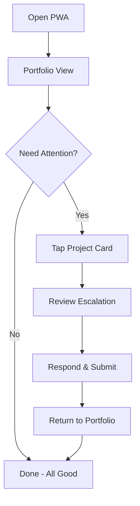
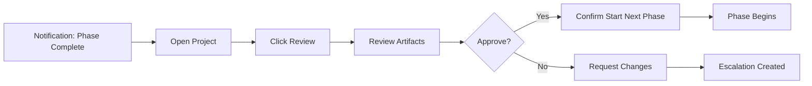

# Agent orchastrator UX Design Specification

_Created on 2025-11-04 by Chris_
_Generated using BMad Method - Create UX Design Workflow v1.0_

---

## Executive Summary

**Project:** Agent Orchestrator - An autonomous BMAD workflow execution system that enables 24/7 software development with minimal human intervention.

**Vision:** Liberate developers from being physically tied to their computers by providing an autonomous AI agent system that executes the BMAD methodology continuously, accessible remotely from any device.

**Target Users:** Solo technical founders and developers who value BMAD's structured approach but are constrained by time and physical presence requirements.

**Platform:** Progressive Web App (PWA) accessible on desktop, tablet, and mobile devices. Requires internet connection for LLM APIs and real-time orchestrator communication.

**Core Experience:**
- Wake up to progress - Development continues 24/7
- Monitor from anywhere - Full remote access via PWA
- Trust autonomous decisions - AI handles 85%+ decisions with confidence scoring
- Parallel intelligence - Multiple stories develop simultaneously in isolated git worktrees

---

## 1. Design System Foundation

### 1.1 Design System Choice

**Selected: shadcn/ui with Tailwind CSS**

**Rationale:**
- Modern, customizable component library built on Radix UI primitives
- Tailwind CSS enables rapid responsive design and theming
- Production-ready accessibility (WCAG 2.1 AA compliant)
- Excellent for PWA development (lightweight, performant)
- Copy-paste component model gives full control
- Active community, extensive documentation
- Perfect for developer-focused tools

**Component Library Includes:**
- Buttons, inputs, forms (with validation states)
- Modals, dialogs, popovers
- Tabs, accordions, collapsibles
- Command palette (for quick actions)
- Toast notifications
- Badge indicators
- Cards, tables, data grids
- Charts (via Recharts integration)

**Theming Approach:**
- CSS variables for easy theme switching
- Support light mode (primary) with dark mode option
- Responsive breakpoints: mobile (< 768px), tablet (768-1024px), desktop (> 1024px)

---

## 2. Core User Experience

### 2.1 Defining Experience

**The ONE thing users will do most:**
Quick status checks across all active projects to see "what's happening right now?" followed by diving deep into specific projects when something needs attention (escalations, phase gates, or completion reviews).

**What must be absolutely effortless:**
- Glancing at all project statuses in under 3 seconds
- Identifying which projects need attention immediately
- Switching between projects with zero friction
- Responding to escalations from mobile in under 2 minutes

**The most critical interaction to get right:**
The multi-project overview → project detail drill-down pattern. Users need to feel confident they know the state of all their projects at a glance, then seamlessly dive into details when needed.

**User Flow Pattern:**
1. Open PWA → See all projects at a glance
2. Spot which projects need attention (visual indicators)
3. Tap/click to drill into project details
4. Take action (approve gate, respond to escalation, review output)
5. Return to overview to check other projects

### 2.2 Novel UX Patterns

**Pattern 1: AI Confidence Indicators**
- **Challenge**: Users need to trust autonomous AI decisions
- **Solution**: Visual confidence scoring (0-100%) on every AI decision
  - 90-100%: Green indicator, high confidence
  - 75-89%: Amber indicator, medium confidence
  - <75%: Red indicator, escalated to human
- **Display**: Subtle badge on decision cards, hover for reasoning
- **Innovation**: Makes AI decision-making transparent and trust-building

**Pattern 2: Three-Level Attention Hierarchy**
- **Challenge**: Prevent notification fatigue while ensuring urgent items seen
- **Solution**: Smart notification prioritization
  - **Critical** (Red): Modal interrupt - Phase gate approval, build failures
  - **Important** (Amber): Toast notification - Escalations, story completions
  - **Informational** (Blue): Badge indicator - Progress updates, minor events
- **AI-Powered**: System learns what user considers urgent based on response patterns
- **User Control**: Notification preferences per project

**Pattern 3: Portfolio-First Navigation**
- **Challenge**: Users manage multiple projects, need instant overview
- **Solution**: Always land on portfolio view first
  - Color-coded project health cards
  - Visual indicators for items needing attention
  - Quick drill-down to project details
  - Breadcrumb navigation to return to portfolio
- **Innovation**: Most PM tools start with single-project view; we prioritize multi-project

**Pattern 4: Conversational Project Context**
- **Challenge**: Users need to ask questions about project status
- **Solution**: Per-project AI chat (like Claude/ChatGPT) with project context
  - "What's blocking story 005?"
  - "Why did you make this architecture decision?"
  - "Estimate time to complete Phase 2"
- **Integration**: Chat interface knows all project state, documents, decisions
- **Innovation**: Combines PM dashboard with conversational AI assistant

**Pattern 5: Dependency Visualization with Worktree Status**
- **Challenge**: Show parallel story development and dependencies
- **Solution**: Interactive dependency graph
  - Nodes = Stories with status (pending, in-progress, review, merged)
  - Edges = Dependencies (dashed if blocking)
  - Worktree indicator shows which stories actively developing
  - Real-time updates as git operations complete
- **Innovation**: Visualizes git worktree parallelism, not just task dependencies

---

## 3. Visual Foundation

### 3.1 Color System

**Color Strategy: Professional with Intelligent Status Indicators**

Based on research insights (Linear's clean minimal aesthetic + AI app conventions + multi-project dashboard best practices), the color system prioritizes:
- Trust and professionalism (developer tool)
- Calm efficiency (reduce cognitive load)
- Clear status communication (health indicators)
- Accessibility (WCAG 2.1 AA compliance)

**Primary Palette:**

- **Primary Blue**: `#2563EB` (Slate 600)
  - Usage: Primary actions, links, active states
  - Psychology: Trust, reliability, professional
  - Rationale: Standard for developer tools (GitHub, VS Code, Linear)

- **Neutral Grays**: `#0F172A` (Slate 900) to `#F8FAFC` (Slate 50)
  - Usage: Text, backgrounds, borders, cards
  - Hierarchy: 900 (headings), 700 (body), 500 (secondary), 300 (borders)

**Status Palette (Critical for Project Health):**

- **Success Green**: `#10B981` (Emerald 500)
  - High confidence AI decisions (90-100%)
  - Healthy project status
  - Completed tasks, merged PRs

- **Warning Amber**: `#F59E0B` (Amber 500)
  - Medium confidence AI decisions (75-89%)
  - Attention needed (escalations pending)
  - In-progress with dependencies

- **Error Red**: `#EF4444` (Red 500)
  - Low confidence / escalation required (<75%)
  - Critical issues, build failures
  - Blocked stories

- **Info Blue**: `#3B82F6` (Blue 500)
  - Informational notifications
  - Progress updates
  - System messages

**Semantic Color Mapping:**

```css
--color-background: #FFFFFF (light) / #0F172A (dark)
--color-surface: #F8FAFC / #1E293B
--color-border: #E2E8F0 / #334155
--color-text-primary: #0F172A / #F8FAFC
--color-text-secondary: #64748B / #94A3B8
--color-primary: #2563EB
--color-success: #10B981
--color-warning: #F59E0B
--color-error: #EF4444
--color-info: #3B82F6
```

**Typography System:**

- **Font Families:**
  - **Headings**: Inter (modern, clean, excellent for UI)
  - **Body**: Inter (consistency, readability)
  - **Code/Monospace**: JetBrains Mono (developer-friendly)

- **Type Scale:**
  - H1: 2.25rem / 36px (Page titles)
  - H2: 1.875rem / 30px (Section headers)
  - H3: 1.5rem / 24px (Card titles)
  - H4: 1.25rem / 20px (Subsections)
  - Body: 1rem / 16px (Standard text)
  - Small: 0.875rem / 14px (Captions, labels)
  - Tiny: 0.75rem / 12px (Badges, timestamps)

- **Font Weights:**
  - 700 (Bold): Headings, emphasis
  - 600 (Semi-bold): Subheadings, button labels
  - 500 (Medium): Navigation, tabs
  - 400 (Regular): Body text

**Spacing System (8px base unit):**

- xs: 4px (0.25rem) - Tight spacing within components
- sm: 8px (0.5rem) - Component padding
- md: 16px (1rem) - Standard spacing
- lg: 24px (1.5rem) - Section spacing
- xl: 32px (2rem) - Page-level spacing
- 2xl: 48px (3rem) - Major section breaks

**Layout Grid:**

- 12-column grid (standard, flexible)
- Gutter: 24px (desktop), 16px (tablet), 12px (mobile)
- Container max-width: 1440px (desktop), 100% (mobile/tablet)

**Interactive Visualizations:**

- Color Theme Explorer: [ux-color-themes.html](./ux-color-themes.html) ✅ Generated

---

## 4. Design Direction

### 4.1 Chosen Design Approach

**Direction: Clean Command Center (Linear-inspired + AI Context)**

**Layout Decisions:**

- **Navigation Pattern**: Top nav bar (fixed) with project switcher dropdown
  - Logo + Project dropdown (left)
  - Global actions: Notifications, Settings, Profile (right)
  - Breadcrumb navigation below top bar (Portfolio > Project Name > Section)

- **Content Structure**: Single column primary + optional sidebar
  - **Portfolio View**: Grid of project cards (2-3 columns desktop, 1 column mobile)
  - **Project Detail View**: Main content area (Kanban/Timeline) + collapsible right sidebar (Chat/Details)

- **Content Organization**: Card-based with clear hierarchy
  - Cards for projects, stories, escalations
  - Status badges prominently displayed
  - Subtle shadows for depth, minimal borders

**Hierarchy Decisions:**

- **Visual Density**: Balanced (not too dense, not too spacious)
  - Information-rich but scannable
  - Generous whitespace around cards
  - Compact within cards for efficiency

- **Header Emphasis**: Bold, clear hierarchy
  - H1 for page titles (bold, large)
  - H2 for section headers (semi-bold, medium)
  - H3 for card titles (semi-bold, smaller)

- **Content Focus**: Mixed data + imagery
  - Status indicators and badges (visual cues)
  - Text-based for details
  - Charts/graphs for metrics (optional)
  - Avatar/icons for agents

**Interaction Decisions:**

- **Primary Action Pattern**: Modal for critical, inline for routine
  - Phase gate approval → Modal dialog (full attention)
  - Escalation response → Modal with context
  - Story detail view → Inline expansion or slide-over panel

- **Information Disclosure**: Progressive (show essentials, hide details)
  - Project card: Name, phase, status, attention indicators
  - Expand/drill-down for full details
  - Hover tooltips for quick info (confidence scores, timestamps)

- **User Control**: Guided but flexible
  - Default views optimized for quick scanning
  - Customizable filters and sorting
  - Command palette (Cmd+K) for power users

**Visual Style Decisions:**

- **Weight**: Minimal-to-balanced (clean, professional)
  - Lots of white space
  - Subtle colors except status indicators
  - Focus on content, not decoration

- **Depth Cues**: Subtle elevation (cards float slightly)
  - Drop shadows: sm (cards), md (modals), none (flat elements)
  - Elevation indicates interactivity

- **Border Style**: Subtle (1px, light gray)
  - Borders to separate sections
  - No borders within cards (whitespace separates)

**Rationale:**

This direction balances the clean, fast aesthetic of Linear with the conversational nature of AI apps and the real-time monitoring needs of multi-project dashboards. It prioritizes:
- Quick scanning (portfolio cards)
- Clear status communication (color-coded health)
- Effortless drill-down (card → detail view)
- AI transparency (confidence indicators, chat interface)
- Mobile-first responsiveness (PWA requirements)

**Key Screens:**

1. **Portfolio View** - Grid of project cards showing health status
2. **Project Detail (Kanban)** - Two-level board (Phases → Stories) with chat sidebar
3. **Escalation Modal** - AI question + reasoning + response form
4. **Phase Gate Approval** - Review + approve modal with generated artifacts
5. **Story Detail Panel** - Slide-over with story info, dependencies, PR links

**Interactive Mockups:**

- Design Direction Showcase: [ux-design-directions.html](./ux-design-directions.html) ✅ Generated

---

## 5. User Journey Flows

### 5.1 Critical User Paths

**Journey 1: Quick Status Check (Mobile - Morning Routine)**

**Goal**: Check progress on all projects while drinking morning coffee

**Flow:**
1. **Entry**: Open PWA on phone (installed on home screen)
2. **Portfolio View**: See 3 project cards at a glance
   - User sees: Project names, current phase, health status (green/amber/red)
   - Visual indicators: Badge count for escalations/attention items
3. **Scan for Attention**: Identify Project B has amber indicator (1 escalation)
4. **Tap Card**: Drill into Project B details
5. **Review Escalation**: Read AI's question and reasoning in modal
6. **Respond**: Tap response option or type custom answer
7. **Submit**: Escalation resolved, modal closes, badge clears
8. **Return**: Swipe back or tap breadcrumb to portfolio view
9. **Success**: All projects status known, one escalation resolved in <2 minutes

**Journey 2: Phase Gate Approval (Desktop - End of Work Day)**

**Goal**: Approve Phase 1 (Analysis) completion and start Phase 2 (Planning)

**Flow:**
1. **Notification**: Toast notification "Project X - Phase 1 Complete, Ready for Gate Review"
2. **Navigate**: Click notification → Opens Project X detail view
3. **Phase View**: Kanban shows Phase 1 column with "Gate Approval" card
4. **Review Artifacts**: Click "Review" button
   - Modal opens with generated PRD document preview
   - Tabs for different artifacts (PRD, research, product brief)
   - Confidence scores visible for key decisions
5. **Decision Point**: User reviews, finds quality acceptable
6. **Approve**: Click "Approve & Start Phase 2" button
7. **Confirmation**: Modal "Are you sure? Phase 2 will begin autonomous execution"
8. **Confirm**: Click "Yes, Start Phase 2"
9. **System Response**:
   - Gate card moves to "Approved"
   - Phase 2 column becomes active
   - Toast: "Phase 2 (Planning) started - Architecture workflow running"
   - Orchestrator begins Winston (Architect) workflow
10. **Success**: User confident work continues overnight

**Journey 3: Monitor Parallel Story Development (Desktop - During Work)**

**Goal**: Check on 3 stories developing simultaneously in git worktrees

**Flow:**
1. **Entry**: Open Project Y detail view
2. **Kanban View**: Phase 4 (Implementation) column shows stories
   - Story 001: In-Progress, green (tests passing, worktree active)
   - Story 002: In-Progress, amber (1 test failing)
   - Story 003: In-Progress, green (PR ready)
3. **Spot Issue**: Story 002 has warning indicator
4. **Click Story Card**: Slide-over panel opens (right side)
   - Story details, acceptance criteria
   - Test results (1 failing)
   - Link to worktree branch
   - Link to failing test in CI
5. **Context**: User wants to understand dependency
6. **Click "Dependencies" Tab**: Dependency graph shows
   - Story 002 depends on Story 001 (still in progress)
   - Visual: Node + edge diagram
7. **Ask AI**: Type in chat sidebar "Why is test failing in Story 002?"
8. **AI Response**: "Test expects Story 001 API endpoint which isn't merged yet. Story 002 will auto-retry tests after Story 001 merges."
9. **Understanding**: User relaxes, knows system will handle it
10. **Close Panel**: Return to Kanban view
11. **Success**: Confident in parallel development, no action needed

**Journey 4: Create New Project (Desktop)**

**Goal**: Start orchestrating a new project

**Flow:**
1. **Portfolio View**: Click "+ New Project" button
2. **Project Setup Modal**: Multi-step wizard
   - Step 1: Project name, description, repository URL
   - Step 2: BMAD parameters (detail level, cost budget, workflow path)
   - Step 3: Agent LLM assignments (defaults pre-filled, can customize)
   - Step 4: Initial requirements (text input or upload doc)
3. **Create**: Click "Create & Start Analysis"
4. **Orchestrator Initializes**:
   - Creates project directory
   - Loads project configuration
   - Spawns Mary (Analyst) agent
   - Begins brainstorming workflow
5. **Portfolio View**: New project card appears
   - Status: Phase 1 - Brainstorming (in progress)
   - Real-time updates via WebSocket
6. **Success**: New project orchestrating autonomously

**Mermaid Diagrams:**





---

**Journey 5: Sprint Planning with Dependency Graph (Desktop)**

**Goal**: Plan sprint work by understanding story dependencies and identifying parallel work

**Flow:**
1. **Entry**: Open Project X detail view
2. **Navigate to Dependencies**: Click "Dependencies" tab (alongside Kanban tab)
3. **Graph Loads**: Dependency graph renders with all 25 stories
   - Visual scan reveals:
     - 8 stories at top (no dependencies, can start immediately)
     - Critical path highlighted: 6 stories in sequence (longest chain)
     - 2 bottleneck stories (blocking 4+ other stories)
4. **Identify Parallel Work**: User sees:
   - Stories 001-008 can develop in parallel (no dependencies)
   - Stories 009-015 depend on 005 (bottleneck)
   - Stories 016-025 can start after 012
5. **Spot Bottleneck**: Hover over Story 005 (red highlighted)
   - Tooltip: "Blocking 7 stories"
   - User notes: Prioritize Story 005 for immediate work
6. **Examine Critical Path**: Critical path highlighted in blue
   - 6 stories in sequence: 001 → 003 → 005 → 009 → 012 → 025
   - User understands: This is the minimum project duration
7. **Click Node**: Click Story 005 to see details
   - Story detail slide-over opens
   - Shows: Acceptance criteria, dependencies, estimated time
8. **Plan Sprint**: Based on graph insights
   - Sprint 1: Stories 001-008 (parallel development)
   - Sprint 2: Story 005 (bottleneck), then 009-015
   - Sprint 3: Stories 016-025
9. **Export Graph**: Click "Export PNG" button
   - Graph downloads as sprint-plan.png
   - Share with team in Slack
10. **Real-Time Update**: Story 003 status changes to "In Progress"
    - Node color smoothly transitions from gray to blue
    - Pulsing border indicates active work
11. **Success**: Sprint planned with clear parallel work strategy, <5 minutes total

**Journey 6: Implementation Readiness Gate (Desktop)**

**Goal**: Ensure solutioning phase output is complete before coding begins

**Flow:**
1. **Notification**: Toast "Solutioning complete - Running readiness gate..."
2. **Gate Execution**: Automated validation (invisible to user, <3 minutes)
3. **Scenario A - Gate Passes**:
   - Toast: "Implementation readiness gate passed ✅"
   - Badge: "Ready for Development" appears on project card
   - Phase 4 (Implementation) becomes available
   - User confidence: Stories are ready, no blockers
4. **Scenario B - Gate Fails**:
   - Modal: "Implementation Readiness Gate Failed"
   - Blocker list displayed:
     - "Story 005: Only 3 acceptance criteria (minimum 8)"
     - "Story 012: Circular dependency with Story 015"
     - "Epic 2: No test strategy defined"
   - Recommendations provided:
     - "Add 5 more acceptance criteria to Story 005"
     - "Remove dependency from Story 012 to 015"
     - "Re-run architecture workflow to generate test strategy"
   - Action: "Fix Blockers" button → Returns to solutioning phase
   - Implementation phase blocked until gate passes
5. **Remediation**: User or Bob agent fixes blockers
6. **Re-run Gate**: Validation executes again automatically
7. **Gate Passes**: Implementation phase unlocked

---

## 6. Component Library

### 6.1 Component Strategy

**From shadcn/ui (Standard Components):**

- ✅ Button (primary, secondary, ghost, destructive variants)
- ✅ Input, Textarea, Select, Checkbox, Radio
- ✅ Modal/Dialog, Alert Dialog
- ✅ Toast notifications
- ✅ Dropdown Menu, Context Menu
- ✅ Tabs, Accordion
- ✅ Card, Badge, Avatar
- ✅ Table, Data Grid
- ✅ Command Palette (Cmd+K)
- ✅ Tooltip, Popover
- ✅ Progress Bar, Skeleton Loader

**Custom Components Needed:**

**1. ProjectCard Component**
- **Purpose**: Display project at-a-glance status in portfolio view
- **Anatomy**:
  - Project name (H3)
  - Current phase indicator (badge)
  - Health status (color-coded border: green/amber/red)
  - Attention badges (escalation count, gate approval needed)
  - Last activity timestamp
  - Quick actions menu (3-dot)
- **States**:
  - Default: Neutral border, hover elevates
  - Needs Attention: Amber/red border, pulsing badge
  - Hover: Slight elevation, cursor pointer
  - Loading: Skeleton loader pattern
- **Variants**:
  - Compact (mobile): Single column, essential info only
  - Standard (desktop): Full info with metrics
- **Behavior**:
  - Click → Navigate to project detail view
  - Hover → Show quick preview tooltip
- **Accessibility**:
  - ARIA role: "article"
  - Keyboard: Tab to focus, Enter to open
  - Screen reader: "Project [name], Phase [N], Status [health], [X] items need attention"

**2. PhaseKanbanBoard Component**
- **Purpose**: Two-level Kanban (Phases as columns, Stories as cards within)
- **Anatomy**:
  - Column headers (Phase names: Analysis, Planning, Solutioning, Implementation)
  - Story cards within columns
  - Swimlanes for different story types (optional)
  - WIP limits per phase (visual indicator)
- **States**:
  - Active phase: Highlighted column header
  - Completed phase: Grayed out, collapsed option
  - Gate approval: Special card type at phase boundary
- **Variants**:
  - Desktop: Full board, all phases visible
  - Tablet: Horizontal scroll
  - Mobile: Single phase view, swipe to change phase
- **Behavior**:
  - Drag-and-drop stories (if manual reordering allowed)
  - Click story card → Open detail slide-over
  - Real-time updates via WebSocket (cards move automatically)
- **Accessibility**:
  - ARIA live region for updates
  - Keyboard: Arrow keys to navigate, Enter to select
  - Screen reader: Announce phase changes, story moves

**3. StoryCard Component**
- **Purpose**: Display story within Kanban board
- **Anatomy**:
  - Story ID + title
  - Status badge (pending, in-progress, review, merged)
  - Confidence indicator (if AI-generated)
  - Dependency indicator (if has dependencies)
  - Worktree indicator (if actively developing)
  - Assignee avatar (agent icon)
- **States**:
  - Pending: Gray
  - In-Progress: Blue, animated border
  - Blocked: Red, warning icon
  - Review: Amber, "needs review" badge
  - Merged: Green, checkmark
- **Variants**:
  - Compact: ID + title only
  - Standard: Full details with badges
- **Behavior**:
  - Click → Open story detail slide-over
  - Hover → Show quick preview
- **Accessibility**:
  - ARIA role: "button"
  - Keyboard: Tab + Enter
  - Screen reader: "Story [ID] [title], Status [status], [dependency info]"

**4. AI ChatInterface Component**
- **Purpose**: Per-project conversational AI assistant
- **Anatomy**:
  - Chat message list (scrollable)
  - User messages (right-aligned, blue bubble)
  - AI messages (left-aligned, gray bubble)
  - Confidence indicator on AI responses
  - Input field with send button
  - Suggested questions (chips)
  - "AI can make mistakes" disclaimer at top
- **States**:
  - Idle: Input field active
  - Thinking: Loading indicator, input disabled
  - Error: Red border on input, error message
- **Variants**:
  - Sidebar (desktop): Fixed height, scrollable
  - Full-screen (mobile): Takes over screen
- **Behavior**:
  - Type message → Send → AI response appears
  - Click suggested question → Auto-fills input
  - Scroll to bottom on new message
- **Accessibility**:
  - ARIA live region for new messages
  - Keyboard: Tab to input, Enter to send
  - Screen reader: Announce new messages

**5. ConfidenceIndicator Component**
- **Purpose**: Visual representation of AI decision confidence
- **Anatomy**:
  - Circular progress indicator (0-100%)
  - Color-coded: Green (90-100%), Amber (75-89%), Red (<75%)
  - Percentage label
  - Hover tooltip with reasoning
- **States**:
  - Static display
  - Hover: Tooltip with detailed reasoning
- **Variants**:
  - Small: Icon-size (16px)
  - Medium: Badge-size (24px)
  - Large: Standalone (48px)
- **Behavior**:
  - Hover → Show reasoning tooltip
  - Click → Open decision details modal (optional)
- **Accessibility**:
  - ARIA label: "Confidence [%], [reasoning]"
  - Keyboard: Tab + Enter to show tooltip
  - Screen reader: Read confidence and reasoning

**6. EscalationModal Component**
- **Purpose**: Present AI question to user for response
- **Anatomy**:
  - Modal header: "Escalation Required"
  - AI's question (prominently displayed)
  - AI's attempted reasoning (collapsible section)
  - Context (workflow, step, relevant docs)
  - Response form (radio buttons, text input, or both)
  - Actions: Cancel, Submit Response
- **States**:
  - Open: Modal visible, focused
  - Submitting: Loading state, actions disabled
  - Success: Close modal, toast confirmation
- **Variants**:
  - Simple choice: Radio buttons (2-4 options)
  - Open-ended: Text area for custom response
  - Hybrid: Suggested options + "Other" text field
- **Behavior**:
  - Escape key closes (with confirmation)
  - Click outside → Confirm close (unsaved response warning)
  - Submit → Close modal, resume workflow
- **Accessibility**:
  - Focus trap within modal
  - Keyboard: Tab through elements, Enter to submit, Escape to close
  - Screen reader: Announce modal open, read question first

**UPDATED: 7. DependencyGraph Component (Detailed Specification)**

**Purpose:** Visualize story dependencies with real-time worktree status for sprint planning

**Enhanced Anatomy:**
- **SVG Canvas**: Scalable vector graphics container
- **Nodes (Story Circles)**:
  - Circle shape with status-based color fill
  - Story ID label (centered, white text)
  - Size varies by complexity:
    - Small (32px): 1-5 acceptance criteria
    - Medium (48px): 6-10 acceptance criteria
    - Large (64px): 11+ acceptance criteria
  - Worktree badge (top-right): Orange circle with "W" icon
  - Confidence indicator (bottom-right): Small percentage badge (if AI-generated)
- **Edges (Dependency Lines)**:
  - Source: Prerequisite story node
  - Target: Dependent story node
  - Line style:
    - Solid: Hard dependency (blocking)
    - Dashed: Soft dependency (suggested order)
  - Color:
    - Red (#EF4444): Blocking (target can't start)
    - Gray (#9CA3AF): Non-blocking
  - Arrow head at target end
- **Critical Path Highlight**:
  - Thicker edges (3px vs 1.5px)
  - Blue color (#2563EB)
  - Dashed glow effect
- **Layout**:
  - Hierarchical (top-to-bottom flow)
  - No-dependency stories at top
  - Dependent stories below prerequisites
  - Auto-spacing to prevent overlaps
- **Controls**:
  - Zoom slider (bottom-right)
  - Pan indicator (center when not at default view)
  - Reset button ("Fit to View")
  - Export dropdown (PNG, SVG, Link)
- **Legend**:
  - Status colors (Pending, In-Progress, Review, Merged, Blocked)
  - Edge types (Hard, Soft, Critical Path)
  - Icon meanings (Worktree active, Confidence score)

**Enhanced States:**
- **Loading**: Skeleton placeholder with animated shimmer
- **Default**: Full graph rendered, nodes static
- **Hover Node**: Node elevates (drop shadow), tooltip appears, connected edges highlight
- **Selected Node**: Node border thickens, connected dependencies highlighted
- **Panning**: Cursor changes to grab hand, graph moves with mouse
- **Zooming**: Graph scales smoothly, labels fade in/out based on zoom level
- **Updating**: Smooth transitions (500ms) when node status changes
- **Error**: Error message overlay, "Unable to load dependency graph"

**Enhanced Variants:**
- **Desktop Full**: Complete graph with all interactions, filters sidebar
- **Tablet**: Simplified graph, touch-optimized, swipe to pan
- **Mobile**: List view with expandable dependencies (graph too complex for small screens)

**Enhanced Behavior:**
- **Click Node**: Open story detail slide-over panel (right side)
- **Double-Click Node**: Center and zoom to node + immediate dependencies
- **Hover Node**: Show tooltip with story title, status, epic, worktree status
- **Click Edge**: Show tooltip with dependency type and reason
- **Drag Node**: If manual layout enabled, update node position (save to preferences)
- **Scroll**: Zoom in/out centered on mouse position
- **Pinch (Touch)**: Zoom in/out on touch devices
- **Pan**: Click-and-drag background to move graph
- **Export PNG**: Download current view as PNG image
- **Export SVG**: Download graph as SVG file (editable)
- **Share Link**: Copy URL with graph view state (zoom, pan, selected node)
- **Real-Time Updates**:
  - WebSocket event: story.status.changed → Update node color
  - WebSocket event: dependency.added → Add new edge
  - WebSocket event: dependency.removed → Remove edge
  - All changes animated smoothly (no jarring redraws)

**Enhanced Accessibility:**
- **ARIA Attributes**:
  - role="img" with aria-label="Story dependency graph for [project name]"
  - Each node: role="button" with aria-label="Story [ID]: [title], Status: [status]"
- **Keyboard Navigation**:
  - Tab: Focus next node (in topological order)
  - Shift+Tab: Focus previous node
  - Enter: Open focused node detail
  - Arrow keys: Pan graph
  - +/-: Zoom in/out
  - R: Reset view to fit
- **Screen Reader Support**:
  - Provide text alternative: "Dependency list" with hierarchical structure
  - Announce status changes: "Story 005 status changed to In Progress"
- **Focus Indicators**:
  - 3px blue outline on focused node
  - Skip link: "Skip to dependency list"

**Enhanced Implementation Notes:**
- **Library**: D3.js v7 for data binding and SVG manipulation
- **Layout Algorithm**: d3-hierarchy with topological sort
- **Performance**:
  - Virtualization for >100 nodes (only render visible)
  - Canvas fallback for >500 nodes (WebGL acceleration)
  - Debounce zoom/pan events (16ms = 60 FPS)
- **Data Refresh**: Poll every 10 seconds or use WebSocket
- **State Management**: Zustand slice for graph state (zoom, pan, selected node)
- **Export**: html2canvas for PNG, native SVG serialization

**8. CISConsultationCard Component**

**Purpose:** Display CIS agent framework analysis and recommendations

**Anatomy:**
- Card header: "[Agent Name] - [Framework]"
  - Example: "Maya - Design Thinking Framework"
- Framework visualization:
  - For Maya: 5 phases diagram (Empathize → Define → Ideate → Prototype → Test)
  - For Dr. Quinn: Problem-solving canvas
  - For Sophia: Story arc diagram
  - For Victor: Innovation canvas
- Analysis section (collapsible):
  - Framework-specific analysis in markdown
  - Key insights highlighted
- Recommendations section:
  - 3-5 recommendation cards
  - Each with: Option name, Pros (green), Cons (red), Impact/Effort matrix
- Confidence indicator for each recommendation
- Actions: Accept recommendation, Modify, Reject, Ask follow-up

**States:**
- Loading: "Consulting [Agent]..." with animated spinner
- Loaded: Full analysis visible
- Expanded: Framework details visible
- Collapsed: Summary only

**Variants:**
- Inline (chat): Compact version in chat interface
- Modal (critical decisions): Full-screen for detailed review

**Behavior:**
- Click recommendation → Expand details
- Click "Accept" → Apply recommendation to decision
- Click "Ask follow-up" → Opens chat with agent context
- Real-time: Shows "thinking..." as agent analyzes

**Accessibility:**
- ARIA: role="article", aria-label="[Agent] consultation"
- Keyboard: Tab through recommendations, Enter to accept
- Screen reader: Read framework phases, recommendations linearly

**9. Code Review Interface Components**
- **Purpose**: Display Alex agent's code review results with clear severity indicators and actionable feedback
- **Components**:

**Review Status Badge**
- **Location**: Story card in Kanban board, Project detail view
- **States**:
  - 🟡 "In Review" (Alex reviewing)
  - ✅ "Review Passed" (no critical issues)
  - ⚠️ "Review Failed" (critical issues found)
  - 🔴 "Review Escalated" (human review needed)
- **Styling**: Color-coded for quick visual scan

**Review Report Modal**
- **Trigger**: Click "View Review" button on story card
- **Layout Structure**:
  ```
  ┌─────────────────────────────────────────┐
  │ Code Review Report - Story 5.3          │
  │ Reviewed by: Alex | Date: 2025-11-05    │
  ├─────────────────────────────────────────┤
  │ Overall Score: 87/100 ✅                │
  │ Confidence: 0.92                         │
  │                                          │
  │ Summary: 2 important issues, 3 minor    │
  ├─────────────────────────────────────────┤
  │ Findings by Severity:                    │
  │                                          │
  │ ⚠️ Important (2)                         │
  │ ├─ [Security] SQL injection risk        │
  │ │  File: backend/src/api/users.ts:42    │
  │ │  Issue: Unsanitized user input        │
  │ │  Fix: Use parameterized queries       │
  │ └─ [Quality] High complexity function   │
  │    File: backend/src/core/engine.ts:156 │
  │    Issue: Cyclomatic complexity: 18     │
  │    Fix: Extract smaller functions       │
  │                                          │
  │ ℹ️ Minor (3)                             │
  │ ├─ [Style] Inconsistent naming          │
  │ ├─ [Performance] Unoptimized loop       │
  │ └─ [Maintainability] Missing JSDoc      │
  │                                          │
  │ ✅ Recommendations:                      │
  │ • Add input validation layer            │
  │ • Refactor executeStep() method         │
  │ • Update documentation                  │
  ├─────────────────────────────────────────┤
  │ [View Full Report] [Accept & Continue]  │
  └─────────────────────────────────────────┘
  ```
- **Features**:
  - Expandable finding cards with file links
  - "View in GitHub" links to specific lines
  - Actions: Accept review, Request re-review, Escalate

**Review Timeline Entry**
- **Location**: Project Detail → Events log
- **Format**: "Alex completed code review for Story 5.3 (Score: 87/100)"
- **Behavior**: Link to full report modal

**9. CostDashboard Component**

**Purpose:** Display real-time cost tracking and budget status

**Anatomy:**
- Budget progress bar (color-coded: green <75%, amber 75-90%, red >90%)
- Current spend vs budget (daily/weekly/monthly toggle)
- Cost breakdown chart:
  - By agent (pie chart)
  - By phase (bar chart)
  - By model (stacked bar)
- Projected monthly cost
- Cost savings from optimization
- Alert badges at thresholds

**States:**
- Normal (< 75%): Green progress bar
- Warning (75-90%): Amber bar, warning badge
- Critical (90-100%): Red bar, downgrade notice
- Over budget (>100%): Red bar, blocked badge

**Interactions:**
- Click chart segment → Filter cost details
- Toggle timeframe → Update all metrics
- Click "Cost Report" → Download CSV
- Click "Adjust Budget" → Open budget config modal

**11. Security Gate Interface Components**
- **Purpose**: Display security gate validation results with clear pass/fail status and actionable gap analysis
- **Components**:

**Security Gate Status Badge**
- **Location**: Project detail view, Phase progress indicator
- **States**:
  - 🟡 "Security Validation In Progress"
  - ✅ "Security Gate Passed (98/100)"
  - ⚠️ "Security Gate Failed - Review Required"
- **Styling**: Color-coded for quick status check

**Security Gate Report Modal**
- **Trigger**: Click "View Security Report" in project detail
- **Layout Structure**:
  ```
  ┌────────────────────────────────────────────┐
  │ Security Gate Validation Report            │
  │ Project: Agent Orchestrator                 │
  │ Date: 2025-11-05 | Score: 98/100 ✅        │
  ├────────────────────────────────────────────┤
  │ Overall Status: PASSED                      │
  │ All critical security requirements met      │
  ├────────────────────────────────────────────┤
  │ Security Checks:                            │
  │                                             │
  │ ✅ Authentication & Authorization           │
  │    Strategy: JWT-based authentication       │
  │    Evidence: Section 6.2 (Auth & Auth)     │
  │                                             │
  │ ✅ Secrets Management                       │
  │    Strategy: Environment variables + Vault  │
  │    Evidence: Section 6.2 (Secrets Mgmt)    │
  │                                             │
  │ ✅ Input Validation                         │
  │    Strategy: Zod schema validation          │
  │    Evidence: Section 6.2 (Input Validation)│
  │                                             │
  │ ✅ API Security                             │
  │    Measures: Rate limiting, CORS, CSP       │
  │    Evidence: Section 6.2 (Network Security)│
  │                                             │
  │ ✅ Data Encryption                          │
  │    Strategy: TLS 1.2+, encrypted env vars   │
  │    Evidence: Section 6.2 (Network Security)│
  │                                             │
  │ ⚠️ Threat Model (Minor Gap)                 │
  │    Status: OWASP Top 10 addressed (90%)    │
  │    Gap: SSRF mitigation not fully detailed  │
  │    Recommendation: Add URL validation spec  │
  ├────────────────────────────────────────────┤
  │ [View Full Architecture] [Continue to Solutioning] │
  └────────────────────────────────────────────┘
  ```
- **Features**:
  - Expandable check cards showing evidence
  - Links to architecture sections
  - For failed gates: Gap report with recommendations

**Failed Gate Escalation**
- **Alert**: "Security Gate Failed - Action Required"
- **Content**: List missing/incomplete security specifications
- **Actions**:
  - Provide recommendations and examples
  - "Update Architecture" button → Re-opens architecture workflow
  - Block "Start Solutioning" until gate passes

---

## 7. UX Pattern Decisions

### 7.1 Consistency Rules

**Button Hierarchy:**
- **Primary**: Blue background, white text - Main actions (Approve, Create, Submit)
- **Secondary**: White background, blue border - Supporting actions (Cancel, Back)
- **Tertiary/Ghost**: No background, blue text - Low-priority actions (View Details, Learn More)
- **Destructive**: Red background, white text - Dangerous actions (Delete Project, Force Stop)

**Feedback Patterns:**
- **Success**: Toast notification (green), auto-dismiss after 3 seconds - "Phase approved", "Story merged"
- **Error**: Toast notification (red), persists until dismissed - "Build failed", "API error"
- **Warning**: Toast notification (amber), auto-dismiss after 5 seconds - "Test failing", "Budget 80% used"
- **Info**: Badge indicator (blue), passive - "New activity", "Update available"
- **Loading**: Spinner for actions, Skeleton for content, Progress bar for known duration

**Form Patterns:**
- **Label Position**: Above input field (accessibility best practice)
- **Required Field Indicator**: Asterisk (*) with "required" text for screen readers
- **Validation Timing**: On blur for errors, on change for corrections
- **Error Display**: Inline below field (red text + icon), summary at top for multiple errors
- **Help Text**: Caption below field (gray text), or tooltip icon for complex explanations

**Modal Patterns:**
- **Size Variants**:
  - Small (400px): Simple confirmations, escalation responses
  - Medium (600px): Forms, artifact previews
  - Large (800px): Multi-step wizards, full document reviews
  - Full-screen (mobile): All modals on small screens
- **Dismiss Behavior**: Escape key, click backdrop (with confirmation if unsaved changes), explicit close button
- **Focus Management**: Auto-focus first interactive element, trap focus within modal, return focus on close
- **Stacking**: Maximum 2 modals (confirmation over main modal), block 3rd modal with warning

**Navigation Patterns:**
- **Active State Indication**: Blue underline for tabs, bold text for sidebar links, blue background for buttons
- **Breadcrumb Usage**: Always shown except on portfolio view (top level)
- **Back Button Behavior**: Browser back supported, breadcrumb preferred for explicit navigation
- **Deep Linking**: All views have unique URLs, shareable, support browser history

**Empty State Patterns:**
- **First Use**: Large illustration, "Get Started" CTA, brief explanation - "No projects yet. Create your first project to begin."
- **No Results**: Helpful message, suggestions to modify filters - "No projects match 'test'. Try different search terms."
- **Cleared Content**: Undo option if applicable - "Project deleted. Undo?"

**Confirmation Patterns:**
- **Delete**: Always confirm with modal - "Are you sure? This cannot be undone."
- **Leave Unsaved**: Warn with modal - "You have unsaved changes. Leave anyway?"
- **Irreversible Actions**: Double confirmation (modal + checkbox "I understand") - "Force stop will lose current progress. Check to confirm."

**Notification Patterns:**
- **Placement**: Top-right corner for toasts, in-app bell icon for history
- **Duration**:
  - Success: 3 seconds auto-dismiss
  - Info: 5 seconds auto-dismiss
  - Warning: 5 seconds auto-dismiss
  - Error: Manual dismiss required
  - Critical: Modal interrupt
- **Stacking**: Maximum 3 toasts, oldest auto-dismiss as new arrive
- **Priority Levels**:
  - Critical (red, modal): Phase gate approval, build failed
  - Important (amber, toast): Escalation, story ready for review
  - Info (blue, badge): Progress update, minor event

**Search Patterns:**
- **Trigger**: On change (instant search), minimum 2 characters
- **Results Display**: Dropdown below search field, grouped by type (Projects, Stories, Docs)
- **Filters**: Sidebar with checkboxes for status, phase, agent
- **No Results**: "No results for '[query]'. Try different keywords."

**Date/Time Patterns:**
- **Format**:
  - Recent (<24 hours): Relative ("2 hours ago", "just now")
  - This week: Day name ("Monday 2:30 PM")
  - Older: Date ("Nov 3, 2025")
- **Timezone Handling**: User local time (detected from browser)
- **Pickers**: Calendar popup for date selection, dropdown for time selection

**Test Quality Indicators (New UX Pattern):**

Display test status and coverage metrics throughout the dashboard:

**Test Coverage Badge:**
- Location: Story cards, Project detail view
- Display: "[X]% coverage" with color coding
  - Green (≥80%): Excellent
  - Amber (60-79%): Acceptable
  - Red (<60%): Needs attention
- Tooltip: "Unit: [X]%, Integration: [Y]%, E2E: [Z]%"

**Test Execution Status:**
- Location: PR cards, Story detail panel
- States:
  - ✅ "All tests passing ([N]/[N])"
  - ⚠️ "[N] tests failing"
  - 🔄 "Tests running..."
  - ❌ "Tests failed ([N]/[M])"
- Click → View test report details

**Test Strategy Indicator:**
- Location: Project detail, Phase progress
- Badge: "Test Strategy Defined ✅" after Planning phase
- Missing indicator if strategy not defined (blocks solutioning)

---

## 8. Responsive Design & Accessibility

### 8.1 Responsive Strategy

**Breakpoint Strategy:**

- **Mobile**: < 768px (1-column layout, bottom navigation, full-screen modals)
- **Tablet**: 768px - 1024px (2-column layout, side navigation, slide-over panels)
- **Desktop**: > 1024px (3-column layout, fixed sidebar, modal dialogs)

**Device-Specific Adaptations:**

**Mobile (Portrait):**
- **Portfolio View**: Single column project cards, full width
- **Navigation**: Bottom tab bar (Portfolio, Notifications, Settings, Profile)
- **Project Detail**: Tabs for different views (Kanban, Chat, Details)
- **Kanban**: Single phase view, swipe horizontally to change phase
- **Modals**: Full-screen overlays
- **Cards**: Compact variant (essential info only)
- **Touch Targets**: Minimum 44x44px (Apple HIG standard)
- **Chat**: Full-screen, swipe down to close

**Tablet:**
- **Portfolio View**: 2-column grid
- **Navigation**: Left sidebar (collapsible)
- **Project Detail**: Main content + collapsible right sidebar (chat)
- **Kanban**: 2 phases visible, horizontal scroll
- **Modals**: Centered, max-width 600px
- **Cards**: Standard variant
- **Touch Targets**: Minimum 44x44px

**Desktop:**
- **Portfolio View**: 3-column grid (or 2-column for < 1440px screens)
- **Navigation**: Fixed left sidebar
- **Project Detail**: Main content + fixed right sidebar (chat always visible)
- **Kanban**: All 4 phases visible simultaneously
- **Modals**: Centered, size-appropriate (small/medium/large)
- **Cards**: Standard variant with hover states
- **Touch Targets**: Minimum 32x32px (keyboard + mouse)

**Adaptation Patterns:**

- **Navigation**:
  - Mobile: Bottom tab bar (4 main sections)
  - Tablet: Left sidebar (collapsible via hamburger)
  - Desktop: Fixed left sidebar (always visible)

- **Sidebar (Chat/Details)**:
  - Mobile: Full-screen overlay, swipe to open/close
  - Tablet: Slide-over panel from right, backdrop dismiss
  - Desktop: Fixed right sidebar (always visible, collapsible)

- **Cards/Lists**:
  - Mobile: Vertical stack, full width
  - Tablet: 2-column grid
  - Desktop: 3-column grid

- **Tables**:
  - Mobile: Card view (vertical stack with key info)
  - Tablet: Horizontal scroll with sticky first column
  - Desktop: Full table with all columns visible

- **Modals**:
  - Mobile: Full-screen overlay
  - Tablet/Desktop: Centered with backdrop, max-width by size variant

- **Forms**:
  - Mobile: Single column, full width inputs
  - Tablet: Single column, constrained width (600px max)
  - Desktop: 2-column for related fields, single column for long inputs

### 8.2 Accessibility Strategy

**WCAG 2.1 Level AA Compliance (Target)**

**Rationale**: Developer tools used in professional settings should meet legal/ethical standards. Level AA is:
- Legally required for government/education/public sites
- Industry standard for professional tools
- Achievable without compromising design

**Key Requirements:**

**Color Contrast:**
- Text contrast: Minimum 4.5:1 for normal text, 3:1 for large text (18px+)
- UI component contrast: Minimum 3:1 for buttons, borders, focus indicators
- Status colors tested for contrast against backgrounds
- Color never sole indicator (always paired with icon/text)

**Keyboard Navigation:**
- All interactive elements accessible via Tab key
- Logical tab order (left-to-right, top-to-bottom)
- Skip to content link for screen readers
- Keyboard shortcuts: Cmd+K (command palette), Escape (close modals), Arrow keys (navigate lists)
- Focus visible indicators (2px blue outline)

**Focus Indicators:**
- Visible on all interactive elements
- 2px solid blue outline (--color-primary)
- Minimum 2px offset from element
- Never removed with `outline: none` without custom replacement

**ARIA Labels:**
- Meaningful labels for all interactive elements
- aria-label for icon-only buttons
- aria-describedby for additional context
- aria-live for dynamic content (toast notifications, status updates)
- role attributes for custom components (e.g., role="button" for clickable cards)

**Alt Text:**
- Descriptive text for all meaningful images
- Empty alt for decorative images (alt="")
- Icon labels for screen readers (sr-only class)

**Form Labels:**
- Proper label association (<label for="id">)
- Required field indication (aria-required="true" + visual asterisk)
- Error messages linked with aria-describedby
- Group related inputs with <fieldset> and <legend>

**Error Identification:**
- Clear, descriptive error messages
- Visual + text indication (not color alone)
- Error summary at top of form
- Individual field errors inline below field

**Touch Target Size:**
- Mobile: Minimum 44x44px (Apple HIG)
- Desktop: Minimum 32x32px (with keyboard as primary input)
- Spacing between targets: Minimum 8px
- Exception: Inline text links (rely on surrounding spacing)

**Screen Reader Support:**
- Semantic HTML (nav, main, article, aside, footer)
- Headings hierarchy (h1-h6) for document structure
- Lists for related items (ul, ol)
- Tables for tabular data (proper thead, tbody, th, td)
- Live regions for dynamic updates (aria-live="polite" for toasts)
- Skip links for main content areas

**Testing Strategy:**

**Automated Testing:**
- Lighthouse accessibility audit (target: 100 score)
- axe DevTools browser extension
- WAVE (Web Accessibility Evaluation Tool)
- eslint-plugin-jsx-a11y for React

**Manual Testing:**
- Keyboard-only navigation (unplug mouse, test all flows)
- Screen reader testing:
  - VoiceOver (macOS/iOS) for Apple devices
  - NVDA (Windows) for desktop
  - TalkBack (Android) for mobile
- Color blindness simulation (Chrome DevTools)
- Zoom to 200% (text reflow, no horizontal scroll)

**Continuous Compliance:**
- Accessibility checklist in PR reviews
- Automated tests in CI/CD pipeline
- Regular audits (quarterly)
- User testing with assistive technology users

---

## 9. Implementation Guidance

### 9.1 Completion Summary

**UX Design Specification Complete!**

**What We Created:**

✅ **Design System**: shadcn/ui with Tailwind CSS
- Modern, accessible component library
- Full customization control
- Perfect for PWA development

✅ **Visual Foundation**: Professional Blue + Status Indicators theme
- Color palette optimized for developer tools
- Clear status communication (green/amber/red)
- Typography: Inter for UI, JetBrains Mono for code
- 8px spacing system for consistency
- WCAG 2.1 AA compliant colors

✅ **Design Direction**: Clean Command Center (Linear-inspired + AI Context)
- Portfolio-first navigation
- Card-based interface with subtle elevation
- Modal for critical, inline for routine
- Progressive information disclosure
- Mobile-first responsiveness

✅ **Novel UX Patterns**: 5 innovative patterns for AI + PM hybrid
1. AI Confidence Indicators (transparency for trust)
2. Three-Level Attention Hierarchy (prevent notification fatigue)
3. Portfolio-First Navigation (multi-project management)
4. Conversational Project Context (AI chat per project)
5. Dependency Visualization with Worktree Status (parallel development)

✅ **User Journey Flows**: 4 critical paths designed
1. Quick Status Check (Mobile - Morning Routine)
2. Phase Gate Approval (Desktop - End of Day)
3. Monitor Parallel Story Development (Desktop - During Work)
4. Create New Project (Desktop)

✅ **Component Library**: 7 custom components + shadcn/ui base
- ProjectCard, PhaseKanbanBoard, StoryCard
- AI ChatInterface, ConfidenceIndicator
- EscalationModal, DependencyGraph
- All with accessibility built-in

✅ **UX Pattern Decisions**: Comprehensive consistency rules
- Button hierarchy, feedback patterns, form patterns
- Modal patterns, navigation patterns
- Empty states, confirmation patterns
- Notification patterns, search patterns
- Date/time patterns

✅ **Responsive Strategy**: Mobile-first PWA
- Breakpoints: Mobile (< 768px), Tablet (768-1024px), Desktop (> 1024px)
- Adaptation patterns for navigation, sidebar, cards, modals, forms
- Touch targets: 44px mobile, 32px desktop

✅ **Accessibility**: WCAG 2.1 Level AA compliance
- Color contrast 4.5:1 (text), 3:1 (UI components)
- Full keyboard navigation with visible focus
- ARIA labels and live regions
- Screen reader support with semantic HTML
- Automated + manual testing strategy

**Key Design Decisions & Rationale:**

**Emotional Response**: Confident Control + Calm Efficiency
- Users trust autonomous AI decisions (confidence indicators)
- Feel calm knowing system escalates appropriately
- Experience momentum of continuous progress

**Core Experience**: Quick scan → Drill down when needed
- Portfolio view optimized for 3-second status check
- Color-coded health indicators catch attention
- Effortless navigation to details

**Visual Style**: Clean, professional, status-focused
- Inspired by Linear's minimal aesthetic
- Enhanced with AI transparency features
- Real-time updates without overwhelming

**Mobile Strategy**: PWA that feels native
- Installable on home screen
- Responsive across all devices
- Requires internet (LLM APIs, real-time updates)
- Touch-optimized with appropriate target sizes

**What Happens Next:**

**For Designers:**
- Create high-fidelity mockups from this specification
- Generate design system in Figma with all components
- Produce interactive prototypes for user testing
- Design icon set for agents, phases, status indicators

**For Developers:**
- Implement with React + TypeScript + Tailwind CSS
- Use shadcn/ui for base components
- Build custom components per specifications
- Follow accessibility requirements throughout
- Implement WebSocket for real-time updates
- Create PWA manifest for installation

**For Product:**
- Use this as source of truth for UX decisions
- Reference when writing user stories
- Validate designs against this specification
- Update as product evolves

**Success Metrics to Track:**

**Efficiency:**
- Time to check all project status < 3 seconds
- Time to respond to escalation < 2 minutes
- Navigation between projects < 1 second

**Trust:**
- Users approve AI decisions >85% without modification
- Confidence indicators reduce user anxiety (qualitative)
- Escalation rate appropriate (not too high, not too low)

**Accessibility:**
- Lighthouse accessibility score: 100
- Keyboard-only users can complete all tasks
- Screen reader users report positive experience

**Adoption:**
- Mobile usage >40% (users check from anywhere)
- Daily active usage (users check regularly)
- Time in app decreases as trust increases (efficiency goal)

**File References:**

- **PRD**: docs/PRD.md
- **Product Brief**: docs/product-brief-agent-orchestrator-2025-11-03.md
- **Technical Design**: technical-design.md (if exists)

**Optional Enhancements (Post-Workflow):**

While the UX specification is complete and implementation-ready, these optional artifacts can further enhance the design process:

1. **Interactive HTML Mockups**: Generate design direction showcase with multiple layout options
2. **Color Theme Visualizer**: Create HTML visualizer with UI components in chosen theme
3. **Component Showcase**: Interactive component library documentation
4. **User Journey Animations**: Animated flow diagrams for key journeys
5. **Figma Design File**: Complete design system and screens

These are not required but can be valuable for:
- Stakeholder presentations
- Developer handoff
- User testing
- Design system documentation

**This UX Design Specification provides everything needed to implement the Agent Orchestrator PWA with confidence, clarity, and consistency.**

---

## Appendix

### Related Documents

- Product Requirements: `docs/PRD.md`
- Product Brief: `docs/product-brief-agent-orchestrator-2025-11-03.md`
- Brainstorming: `docs/brainstorming-session-results-2025-11-03.md`

### Core Interactive Deliverables

This UX Design Specification was created through visual collaboration:

- **Color Theme Visualizer**: /home/chris/projects/work/Agent orchastrator/docs/ux-color-themes.html
  - Interactive HTML showing all color theme options explored
  - Live UI component examples in each theme
  - Side-by-side comparison and semantic color usage

- **Design Direction Mockups**: /home/chris/projects/work/Agent orchastrator/docs/ux-design-directions.html
  - Interactive HTML with 6-8 complete design approaches
  - Full-screen mockups of key screens
  - Design philosophy and rationale for each direction

### Optional Enhancement Deliverables

_This section will be populated if additional UX artifacts are generated through follow-up workflows._

<!-- Additional deliverables added here by other workflows -->

### Next Steps & Follow-Up Workflows

This UX Design Specification can serve as input to:

- **Wireframe Generation Workflow** - Create detailed wireframes from user flows
- **Figma Design Workflow** - Generate Figma files via MCP integration
- **Interactive Prototype Workflow** - Build clickable HTML prototypes
- **Component Showcase Workflow** - Create interactive component library
- **AI Frontend Prompt Workflow** - Generate prompts for v0, Lovable, Bolt, etc.
- **Solution Architecture Workflow** - Define technical architecture with UX context

### Version History

| Date     | Version | Changes                         | Author        |
| -------- | ------- | ------------------------------- | ------------- |
| 2025-11-04 | 1.0     | Initial UX Design Specification | Chris |

---

_This UX Design Specification was created through collaborative design facilitation, not template generation. All decisions were made with user input and are documented with rationale._
