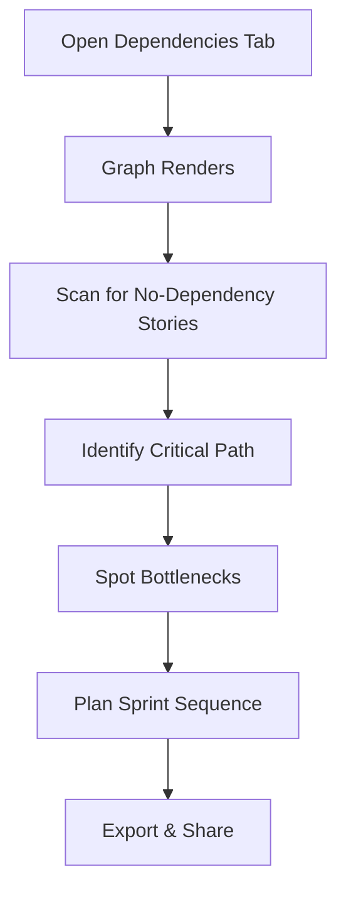

# Enhancement Incorporation Guide
## Strategic Improvements Integration Plan

**Date:** 2025-11-05
**Purpose:** Systematically incorporate 12 strategic improvements into existing Agent Orchestrator documentation
**Target Documents:** PRD.md, architecture.md, epics.md, ux-design.md (to be created)

---

## Executive Summary

This guide provides a detailed plan for incorporating strategic improvements identified during the ultrathink analysis into the Agent Orchestrator's existing documentation. The improvements are categorized by priority (V1, V1.5, V2, V3+) and mapped to specific document sections with agent assignments for implementation.

**Documentation Status:**
- ✅ **PRD.md** - Complete (1088 lines)
- ✅ **architecture.md** - Complete (2235 lines)
- ✅ **epics.md** - Complete (1808 lines)
- ❌ **ux-design.md** - Does not exist (needs creation)

**Total Enhancements:** 12 strategic improvements
**Implementation Approach:** Phased incorporation using BMAD agents and workflows

---

## Table of Contents

1. [Enhancement Priority Matrix](#enhancement-priority-matrix)
2. [Document Structure Analysis](#document-structure-analysis)
3. [Enhancement Mapping by Document](#enhancement-mapping-by-document)
4. [Detailed Enhancement Specifications](#detailed-enhancement-specifications)
5. [Implementation Workflow Guide](#implementation-workflow-guide)
6. [Agent Assignments](#agent-assignments)
7. [Order of Operations](#order-of-operations)
8. [Quality Validation](#quality-validation)

---

## Enhancement Priority Matrix

### V1 Priority (Must Have - Include in Initial Implementation)

| # | Enhancement | Business Value | Complexity | Documents Affected |
|---|-------------|----------------|------------|-------------------|
| 1 | **Alex (Code Review Agent)** | Critical quality assurance | Medium | PRD, Architecture, Epics, UX |
| 2 | **Security Gate** | Risk mitigation, compliance | Low | PRD, Architecture, Epics, UX |
| 3 | **Dependency Graph** | Visualization, planning | Medium | PRD, Architecture, Epics, UX |
| 4 | **TEA Workflows Required** | Quality foundation | Low | PRD, Architecture, Epics |

### V1.5 Priority (Should Have - High Value, Add Soon After MVP)

| # | Enhancement | Business Value | Complexity | Documents Affected |
|---|-------------|----------------|------------|-------------------|
| 5 | **CIS Agent Integration** | Strategic decision quality | Medium | PRD, Architecture, Epics, UX |
| 6 | **Implementation Readiness Gate** | Phase transition safety | Low | PRD, Architecture, Epics, UX |
| 7 | **Cost-Quality Optimizer** | Budget optimization | High | PRD, Architecture, Epics, UX |

### V2 Priority (Nice to Have - Future Enhancements)

| # | Enhancement | Business Value | Complexity | Documents Affected |
|---|-------------|----------------|------------|-------------------|
| 8 | **Knowledge Base Evolution** | Continuous improvement | High | PRD, Architecture |
| 9 | **Continuous Doc Sync** | Documentation accuracy | High | PRD, Architecture |
| 10 | **Multi-Epic Parallelism** | Speed multiplier | High | PRD, Architecture, Epics |
| 11 | **Context Pruning Intelligence** | Token optimization | Medium | PRD, Architecture |
| 12 | **Performance Monitoring** | Observability | Medium | PRD, Architecture, UX |

---

## Document Structure Analysis

### PRD.md Structure

```
├── Executive Summary (lines 1-30)
├── Project Classification (lines 31-67)
├── Success Criteria (lines 68-122)
├── Product Scope (lines 123-232)
│   ├── MVP - Minimum Viable Product
│   ├── Growth Features (Post-MVP)
│   └── Vision (Future)
├── Innovation & Novel Patterns (lines 242-327)
├── Developer Tool Specific Requirements (lines 329-517)
│   ├── API & Integration Requirements
│   ├── Authentication & Authorization
│   ├── Command-Line Interface
│   ├── Data Schemas
│   └── Error Handling
├── Functional Requirements (lines 519-763)
│   ├── Core Workflow Execution
│   ├── Agent Management
│   ├── Decision & Escalation Management
│   ├── State Management
│   ├── Git Worktree Operations
│   ├── Remote Access API
│   └── Web Dashboard
├── Non-Functional Requirements (lines 764-923)
│   ├── Performance
│   ├── Scalability
│   ├── Reliability
│   ├── Security
│   ├── Usability
│   ├── Maintainability
│   └── Cost Efficiency
├── Implementation Planning (lines 927-1006)
│   ├── Technology Stack
│   └── Epic Breakdown Required
└── References (lines 1008-1088)
```

**Key Insertion Points for Enhancements:**
- **Functional Requirements** (line ~519): Add new FR sections for agents, gates, visualizations
- **Product Scope → Growth Features** (line ~184): Add v1.1-v1.3 enhancements
- **Innovation & Novel Patterns** (line ~242): Add novel enhancement patterns
- **Epic Breakdown** (line ~969): Update epic structure

### architecture.md Structure

```
├── Executive Summary (lines 1-24)
├── System Architecture Overview (lines 26-128)
├── Component Architecture (lines 130-417)
│   ├── Core Kernel Components (Epic 1)
│   │   ├── Workflow Engine
│   │   ├── Agent Pool
│   │   ├── State Manager
│   │   ├── Worktree Manager
│   │   └── Template Processor
│   ├── Workflow Plugins (Epics 2-5)
│   └── Support Services
│       ├── Decision Engine
│       ├── Escalation Queue
│       └── Error Handler
├── Data Models (lines 567-808)
├── API Specifications (lines 809-979)
├── Technology Stack Decisions (lines 983-1235)
├── Security Architecture (lines 1237-1423)
├── Testing Strategy (lines 1425-1630)
├── Deployment Architecture (lines 1632-1855)
├── Scalability & Performance (lines 1857-1947)
├── Migration & Rollout Plan (lines 1949-2007)
├── Technical Decisions Log (lines 2009-2143)
└── Open Questions & Future Work (lines 2145-2235)
```

**Key Insertion Points for Enhancements:**
- **Component Architecture → Support Services** (line ~419): Add new service components
- **Component Architecture → Workflow Plugins** (line ~392): Add new workflows
- **Technology Stack** (line ~983): Update with new tools/patterns
- **Testing Strategy** (line ~1425): Add security testing, test gates
- **Technical Decisions Log** (line ~2009): Document enhancement decisions
- **Future Work** (line ~2167): Add V2 enhancements

### epics.md Structure

```
├── Overview (lines 1-30)
├── Epic Structure (lines 32-44)
├── Story 0.1: Project Scaffolding (lines 46-98)
├── Epic 1: Foundation & Core Engine (lines 100-355)
│   └── Stories 1.1 - 1.10
├── Epic 2: Analysis Phase Automation (lines 357-525)
│   └── Stories 2.1 - 2.7
├── Epic 3: Planning Phase Automation (lines 527-655)
│   └── Stories 3.1 - 3.5
├── Epic 4: Solutioning Phase Automation (lines 657-819)
│   └── Stories 4.1 - 4.7
├── Epic 5: Story Implementation Automation (lines 821-1017)
│   └── Stories 5.1 - 5.8
├── Epic 6: Remote Access & Monitoring (lines 1019-1277)
│   └── Stories 6.1 - 6.11
├── Implementation Sequencing & Phases (lines 1279-1502)
├── Dependency Summary (lines 1475-1517)
├── Story Validation & Quality Summary (lines 1519-1583)
└── Development Guidance & Best Practices (lines 1585-1808)
```

**Key Insertion Points for Enhancements:**
- **Epic Structure** (line ~32): Update epic count if needed
- **Epic 1 Stories** (line ~209): Add Cost-Quality Optimizer story
- **Epic 3 Stories** (line ~575): Add Security Gate story, TEA required updates
- **Epic 4 Stories** (line ~795): Add Dependency Graph, Readiness Gate stories
- **Epic 5 Stories** (line ~861): Add Alex agent stories, update review workflow
- **Epic 6 Stories** (line ~1159): Add visualization, monitoring stories
- **Future Work** (line ~1808): Add V2 enhancement stories

### ux-design.md Structure (To Be Created)

**Required Sections:**
```
├── Executive Summary
├── Design System Overview
│   ├── Color Palette
│   ├── Typography
│   ├── Components (shadcn/ui)
│   └── Spacing & Layout
├── Information Architecture
├── User Flows
│   ├── Project Creation Flow
│   ├── Workflow Monitoring Flow
│   ├── Escalation Response Flow
│   └── Story Tracking Flow
├── Page Designs
│   ├── Portfolio View (All Projects)
│   ├── Project Detail View
│   ├── Escalation Interface
│   ├── Story Kanban Board
│   ├── Security Gate Approval
│   ├── Code Review Interface
│   └── Dependency Graph Visualization
├── Component Specifications
└── Accessibility & Responsive Design
```

**Enhancement-Specific Sections Needed:**
- Security Gate approval interface
- Code Review status and comments interface
- Dependency Graph visualization component
- Implementation Readiness Gate checklist
- CIS agent invocation indicators
- Cost tracking dashboard
- Performance monitoring dashboard

---

## Enhancement Mapping by Document

### Enhancement 1: Alex (Code Review Agent)

**Priority:** V1 (Must Have)
**Complexity:** Medium
**Business Value:** Critical quality assurance, unbiased code review

#### PRD.md Updates

**Location 1: Functional Requirements → Agent Management**
Insert after line ~591 (after FR-AGENT-003):

```markdown
**FR-AGENT-004: Code Review Agent (Alex)**
- Dedicated agent for unbiased, thorough code review
- Separate LLM assignment from developer agent (Amelia)
- Review code against: project standards, security best practices, test coverage, code smells
- Generate review report with severity levels (critical, important, minor)
- Integration with Story Development Workflow after self-review
- Confidence scoring for review quality
- Escalate if critical issues found or confidence <0.85
```

**Location 2: Product Scope → MVP → Essential Infrastructure**
Update line ~164 (after Story 5.5):

```markdown
6. **Code Review Automation**
   - ✅ Alex agent with dedicated LLM for unbiased review
   - ✅ Automated code review workflow integrated with dev-story
   - ✅ Review report generation with actionable feedback
   - ✅ Security and quality gate enforcement
   - **Success**: >90% code quality score, <5% critical issues in production
```

**Location 3: Innovation & Novel Patterns**
Add new section after line ~326:

```markdown
### 6. Dedicated Code Review Agent

**Innovation**: Separate AI agent (Alex) with different LLM for code review, preventing confirmation bias.

**Why Novel**:
- Developer agent (Amelia) uses GPT-4 for code generation
- Review agent (Alex) uses Claude Sonnet for analytical review
- Different models = different perspectives = better quality
- Eliminates "reviewing own work" bias in AI systems

**Validation Approach**:
- Compare: Single-agent review vs dual-agent review
- Measure: Bug detection rate, code quality scores
- Track: False positive rate, review relevance

**Business Impact**:
- Higher code quality through unbiased review
- Reduced production bugs (target: 50% reduction)
- Competitive advantage through multi-model orchestration
```

#### architecture.md Updates

**Location 1: Component Architecture → Workflow Plugins**
Insert after line ~410:

```markdown
**Code Review Workflow (Epic 5):**
- Spawns Alex agent → Reviews implementation against standards
- Checks: security vulnerabilities, test coverage, code smells, naming conventions
- Generates review report with severity levels
- Escalates critical issues for human review
```

**Location 2: Component Architecture → Support Services**
Add after line ~467 (after Decision Engine):

```typescript
#### 2.3.4 Code Review Engine

**Responsibility:** Provide automated, unbiased code review with actionable feedback

**Key Classes:**
```typescript
interface CodeReview {
  storyId: string;
  reviewedBy: string; // "alex"
  reviewDate: Date;
  overallScore: number; // 0-100
  findings: ReviewFinding[];
  recommendations: string[];
  confidence: number; // 0-1
  criticalIssuesFound: boolean;
}

interface ReviewFinding {
  severity: 'critical' | 'important' | 'minor';
  category: 'security' | 'quality' | 'performance' | 'maintainability';
  file: string;
  line?: number;
  issue: string;
  recommendation: string;
}

class CodeReviewEngine {
  async reviewCode(
    storyId: string,
    worktreePath: string,
    standards: ProjectStandards
  ): Promise<CodeReview>;

  private async runSecurityScan(): Promise<ReviewFinding[]>;
  private async analyzeCodeQuality(): Promise<ReviewFinding[]>;
  private async checkTestCoverage(): Promise<ReviewFinding[]>;
  private assessOverallQuality(findings: ReviewFinding[]): number;
}
```

**Review Workflow:**
1. **Trigger**: After Amelia's self-review (Story 5.5)
2. **Alex Agent Invocation**: Spawn with Claude Sonnet LLM
3. **Multi-Faceted Review**:
   - Security scan (OWASP top 10, injection vulnerabilities)
   - Code quality (complexity, duplication, naming)
   - Test coverage (>80% target)
   - Architecture compliance
4. **Generate Report**: Structured findings with severity levels
5. **Confidence Check**: If confidence <0.85 or critical issues found → escalate
6. **Pass/Fail Decision**: Determine if code ready for PR creation
```

**Location 3: Technology Stack → Backend Stack**
Add after line ~1039:

```markdown
| **Code Review** | ESLint + security plugins | Static analysis for code quality and security |
```

**Location 4: Technical Decisions Log**
Add new decision after line ~2075 (TD-006):

```markdown
---

### TD-007: Dedicated Code Review Agent (Alex)

**Decision:** Use separate AI agent with different LLM for code review instead of same agent

**Context:** Need unbiased, thorough code review without confirmation bias

**Alternatives:**
1. **Same agent reviews own code**: Fast (rejected: confirmation bias)
2. **Human-only review**: High quality (rejected: slow, bottleneck)
3. **Separate AI agent with different LLM**: Unbiased, fast (chosen)

**Consequences:**
- ✅ Pro: Different LLM perspective reduces bias
- ✅ Pro: Amelia (GPT-4) codes, Alex (Claude Sonnet) reviews = diverse analysis
- ✅ Pro: Automated yet thorough review
- ❌ Con: Additional LLM costs (~$1-2 per review)
- ❌ Con: Slightly longer review time (<10 minutes)

**LLM Assignment:**
- Amelia (Developer): GPT-4 Turbo (superior code generation)
- Alex (Reviewer): Claude Sonnet (superior analytical reasoning)

**Status:** Accepted
```

#### epics.md Updates

**Location 1: Epic 5 Description**
Update lines 821-835:

```markdown
## Epic 5: Story Implementation Automation

**Goal:** Enable autonomous code development - agents implement stories with code, tests, and **thorough independent code review**, creating PRs automatically.

**Value Proposition:** The "parallel intelligence" magic moment. Stories develop autonomously with quality code, comprehensive tests, **unbiased code review from separate agent**, and clear PRs.

**Business Value:** 10x faster implementation (<2 hours per story vs 4-8 hours). Continuous progress. **Higher code quality through dual-agent review**. Parallel development ready (v1.1).

**Technical Scope:**
- Story context generation
- Amelia (Developer) agent
- Code generation and testing
- **Alex (Code Reviewer) agent** ← NEW
- **Automated code review workflow** ← NEW
- PR creation automation
```

**Location 2: Add New Stories**
Insert after Story 5.5 (line ~945):

```markdown
---

**Story 5.6: Alex Agent - Code Review Specialist Persona**

As the orchestrator core,
I want an Alex agent expert at unbiased code review,
So that story implementations receive thorough, independent quality assessment.

**Acceptance Criteria:**
1. Load Alex persona from bmad/bmm/agents/alex.md
2. Configure with project-assigned LLM from `.bmad/project-config.yaml` agent_assignments:
   - Supports any provider: Anthropic (Claude), OpenAI (GPT/Codex), Zhipu (GLM), Google (Gemini)
   - Recommended: Claude Sonnet for superior analytical reasoning and code review capabilities
   - Different LLM from Amelia to ensure diverse perspective (e.g., Amelia on GPT-4, Alex on Claude)
   - See Story 1.3 for configuration examples with multiple providers
3. Specialized prompts for: security review, code quality analysis, test coverage validation
4. Context includes: story requirements, project standards, Amelia's implementation, test results
5. Methods: reviewSecurity(), analyzeQuality(), validateTests(), generateReport()
6. Check against: OWASP top 10, code smells, complexity metrics, naming conventions
7. Generate structured review report with severity levels
8. Provide actionable recommendations for each finding
9. Make pass/fail decisions with confidence scoring

**Prerequisites:** Story 5.5 (Self Code Review), Epic 1 (Agent Pool)

**Estimated Time:** 2-3 hours

---

**Story 5.7: Code Review Workflow Integration**

As the story development workflow,
I want Alex agent to review code after self-review,
So that implementations receive independent quality validation before PR creation.

**Acceptance Criteria:**
1. Integrate Alex review step between Story 5.5 (Self Review) and Story 5.8 (PR Creation)
2. Spawn Alex agent with configured LLM (different from Amelia)
3. Provide Alex with:
   - Story context and acceptance criteria
   - Amelia's implementation code
   - Self-review report
   - Test results and coverage
   - Project coding standards
4. Execute multi-faceted review:
   - Security scan (static analysis, vulnerability detection)
   - Code quality check (complexity, duplication, maintainability)
   - Test coverage validation (>80% target)
   - Architecture compliance verification
5. Generate structured review report with findings categorized by severity
6. If critical issues found OR confidence <0.85:
   - Escalate to human for review
   - Provide detailed context and recommendations
7. If review passes:
   - Proceed to PR creation
   - Include review summary in PR description
8. If review fails but fixable:
   - Return to Amelia for fixes
   - Re-review after fixes
9. Track review metrics: time, findings count, pass/fail rate

**Prerequisites:** Story 5.6 (Alex Agent), Story 5.5 (Self Review)

**Estimated Time:** 3-4 hours
```

**Location 3: Renumber Subsequent Stories**
Update story numbers:
- Old Story 5.6 (PR Creation) → New Story 5.8
- Old Story 5.7 (Workflow Executor) → New Story 5.9
- Old Story 5.8 (PR Merge) → New Story 5.10

#### ux-design.md Updates (To Be Created)

**Add New Section: Code Review Interface**

```markdown
## Code Review Interface

### Overview
Display Alex agent's code review results with clear severity indicators and actionable feedback.

### Components

**Review Status Badge**
- Location: Story card in Kanban board, Project detail view
- States:
  - 🟡 "In Review" (Alex reviewing)
  - ✅ "Review Passed" (no critical issues)
  - ⚠️ "Review Failed" (critical issues found)
  - 🔴 "Review Escalated" (human review needed)
- Color-coded for quick visual scan

**Review Report Modal**
- Trigger: Click "View Review" button on story card
- Layout:
  ```
  ┌─────────────────────────────────────────┐
  │ Code Review Report - Story 5.3          │
  │ Reviewed by: Alex | Date: 2025-11-05    │
  ├─────────────────────────────────────────┤
  │ Overall Score: 87/100 ✅                │
  │ Confidence: 0.92                         │
  │                                          │
  │ Summary: 2 important issues, 3 minor    │
  ├─────────────────────────────────────────┤
  │ Findings by Severity:                    │
  │                                          │
  │ ⚠️ Important (2)                         │
  │ ├─ [Security] SQL injection risk        │
  │ │  File: backend/src/api/users.ts:42    │
  │ │  Issue: Unsanitized user input        │
  │ │  Fix: Use parameterized queries       │
  │ └─ [Quality] High complexity function   │
  │    File: backend/src/core/engine.ts:156 │
  │    Issue: Cyclomatic complexity: 18     │
  │    Fix: Extract smaller functions       │
  │                                          │
  │ ℹ️ Minor (3)                             │
  │ ├─ [Style] Inconsistent naming          │
  │ ├─ [Performance] Unoptimized loop       │
  │ └─ [Maintainability] Missing JSDoc      │
  │                                          │
  │ ✅ Recommendations:                      │
  │ • Add input validation layer            │
  │ • Refactor executeStep() method         │
  │ • Update documentation                  │
  ├─────────────────────────────────────────┤
  │ [View Full Report] [Accept & Continue]  │
  └─────────────────────────────────────────┘
  ```
- Expandable finding cards with file links
- "View in GitHub" links to specific lines
- Actions: Accept review, Request re-review, Escalate

**Review Timeline**
- Show in Project Detail → Events log
- Format: "Alex completed code review for Story 5.3 (Score: 87/100)"
- Link to full report
```

---

### Enhancement 2: Security Gate

**Priority:** V1 (Must Have)
**Complexity:** Low
**Business Value:** Risk mitigation, compliance readiness

#### PRD.md Updates

**Location 1: Functional Requirements → New Section**
Insert after line ~518 (before Core Workflow Execution):

```markdown
### Security Gate Validation

**FR-SEC-006: Mandatory Security Gate**
- **Input**: Completed architecture.md document
- **Process**:
  - Validate security architecture section completeness
  - Check authentication/authorization specifications
  - Verify data encryption strategy defined
  - Validate input validation approach documented
  - Check API security (rate limiting, CORS, CSP)
  - Assess threat model coverage
  - Review secrets management strategy
- **Output**: Security gate approval or escalation with gaps identified
- **Acceptance Criteria**:
  - Security gate executes after architecture workflow, before solutioning phase
  - All required security sections present and detailed
  - Threat model addresses OWASP Top 10
  - <1 escalation per project (clear security requirements)
  - Gate completion in <5 minutes (automated checks)
```

**Location 2: Product Scope → MVP**
Update line ~141 (add to Planning Phase Automation):

```markdown
2. **Planning Phase Automation**
   - ✅ Architecture workflow with Winston (Architect) and Murat (Test Architect)
   - ✅ **Security gate validation before solutioning** ← NEW
   - ✅ Technical decisions documentation
   - ✅ System design and data models
   - **Success**: Complete architecture in <45 minutes, **security gate passes**, <2 escalations
```

**Location 3: Non-Functional Requirements → Security**
Add after line ~856 (NFR-SEC-005):

```markdown
**NFR-SEC-006: Security Gate Compliance**
- Mandatory security validation checkpoint after architecture phase
- Block progression to solutioning if security requirements incomplete
- Automated checks for:
  - Authentication & authorization specified
  - Secrets management strategy defined
  - Input validation approach documented
  - API security measures defined (rate limiting, CORS, CSP)
  - Data encryption strategy specified
- Human escalation if gaps detected
- Audit trail of security gate decisions
```

#### architecture.md Updates

**Location 1: Component Architecture → Support Services**
Add after line ~519 (after Escalation Queue):

```markdown
#### 2.3.5 Security Gate Validator

**Responsibility:** Validate architecture security completeness before solutioning phase

**Key Classes:**
```typescript
interface SecurityGateCheck {
  category: string;
  requirement: string;
  satisfied: boolean;
  evidence?: string;
  recommendation?: string;
}

interface SecurityGateResult {
  passed: boolean;
  overallScore: number; // 0-100
  checks: SecurityGateCheck[];
  gaps: string[];
  escalationRequired: boolean;
  timestamp: Date;
}

class SecurityGateValidator {
  async validateArchitecture(
    architecturePath: string
  ): Promise<SecurityGateResult>;

  private checkAuthenticationSpec(): SecurityGateCheck;
  private checkSecretsManagement(): SecurityGateCheck;
  private checkInputValidation(): SecurityGateCheck;
  private checkAPISecurityMeasures(): SecurityGateCheck;
  private checkDataEncryption(): SecurityGateCheck;
  private checkThreatModel(): SecurityGateCheck;

  private generateGapReport(checks: SecurityGateCheck[]): string[];
  private determineEscalation(gaps: string[]): boolean;
}
```

**Validation Workflow:**
1. **Trigger**: After architecture workflow completes (Story 3.5)
2. **Load Architecture**: Read docs/architecture.md
3. **Execute Checks**: Validate each security category
4. **Score Calculation**: (Satisfied checks / Total checks) × 100
5. **Pass/Fail Decision**:
   - Score ≥95%: Pass (proceed to solutioning)
   - Score <95%: Fail (escalate with gap report)
6. **Audit Trail**: Log gate decision and evidence

**Security Check Categories:**
- **Authentication & Authorization** (Required):
  - Strategy specified (JWT, OAuth, session-based)
  - User permissions model defined
  - API authentication mechanism documented
- **Secrets Management** (Required):
  - Storage strategy specified (env vars, vault, secrets manager)
  - Rotation policy documented
  - No secrets in code policy enforced
- **Input Validation** (Required):
  - Validation approach specified (schema validation, sanitization)
  - SQL injection prevention documented
  - XSS prevention documented
- **API Security** (Required):
  - Rate limiting strategy defined
  - CORS configuration specified
  - CSP (Content Security Policy) defined
- **Data Encryption** (Required):
  - At-rest encryption strategy
  - In-transit encryption (HTTPS/TLS)
  - Sensitive data handling specified
- **Threat Modeling** (Required):
  - OWASP Top 10 addressed
  - Attack surface analysis documented
  - Risk mitigation strategies defined

**Escalation Criteria:**
- Any required category unsatisfied
- Evidence insufficient for validation
- Conflicting security specifications
- Missing threat model for high-risk project

---
```

**Location 2: Testing Strategy**
Add after line ~1449 (after Unit Testing):

```markdown
### 7.2.5 Security Testing

**Scope:** Validate security controls and identify vulnerabilities

**Tools:** OWASP ZAP, npm audit, Snyk, ESLint security plugins

**Security Test Types:**

**1. Static Application Security Testing (SAST)**
```typescript
// Example: ESLint security scan
describe('Security - Static Analysis', () => {
  it('should have no high-severity vulnerabilities', async () => {
    const scanResults = await runStaticSecurityScan('src/');
    const highSeverity = scanResults.filter(v => v.severity === 'high');
    expect(highSeverity).toHaveLength(0);
  });
});
```

**2. Dependency Vulnerability Scanning**
- Run `npm audit` in CI/CD
- Fail build if high/critical vulnerabilities
- Track exceptions with justification

**3. Security Gate Integration Tests**
```typescript
describe('Security Gate Validator', () => {
  it('should pass architecture with complete security specs', async () => {
    const result = await securityGate.validateArchitecture('test-fixtures/secure-arch.md');
    expect(result.passed).toBe(true);
    expect(result.overallScore).toBeGreaterThan(95);
  });

  it('should fail architecture missing authentication spec', async () => {
    const result = await securityGate.validateArchitecture('test-fixtures/incomplete-arch.md');
    expect(result.passed).toBe(false);
    expect(result.gaps).toContain('Authentication strategy not specified');
  });
});
```

**4. API Security Tests**
- Test rate limiting enforcement
- Validate CORS configuration
- Check CSP headers
- Test authentication bypass attempts

**Coverage Target:** 100% security gate checks covered by tests
```

**Location 3: Technical Decisions Log**
Add after TD-007:

```markdown
---

### TD-008: Mandatory Security Gate After Architecture

**Decision:** Require security gate validation before proceeding to solutioning phase

**Context:** Architecture documents often lack sufficient security detail, leading to vulnerabilities discovered late

**Alternatives:**
1. **Optional security review**: Fast (rejected: security often skipped)
2. **Security review during implementation**: Catches issues (rejected: too late, expensive fixes)
3. **Mandatory security gate after architecture**: Early validation (chosen)

**Consequences:**
- ✅ Pro: Security considered upfront, not afterthought
- ✅ Pro: Clear security requirements before implementation
- ✅ Pro: Reduced vulnerability discovery in production
- ✅ Pro: Compliance readiness (SOC 2, ISO 27001)
- ❌ Con: Adds 5-10 minutes to architecture phase
- ❌ Con: May escalate if security not well-defined initially

**Validation Criteria:**
- OWASP Top 10 addressed
- Authentication & authorization specified
- Secrets management strategy defined
- Data encryption approach documented
- API security measures defined

**Status:** Accepted

---
```

#### epics.md Updates

**Location 1: Epic 3 Description**
Update lines 527-540:

```markdown
## Epic 3: Planning Phase Automation

**Goal:** Enable autonomous architecture design with **mandatory security validation**, eliminating the architect bottleneck and producing **secure** technical specifications automatically.

**Value Proposition:** System architecture emerges from requirements automatically. Technical decisions documented with rationale. Testing strategies defined upfront. **Security gate ensures compliance before solutioning**.

**Business Value:** 10x faster architecture phase (<45 minutes vs 4-8 hours). Consistent quality. **Reduced security vulnerabilities through early validation**. No waiting for architect availability.

**Technical Scope:**
- Architecture workflow execution
- Winston (Architect) and Murat (Test Architect) agents
- **Security gate validation** ← NEW
- Technical decisions logging
- Architecture document generation
```

**Location 2: Add New Story**
Insert after Story 3.5 (line ~650):

```markdown
---

**Story 3.6: Security Gate Validation Workflow**

As an autonomous orchestrator prioritizing security,
I want mandatory security validation after architecture design,
So that security requirements are complete before proceeding to solutioning.

**Acceptance Criteria:**
1. Implement SecurityGateValidator class with comprehensive security checks
2. Execute automatically after Story 3.5 (Architecture Template generation)
3. Validate required security sections in architecture.md:
   - Authentication & Authorization strategy
   - Secrets Management approach
   - Input Validation strategy
   - API Security measures (rate limiting, CORS, CSP)
   - Data Encryption (at-rest and in-transit)
   - Threat Model (OWASP Top 10 coverage)
4. Generate SecurityGateResult with:
   - Pass/fail status (≥95% score to pass)
   - Detailed check results per category
   - Gap analysis for failed checks
   - Actionable recommendations
5. If gate fails (score <95%):
   - Generate gap report with specific missing elements
   - Escalate to user with recommendations
   - Block progression to solutioning phase
6. If gate passes:
   - Update workflow-status.yaml (security_gate: passed)
   - Proceed to Epic 4 (Solutioning)
7. Log security gate decision with evidence for audit trail
8. Complete gate validation in <5 minutes
9. Track metrics: pass rate, common gaps, escalation frequency

**Prerequisites:** Story 3.5 (Architecture Template Generation)

**Estimated Time:** 2-3 hours

---
```

**Location 3: Update Phase 2B Completion Gate**
Update line ~1387:

```markdown
**Phase 2B Completion Gate:** ✅ Architecture workflow generates technical specs autonomously **AND security gate passes validation**
```

#### ux-design.md Updates (To Be Created)

**Add New Section: Security Gate Interface**

```markdown
## Security Gate Interface

### Overview
Display security gate validation results with clear pass/fail status and actionable gap analysis.

### Components

**Security Gate Status Badge**
- Location: Project detail view, Phase progress indicator
- States:
  - 🟡 "Security Validation In Progress"
  - ✅ "Security Gate Passed (98/100)"
  - ⚠️ "Security Gate Failed - Review Required"
- Color-coded for quick status check

**Security Gate Report Modal**
- Trigger: Click "View Security Report" in project detail
- Layout:
  ```
  ┌────────────────────────────────────────────┐
  │ Security Gate Validation Report            │
  │ Project: Agent Orchestrator                 │
  │ Date: 2025-11-05 | Score: 98/100 ✅        │
  ├────────────────────────────────────────────┤
  │ Overall Status: PASSED                      │
  │ All critical security requirements met      │
  ├────────────────────────────────────────────┤
  │ Security Checks:                            │
  │                                             │
  │ ✅ Authentication & Authorization           │
  │    Strategy: JWT-based authentication       │
  │    Evidence: Section 6.2 (Auth & Auth)     │
  │                                             │
  │ ✅ Secrets Management                       │
  │    Strategy: Environment variables + Vault  │
  │    Evidence: Section 6.2 (Secrets Mgmt)    │
  │                                             │
  │ ✅ Input Validation                         │
  │    Strategy: Zod schema validation          │
  │    Evidence: Section 6.2 (Input Validation)│
  │                                             │
  │ ✅ API Security                             │
  │    Measures: Rate limiting, CORS, CSP       │
  │    Evidence: Section 6.2 (Network Security)│
  │                                             │
  │ ✅ Data Encryption                          │
  │    Strategy: TLS 1.2+, encrypted env vars   │
  │    Evidence: Section 6.2 (Network Security)│
  │                                             │
  │ ⚠️ Threat Model (Minor Gap)                 │
  │    Status: OWASP Top 10 addressed (90%)    │
  │    Gap: SSRF mitigation not fully detailed  │
  │    Recommendation: Add URL validation spec  │
  ├────────────────────────────────────────────┤
  │ [View Full Architecture] [Continue to Solutioning] │
  └────────────────────────────────────────────┘
  ```
- Expandable check cards showing evidence
- Links to architecture sections
- For failed gates: Gap report with recommendations

**Failed Gate Escalation**
- Alert: "Security Gate Failed - Action Required"
- List missing/incomplete security specifications
- Provide recommendations and examples
- Action: "Update Architecture" button → Re-opens architecture workflow
- Block "Start Solutioning" until gate passes
```

---

### Enhancement 3: Dependency Graph Visualization

**Priority:** V1 (Must Have)
**Complexity:** Medium
**Business Value:** Visual clarity for planning, dependency understanding

#### PRD.md Updates

**Location 1: Functional Requirements → Web Dashboard**
Insert after line ~750 (after FR-DASH-004):

```markdown
**FR-DASH-005: Dependency Graph Visualization**
- **Input**: Story dependencies from sprint-status.yaml
- **Processing**:
  - Generate interactive dependency graph (nodes = stories, edges = dependencies)
  - Visualize story status with color coding
  - Show worktree activity indicators
  - Highlight critical path and blocking dependencies
  - Support pan/zoom for large graphs
- **Output**: Interactive SVG graph with click-to-detail functionality
- **Acceptance Criteria**:
  - Graph renders all stories and dependencies accurately
  - Real-time updates as story status changes
  - Mobile-responsive (simplified view on small screens)
  - Click node → open story detail panel
  - Export graph as PNG/SVG
  - <2 second render time for graphs up to 100 stories
```

**Location 2: Product Scope → MVP → Web Dashboard**
Update line ~173 (add to dashboard features):

```markdown
5. **Story Dependency Visualization**
   - ✅ Interactive dependency graph showing story relationships
   - ✅ Real-time status updates (pending, in-progress, review, merged)
   - ✅ Worktree activity indicators
   - ✅ Critical path highlighting
   - **Success**: Users understand dependencies at a glance, <5 seconds to identify blockers
```

**Location 3: Innovation & Novel Patterns**
Add new section after line ~356:

```markdown
### 7. Visual Dependency Intelligence

**Innovation**: AI-generated dependency graph with real-time worktree status overlay

**Why Novel**:
- Most PM tools show static dependencies in lists/tables
- We combine: dependency graph + git worktree status + real-time updates
- Visual representation makes parallel development comprehensible
- Critical path automatically calculated and highlighted

**Validation Approach**:
- A/B test: Dependency graph vs list view
- Measure: Time to identify blocking dependencies
- Track: User preference, error rate in parallel development

**Business Impact**:
- Faster sprint planning (visual dependencies)
- Reduced blocked stories (clear dependency view)
- Confident parallel development (worktree status visible)
```

#### architecture.md Updates

**Location 1: Component Architecture → Support Services**
Add after line ~519 (after Security Gate Validator):

```typescript
#### 2.3.6 Dependency Graph Generator

**Responsibility:** Generate interactive dependency graphs from story relationships

**Key Classes:**
```typescript
interface StoryNode {
  id: string;
  title: string;
  status: 'pending' | 'in_progress' | 'review' | 'merged' | 'blocked';
  epic: string;
  worktreeActive: boolean;
  confidence?: number;
}

interface DependencyEdge {
  source: string; // story ID
  target: string; // story ID
  type: 'hard' | 'soft'; // hard = blocking, soft = suggested order
  blocking: boolean;
}

interface DependencyGraph {
  nodes: StoryNode[];
  edges: DependencyEdge[];
  criticalPath: string[]; // array of story IDs
  metadata: {
    totalStories: number;
    parallelizable: number;
    bottlenecks: string[];
  };
}

class DependencyGraphGenerator {
  async generateGraph(
    sprintStatusPath: string
  ): Promise<DependencyGraph>;

  private detectDependencies(stories: Story[]): DependencyEdge[];
  private calculateCriticalPath(graph: DependencyGraph): string[];
  private identifyBottlenecks(graph: DependencyGraph): string[];
  private detectParallelizable(graph: DependencyGraph): number;

  async exportToSVG(graph: DependencyGraph): Promise<string>;
  async exportToPNG(graph: DependencyGraph): Promise<Buffer>;
}
```

**Graph Generation Workflow:**
1. **Load Data**: Read sprint-status.yaml and story files
2. **Parse Dependencies**: Extract prerequisites from story metadata
3. **Build Graph Structure**: Create nodes and edges
4. **Calculate Metrics**:
   - Critical path (longest dependency chain)
   - Bottlenecks (stories blocking multiple others)
   - Parallelizable count (stories with no blocking dependencies)
5. **Generate Visualization**: Create interactive SVG with D3.js
6. **Real-Time Updates**: Subscribe to WebSocket for status changes

**Visualization Features:**
- **Node Rendering**:
  - Circle shape, color-coded by status
  - Size based on story complexity (acceptance criteria count)
  - Badge for worktree active indicator
  - Label: Story ID
- **Edge Rendering**:
  - Solid line for hard dependencies (blocking)
  - Dashed line for soft dependencies (suggested order)
  - Red highlight for blocking dependencies
- **Interactions**:
  - Pan/zoom with mouse or touch
  - Click node → Open story detail panel
  - Hover node → Show story title tooltip
  - Click edge → Show dependency details
- **Layout Algorithm**: Hierarchical layout (dependencies flow top-to-bottom)

---
```

**Location 2: Technology Stack → Frontend Stack**
Add after line ~1114:

```markdown
| **Data Visualization** | D3.js v7 | Interactive dependency graphs, force-directed layouts |
```

**Location 3: API Specifications → State Query Endpoints**
Add after line ~942:

```markdown
### 4.4.5 Dependency Graph Endpoint

**Endpoint:** `GET /api/projects/:id/dependency-graph`

**Description:** Generate dependency graph for project stories

**Response:**
```typescript
{
  "nodes": [
    {
      "id": "story-001",
      "title": "Project Repository Structure",
      "status": "merged",
      "epic": "epic-1",
      "worktreeActive": false,
      "confidence": 0.95
    }
  ],
  "edges": [
    {
      "source": "story-001",
      "target": "story-002",
      "type": "hard",
      "blocking": false
    }
  ],
  "criticalPath": ["story-001", "story-002", "story-005"],
  "metadata": {
    "totalStories": 25,
    "parallelizable": 8,
    "bottlenecks": ["story-005", "story-012"]
  }
}
```

**Query Parameters:**
- `epic` (optional): Filter by epic ID
- `status` (optional): Filter by story status
- `format` (optional): `json` (default) or `svg` or `png`
```

**Location 4: Technical Decisions Log**
Add after TD-008:

```markdown
---

### TD-009: Dependency Graph Visualization

**Decision:** Use D3.js for interactive dependency graph visualization

**Context:** Need to visualize story dependencies and parallel development status

**Alternatives:**
1. **Static image generation**: Simple (rejected: not interactive, no real-time updates)
2. **React Flow**: Modern React library (rejected: overkill for our use case)
3. **D3.js**: Mature, flexible data visualization (chosen)
4. **Mermaid.js**: Simple diagrams (rejected: limited interactivity)

**Consequences:**
- ✅ Pro: Maximum customization for our specific needs
- ✅ Pro: Mature library with extensive documentation
- ✅ Pro: SVG output = scalable, accessible
- ✅ Pro: Real-time updates via data rebinding
- ❌ Con: Steeper learning curve than React Flow
- ❌ Con: Manual layout management

**Implementation Notes:**
- Use hierarchical layout (dependencies top-to-bottom)
- Color-code nodes by status (green/amber/red/blue/gray)
- Show worktree status with badge overlay
- Calculate critical path using topological sort
- Export to SVG/PNG for offline viewing

**Status:** Accepted

---
```

#### epics.md Updates

**Location 1: Epic 4 Description**
Update lines 657-670 to emphasize visualization:

```markdown
## Epic 4: Solutioning Phase Automation

**Goal:** Automatically decompose requirements into implementable epics and stories **with visual dependency mapping**, enabling immediate development kickoff.

**Value Proposition:** Requirements break down into bite-sized stories autonomously. Dependencies mapped **and visualized**. Ready-to-develop stories generated in minutes.

**Business Value:** Eliminates story writing bottleneck. Consistent quality. **Dependencies detected and visualized automatically for planning clarity**.

**Technical Scope:**
- Epic/story generation workflow
- Bob (Scrum Master) agent
- Story dependency detection
- **Dependency graph generation and visualization** ← NEW
- Sprint status file generation
```

**Location 2: Add New Story**
Insert after Story 4.7 (line ~819):

```markdown
---

**Story 4.8: Dependency Graph Data Generation**

As the solutioning workflow,
I want to generate dependency graph data during story decomposition,
So that story relationships are captured for visualization and planning.

**Acceptance Criteria:**
1. Implement DependencyGraphGenerator class with graph generation logic
2. Execute automatically after Story 4.4 (Dependency Detection)
3. Analyze story prerequisites to build dependency edges:
   - Hard dependencies (blocking): Story A must complete before Story B
   - Soft dependencies (suggested): Story A should complete before Story B for logical flow
4. Create dependency graph structure:
   - Nodes: All stories with metadata (ID, title, status, epic, complexity)
   - Edges: Dependency relationships with type (hard/soft) and blocking status
5. Calculate graph metrics:
   - Critical path (longest dependency chain from start to finish)
   - Bottlenecks (stories blocking ≥3 other stories)
   - Parallelizable stories (no blocking dependencies)
6. Detect circular dependencies and escalate if found
7. Save graph data to docs/dependency-graph.json:
   ```json
   {
     "nodes": [...],
     "edges": [...],
     "criticalPath": [...],
     "metadata": {
       "totalStories": N,
       "parallelizable": M,
       "bottlenecks": [...]
     }
   }
   ```
8. Update sprint-status.yaml with graph generation timestamp
9. Complete graph generation in <30 seconds
10. Track metrics: graph complexity, critical path length, bottleneck count

**Prerequisites:** Story 4.4 (Dependency Detection & Sequencing)

**Estimated Time:** 2-3 hours

---
```

**Location 3: Update Phase 3 Completion Gate**
Update line ~1410:

```markdown
**Phase 3 Completion Gate:** ✅ Stories generate automatically from PRD + Architecture **AND dependency graph generated for visualization**
```

**Location 4: Epic 6 - Add Visualization Story**
Insert after Story 6.11 (line ~1275):

```markdown
---

**Story 6.12: Dependency Graph Visualization Component**

As a user planning sprint work,
I want to see story dependencies in an interactive visual graph,
So that I can understand relationships and identify blockers at a glance.

**Acceptance Criteria:**
1. Implement DependencyGraph React component using D3.js
2. Fetch dependency graph data from GET /api/projects/:id/dependency-graph
3. Render interactive SVG visualization:
   - **Nodes**: Circular, color-coded by status
     - Pending: Gray (#9CA3AF)
     - In-Progress: Blue (#3B82F6, animated pulsing border)
     - Review: Amber (#F59E0B)
     - Merged: Green (#10B981)
     - Blocked: Red (#EF4444)
   - **Node Size**: Based on story complexity (small: 32px, medium: 48px, large: 64px)
   - **Node Labels**: Story ID (centered inside circle)
   - **Worktree Indicator**: Orange badge (top-right corner) if worktree active
   - **Edges**: Lines connecting dependent stories
     - Solid line: Hard dependency (blocking)
     - Dashed line: Soft dependency (suggested order)
     - Red color: Blocking (target story can't start)
     - Gray color: Non-blocking
4. Layout algorithm: Hierarchical (dependencies flow top-to-bottom)
   - Stories with no dependencies at top
   - Dependent stories below their prerequisites
   - Critical path highlighted with thicker edges
5. Interactions:
   - **Pan/Zoom**: Mouse drag to pan, scroll to zoom
   - **Click Node**: Open story detail slide-over panel
   - **Hover Node**: Show tooltip with story title and status
   - **Click Edge**: Show dependency details tooltip
   - **Double-Click Background**: Reset zoom to fit
6. Real-time updates via WebSocket:
   - When story status changes → Update node color
   - When dependency added/removed → Rebuild graph
   - Smooth transitions (500ms) for visual changes
7. Responsive behavior:
   - **Desktop**: Full graph, all interactions enabled
   - **Tablet**: Simplified graph, touch-optimized
   - **Mobile**: List view fallback with expandable dependencies
8. Export functionality:
   - Button to export graph as PNG (download)
   - Button to export graph as SVG (download)
   - Button to copy shareable link to graph view
9. Accessibility:
   - ARIA label: "Story dependency graph for [project name]"
   - Keyboard navigation: Tab through nodes, Enter to open story
   - Screen reader: Provide text alternative listing dependencies
10. Performance:
    - Render graph in <2 seconds for up to 100 stories
    - Smooth animations (60 FPS)
    - Virtualization for graphs >100 stories (only render visible nodes)
11. Integration with Project Detail view:
    - New tab: "Dependencies" (alongside Kanban, Chat, Details)
    - Toggle: "Show Graph View" / "Show List View"
    - Filter controls: By epic, by status, by blocking

**Prerequisites:** Story 6.4 (State Query Endpoints), Story 4.8 (Graph Data Generation), Epic 4 complete

**Estimated Time:** 4-5 hours

---
```

#### ux-design-specification.md Updates

**Location: Section 6 - Component Library**
Add after line ~639 (after DependencyGraph component placeholder):

```markdown
**UPDATED: 7. DependencyGraph Component (Detailed Specification)**

**Purpose:** Visualize story dependencies with real-time worktree status for sprint planning

**Enhanced Anatomy:**
- **SVG Canvas**: Scalable vector graphics container
- **Nodes (Story Circles)**:
  - Circle shape with status-based color fill
  - Story ID label (centered, white text)
  - Size varies by complexity:
    - Small (32px): 1-5 acceptance criteria
    - Medium (48px): 6-10 acceptance criteria
    - Large (64px): 11+ acceptance criteria
  - Worktree badge (top-right): Orange circle with "W" icon
  - Confidence indicator (bottom-right): Small percentage badge (if AI-generated)
- **Edges (Dependency Lines)**:
  - Source: Prerequisite story node
  - Target: Dependent story node
  - Line style:
    - Solid: Hard dependency (blocking)
    - Dashed: Soft dependency (suggested order)
  - Color:
    - Red (#EF4444): Blocking (target can't start)
    - Gray (#9CA3AF): Non-blocking
  - Arrow head at target end
- **Critical Path Highlight**:
  - Thicker edges (3px vs 1.5px)
  - Blue color (#2563EB)
  - Dashed glow effect
- **Layout**:
  - Hierarchical (top-to-bottom flow)
  - No-dependency stories at top
  - Dependent stories below prerequisites
  - Auto-spacing to prevent overlaps
- **Controls**:
  - Zoom slider (bottom-right)
  - Pan indicator (center when not at default view)
  - Reset button ("Fit to View")
  - Export dropdown (PNG, SVG, Link)
- **Legend**:
  - Status colors (Pending, In-Progress, Review, Merged, Blocked)
  - Edge types (Hard, Soft, Critical Path)
  - Icon meanings (Worktree active, Confidence score)

**Enhanced States:**
- **Loading**: Skeleton placeholder with animated shimmer
- **Default**: Full graph rendered, nodes static
- **Hover Node**: Node elevates (drop shadow), tooltip appears, connected edges highlight
- **Selected Node**: Node border thickens, connected dependencies highlighted
- **Panning**: Cursor changes to grab hand, graph moves with mouse
- **Zooming**: Graph scales smoothly, labels fade in/out based on zoom level
- **Updating**: Smooth transitions (500ms) when node status changes
- **Error**: Error message overlay, "Unable to load dependency graph"

**Enhanced Variants:**
- **Desktop Full**: Complete graph with all interactions, filters sidebar
- **Tablet**: Simplified graph, touch-optimized, swipe to pan
- **Mobile**: List view with expandable dependencies (graph too complex for small screens)

**Enhanced Behavior:**
- **Click Node**: Open story detail slide-over panel (right side)
- **Double-Click Node**: Center and zoom to node + immediate dependencies
- **Hover Node**: Show tooltip with story title, status, epic, worktree status
- **Click Edge**: Show tooltip with dependency type and reason
- **Drag Node**: If manual layout enabled, update node position (save to preferences)
- **Scroll**: Zoom in/out centered on mouse position
- **Pinch (Touch)**: Zoom in/out on touch devices
- **Pan**: Click-and-drag background to move graph
- **Export PNG**: Download current view as PNG image
- **Export SVG**: Download graph as SVG file (editable)
- **Share Link**: Copy URL with graph view state (zoom, pan, selected node)
- **Real-Time Updates**:
  - WebSocket event: story.status.changed → Update node color
  - WebSocket event: dependency.added → Add new edge
  - WebSocket event: dependency.removed → Remove edge
  - All changes animated smoothly (no jarring redraws)

**Enhanced Accessibility:**
- **ARIA Attributes**:
  - role="img" with aria-label="Story dependency graph for [project name]"
  - Each node: role="button" with aria-label="Story [ID]: [title], Status: [status]"
- **Keyboard Navigation**:
  - Tab: Focus next node (in topological order)
  - Shift+Tab: Focus previous node
  - Enter: Open focused node detail
  - Arrow keys: Pan graph
  - +/-: Zoom in/out
  - R: Reset view to fit
- **Screen Reader Support**:
  - Provide text alternative: "Dependency list" with hierarchical structure
  - Announce status changes: "Story 005 status changed to In Progress"
- **Focus Indicators**:
  - 3px blue outline on focused node
  - Skip link: "Skip to dependency list"

**Enhanced Implementation Notes:**
- **Library**: D3.js v7 for data binding and SVG manipulation
- **Layout Algorithm**: d3-hierarchy with topological sort
- **Performance**:
  - Virtualization for >100 nodes (only render visible)
  - Canvas fallback for >500 nodes (WebGL acceleration)
  - Debounce zoom/pan events (16ms = 60 FPS)
- **Data Refresh**: Poll every 10 seconds or use WebSocket
- **State Management**: Zustand slice for graph state (zoom, pan, selected node)
- **Export**: html2canvas for PNG, native SVG serialization
```

**Location: Section 5 - User Journey Flows**
Add new journey after Journey 4:

```markdown
---

**Journey 5: Sprint Planning with Dependency Graph (Desktop)**

**Goal**: Plan sprint work by understanding story dependencies and identifying parallel work

**Flow:**
1. **Entry**: Open Project X detail view
2. **Navigate to Dependencies**: Click "Dependencies" tab (alongside Kanban tab)
3. **Graph Loads**: Dependency graph renders with all 25 stories
   - Visual scan reveals:
     - 8 stories at top (no dependencies, can start immediately)
     - Critical path highlighted: 6 stories in sequence (longest chain)
     - 2 bottleneck stories (blocking 4+ other stories)
4. **Identify Parallel Work**: User sees:
   - Stories 001-008 can develop in parallel (no dependencies)
   - Stories 009-015 depend on 005 (bottleneck)
   - Stories 016-025 can start after 012
5. **Spot Bottleneck**: Hover over Story 005 (red highlighted)
   - Tooltip: "Story 005: LLM Factory - Blocks 8 stories"
   - User understands this should be prioritized
6. **Plan Sprints**:
   - Sprint 1: Stories 001-008 (parallel development)
   - Sprint 2: Story 005 (bottleneck removal) + independent stories
   - Sprint 3: Stories 009-015 (unblocked after 005)
7. **Export for Team**: Click "Export PNG" → Download graph image
8. **Share**: Copy graph link → Paste in Slack for team review
9. **Success**: Sprint planned in <10 minutes, dependencies understood, bottlenecks identified

**Mermaid Diagram:**

```

---

### Enhancement 4: TEA Workflows Required (Not Optional)

**Priority:** V1 (Must Have)
**Complexity:** Low
**Business Value:** Quality foundation, test infrastructure

#### PRD.md Updates

**Location 1: Product Scope → MVP → Planning Phase**
Update line ~141 to make TEA required:

```markdown
2. **Planning Phase Automation**
   - ✅ Architecture workflow with Winston (Architect) and **Murat (Test Architect - required)** ← UPDATED
   - ✅ Security gate validation before solutioning
   - ✅ Technical decisions documentation
   - ✅ **Test strategy and infrastructure planning (required)** ← NEW
   - ✅ System design and data models
   - **Success**: Complete architecture in <45 minutes, security gate passes, **test strategy defined**, <2 escalations
```

**Location 2: Non-Functional Requirements → Testing**
Add after line ~905:

```markdown
**NFR-TEST-007: Test Architecture Required**
- Test strategy must be defined during architecture phase
- Test infrastructure (frameworks, patterns) specified before implementation
- All epics must include test planning stories
- ATDD (Acceptance Test-Driven Development) enforced:
  - Tests written before implementation
  - Acceptance criteria mapped to test cases
  - CI/CD pipeline validates all tests pass
- Minimum test coverage: 80% for new code
```

**Location 3: Success Criteria**
Update line ~97 (Testing success criteria):

```markdown
**Testing & Quality**
- ✅ Test strategy defined in architecture phase (required, not optional)
- ✅ All stories include test acceptance criteria
- ✅ 80%+ code coverage for new code
- ✅ Automated test execution in CI/CD
- ✅ Zero critical bugs in production
```

#### architecture.md Updates

**Location 1: Component Architecture → Workflow Plugins**
Update line ~405 (Planning workflows):

```markdown
**Planning Phase Workflows (Epic 3):**
- Architecture workflow → Winston (Architect) defines system design
- **Test architecture workflow (REQUIRED)** → Murat (Test Architect) defines test strategy ← UPDATED
  - Test framework selection
  - Test pyramid definition (unit, integration, E2E ratios)
  - CI/CD pipeline specification
  - Quality gates definition
- Security gate validation → Validates architecture completeness
```

**Location 2: Testing Strategy**
Update line ~1425 to emphasize ATDD:

```markdown
## 7. Testing Strategy

**Philosophy: Acceptance Test-Driven Development (ATDD) - Required**

All stories follow ATDD methodology:
1. **Define Tests First** (before implementation):
   - Extract test cases from acceptance criteria
   - Write failing tests (RED phase)
2. **Implement Code** (make tests pass):
   - Write minimum code to pass tests (GREEN phase)
3. **Refactor** (improve code quality):
   - Refactor with confidence (tests ensure correctness)

**Test Architecture Phase (Required):**

Before Epic 1 implementation begins, Murat (Test Architect) defines:
- Test framework choices (Vitest for backend, Playwright for E2E)
- Test infrastructure setup
- Test data management strategy
- CI/CD pipeline integration
- Quality gates and coverage targets

This ensures test infrastructure is ready before first story begins.
```

**Location 3: Technical Decisions Log**
Add after TD-009:

```markdown
---

### TD-010: Test Architecture as Required (Not Optional)

**Decision:** Make Murat (Test Architect) workflows required, not optional

**Context:** Early projects skipped test planning, leading to inconsistent test coverage and quality issues

**Alternatives:**
1. **Optional test workflows**: Flexible (rejected: tests often skipped, quality suffers)
2. **Test planning during implementation**: Just-in-time (rejected: infrastructure issues block development)
3. **Required test architecture phase**: Upfront planning (chosen)

**Consequences:**
- ✅ Pro: Test infrastructure ready before implementation begins
- ✅ Pro: Consistent test quality across all projects
- ✅ Pro: ATDD enforced (tests written before code)
- ✅ Pro: Reduced bugs in production
- ❌ Con: Adds 15-20 minutes to architecture phase
- ❌ Con: Cannot skip tests even for prototypes (mitigation: provide "test-light" workflow path)

**Implementation:**
- Murat workflows execute automatically after Winston in architecture phase
- Test strategy section required in architecture.md
- Sprint planning validates test stories exist for each epic
- CI/CD enforces test execution before merge

**Status:** Accepted

---
```

#### epics.md Updates

**Location 1: Epic 3 Description**
Update lines 527-540 to emphasize TEA:

```markdown
## Epic 3: Planning Phase Automation

**Goal:** Enable autonomous architecture design **and test strategy planning** with mandatory security validation, eliminating the architect bottleneck and producing secure, testable technical specifications automatically.

**Value Proposition:** System architecture emerges from requirements automatically. **Test infrastructure defined upfront.** Technical decisions documented with rationale. Testing strategies defined before implementation. Security gate ensures compliance before solutioning.

**Business Value:** 10x faster architecture phase (<45 minutes vs 4-8 hours). **Test quality baked in from the start.** Consistent quality. Reduced security vulnerabilities through early validation. No waiting for architect availability.

**Technical Scope:**
- Architecture workflow execution
- Winston (Architect) agent
- **Murat (Test Architect) agent - REQUIRED** ← UPDATED
- Security gate validation
- Technical decisions logging
- Architecture document generation
- **Test strategy document generation** ← NEW
```

**Location 2: Story 3.2 Updates**
Update Story 3.2 (line ~567) to emphasize "required":

```markdown
**Story 3.2: Murat Agent - Test Architect Persona (REQUIRED)**

As the orchestrator core,
I want a Murat agent focused on comprehensive testing strategy **executed in every architecture workflow**,
So that all projects have solid test infrastructure and quality foundations.

**Acceptance Criteria:**
1. Load Murat persona from bmad/bmm/agents/murat.md
2. Configure with project-assigned LLM from `.bmad/project-config.yaml` agent_assignments:
   - Supports any provider: Anthropic (Claude), OpenAI (GPT/Codex), Zhipu (GLM), Google (Gemini)
   - Recommended: Claude Sonnet for test design reasoning and edge case analysis
   - See Story 1.3 for configuration examples with multiple providers
3. Specialized prompts for: test strategy, coverage analysis, quality gates, ATDD methodology
4. Methods: defineTestStrategy(), planTestInfrastructure(), specifyQualityGates(), designATDDWorkflow()
5. Generate test pyramid recommendations (unit, integration, E2E ratios)
6. Define unit/integration/E2E test requirements per epic
7. Specify performance and security test needs
8. **Collaborate with Winston on testability of architecture (required step)**
9. **Execute automatically after Winston in architecture workflow (not optional)**
10. Escalate if architecture has testability issues (e.g., tightly coupled components)

**Prerequisites:** Epic 1, Story 2.1, Story 3.1 (Winston)

**Estimated Time:** 2-3 hours

---
```

**Location 3: Story 3.3 Updates**
Update Story 3.3 (line ~589) to include Murat execution:

```markdown
**Story 3.3: Architecture Workflow Executor**

As a user wanting automated architecture design,
I want to run the architecture workflow and get a complete technical spec **with test strategy**,
So that I can move directly from PRD to implementation planning with quality baked in.

**Acceptance Criteria:**
1. Load bmad/bmm/workflows/architecture/workflow.yaml
2. Execute all architecture workflow steps **sequentially**
3. **Step 1**: Spawn Winston agent for system design
4. **Step 2**: Spawn Murat agent for test strategy (REQUIRED, not optional) ← NEW
5. **Step 3**: Execute security gate validation
6. Read PRD.md as input
7. Generate architecture.md with:
   - System design, data models, API specs, tech stack (Winston)
   - **Test strategy, infrastructure, quality gates (Murat)** ← NEW
   - Security architecture validation results
8. Make autonomous decisions (target <2 escalations)
9. Complete in <50 minutes (was <45, increased to accommodate test planning) ← UPDATED
10. Update workflow-status.yaml with:
    - architecture_complete: true
    - **test_strategy_defined: true** ← NEW
    - security_gate_passed: true

**Prerequisites:** Story 3.1, Story 3.2, Story 3.6 (Security Gate), Epic 2 complete

**Estimated Time:** 3-4 hours

---
```

**Location 4: All Epic Descriptions**
Add test story note to Implementation Sequencing section (after line ~1516):

```markdown
### Test Story Requirements

**Every Epic Must Include Test Stories:**

Following ATDD methodology, each epic includes dedicated test stories:

**Epic 1 (Foundation):**
- Story 1.11: Test Framework Setup & Infrastructure
- Story 1.12: CI/CD Pipeline Configuration

**Epic 2 (Analysis):**
- Story 2.8: PRD Validation Tests

**Epic 3 (Planning):**
- Story 3.7: Architecture Validation Tests

**Epic 4 (Solutioning):**
- Story 4.9: Story Decomposition Quality Tests

**Epic 5 (Implementation):**
- Test stories embedded in each implementation story (ATDD)
- Story 5.11: Integration Test Suite
- Story 5.12: E2E Test Suite

**Epic 6 (Remote Access):**
- Story 6.13: API Integration Tests
- Story 6.14: Dashboard E2E Tests

**Test Coverage Validation:**
- CI/CD enforces 80% minimum coverage
- Pull requests blocked if coverage drops
- Test execution required before merge
```

#### ux-design-specification.md Updates

**Location: Section 9 - Implementation Guidance**
Add after line ~950:

```markdown
**Test Quality Indicators (New UX Pattern):**

Display test status and coverage metrics throughout the dashboard:

**Test Coverage Badge:**
- Location: Story cards, Project detail view
- Display: "[X]% coverage" with color coding
  - Green (≥80%): Excellent
  - Amber (60-79%): Acceptable
  - Red (<60%): Needs attention
- Tooltip: "Unit: [X]%, Integration: [Y]%, E2E: [Z]%"

**Test Execution Status:**
- Location: PR cards, Story detail panel
- States:
  - ✅ "All tests passing ([N]/[N])"
  - ⚠️ "[N] tests failing"
  - 🔄 "Tests running..."
  - ❌ "Tests failed ([N]/[M])"
- Click → View test report details

**Test Strategy Indicator:**
- Location: Project detail, Phase progress
- Badge: "Test Strategy Defined ✅" after Planning phase
- Missing indicator if strategy not defined (blocks solutioning)
```

---

### Enhancement 5: CIS Agent Integration

**Priority:** V1.5 (Should Have)
**Complexity:** Medium
**Business Value:** Strategic decision quality, creative problem-solving

#### PRD.md Updates

**Location 1: Functional Requirements → New Section**
Insert after line ~763 (after Web Dashboard section):

```markdown
### CIS (Creative & Innovation Suite) Agent Integration

**FR-CIS-001: Strategic Decision Points**
- **Trigger Points**:
  - Architecture design (technology choice, architectural pattern selection)
  - Epic formation (feature grouping, prioritization dilemmas)
  - Critical escalations (high-impact decisions with uncertainty)
- **CIS Agents**:
  - **Dr. Quinn (Problem Solver)**: Complex technical problems, trade-off analysis
  - **Maya (Design Thinking)**: User-centric design decisions, empathy-driven choices
  - **Sophia (Storyteller)**: Product narrative, value proposition clarity
  - **Victor (Innovation)**: Disruptive opportunities, competitive differentiation
- **Integration**:
  - Triggered automatically at decision points with confidence <0.70
  - Can be manually invoked via chat interface ("Ask Maya about UX approach")
  - Provide framework-specific analysis (Design Thinking, Innovation Canvas, etc.)
  - Return structured recommendations with rationale
- **Acceptance Criteria**:
  - CIS agents invoked at strategic decision points
  - Response time <60 seconds
  - Recommendations include framework-specific analysis
  - User can accept, modify, or reject recommendations
  - Audit trail of CIS agent contributions
```

**Location 2: Product Scope → Growth Features (v1.1)**
Add after line ~195:

```markdown
**v1.1 - Enhanced Decision Intelligence**
- ✅ CIS agent integration for strategic decisions
- ✅ Dr. Quinn for technical problem-solving
- ✅ Maya for design thinking and UX decisions
- ✅ Sophia for product storytelling and narrative
- ✅ Victor for innovation and differentiation
- ✅ Manual CIS invocation via chat ("Ask Maya...")
- **Value**: Higher quality strategic decisions through specialized reasoning frameworks
```

**Location 3: Innovation & Novel Patterns**
Add new section:

```markdown
### 8. Multi-Framework AI Decision System

**Innovation**: Invoke specialized AI agents with domain-specific reasoning frameworks at strategic decision points

**Why Novel**:
- Most AI systems use single general-purpose model for all decisions
- We route complex decisions to specialists:
  - Technical problems → Dr. Quinn (systematic problem-solving)
  - UX decisions → Maya (design thinking)
  - Product narrative → Sophia (storytelling frameworks)
  - Innovation → Victor (disruption analysis)
- Each agent trained on specific methodologies

**Validation Approach**:
- A/B test: CIS-enhanced decisions vs standard decisions
- Measure: Decision quality (post-implementation outcomes)
- Track: Time to decision, confidence scores, user satisfaction

**Business Impact**:
- Better strategic decisions (framework-driven analysis)
- Faster complex problem resolution
- More innovative solutions (Victor's disruption lens)
- Clearer product vision (Sophia's narrative)
```

#### architecture.md Updates

**Location 1: Component Architecture → Support Services**
Add new section:

```typescript
#### 2.3.7 CIS Agent Router

**Responsibility:** Route strategic decisions to specialized CIS agents based on decision type

**Key Classes:**
```typescript
interface CISRequest {
  decision: string;
  context: string;
  decisionType: 'technical' | 'ux' | 'product' | 'innovation';
  confidence: number; // from primary agent
  urgency: 'low' | 'medium' | 'high';
  projectContext: ProjectContext;
}

interface CISResponse {
  agent: string; // "dr-quinn" | "maya" | "sophia" | "victor"
  framework: string; // e.g., "design-thinking-5-phases"
  analysis: string; // markdown-formatted analysis
  recommendations: Recommendation[];
  confidence: number; // 0-1
  reasoning: string;
}

interface Recommendation {
  option: string;
  pros: string[];
  cons: string[];
  impact: 'high' | 'medium' | 'low';
  effort: 'high' | 'medium' | 'low';
  rationale: string;
}

class CISAgentRouter {
  async routeDecision(request: CISRequest): Promise<CISResponse>;

  private selectAgent(decisionType: string): string;
  private formatContextForCIS(context: ProjectContext): string;
  private parseFrameworkAnalysis(response: string): CISResponse;

  async invokeDrQuinn(problem: string, context: string): Promise<CISResponse>;
  async invokeMaya(designQuestion: string, context: string): Promise<CISResponse>;
  async invokeSophia(narrativeNeed: string, context: string): Promise<CISResponse>;
  async invokeVictor(innovationChallenge: string, context: string): Promise<CISResponse>;
}
```

**Integration Points:**

1. **Architecture Phase** (Winston):
   - Technology choice → Dr. Quinn (trade-off analysis)
   - UX approach → Maya (design thinking)
   - Product positioning → Sophia (narrative clarity)

2. **Epic Formation** (Bob):
   - Feature prioritization → Victor (innovation lens)
   - User journey mapping → Maya (empathy-driven)

3. **Critical Escalations**:
   - Complex technical problems → Dr. Quinn
   - Product vision questions → Sophia
   - Differentiation opportunities → Victor

**Trigger Logic:**
```typescript
if (decision.confidence < 0.70 && decision.strategic) {
  const cisRequest = {
    decision: decision.question,
    context: buildContext(decision),
    decisionType: classifyDecision(decision),
    confidence: decision.confidence,
    urgency: assessUrgency(decision),
    projectContext: loadProjectContext()
  };

  const cisResponse = await cisRouter.routeDecision(cisRequest);

  // Present CIS recommendations to user or primary agent
  return augmentDecisionWithCIS(decision, cisResponse);
}
```

---
```

**Location 2: Agent Pool**
Update line ~265 to mention CIS agents:

```markdown
**Agent Types:**

**Core BMAD Agents** (Epic 1-6):
- Mary (Business Analyst), John (PM)
- Winston (Architect), Murat (Test Architect)
- Bob (Scrum Master), Amelia (Developer)
- Alex (Code Reviewer)

**CIS (Creative & Innovation Suite) Agents** (v1.1):
- Dr. Quinn (Problem Solver)
- Maya (Design Thinking Coach)
- Sophia (Storyteller)
- Victor (Innovation Strategist)

CIS agents invoked strategically for complex decisions.
```

**Location 3: Technical Decisions Log**
Add new decision:

```markdown
---

### TD-011: CIS Agent Integration for Strategic Decisions

**Decision:** Integrate CIS (Creative & Innovation Suite) agents at strategic decision points

**Context:** Some decisions require specialized reasoning frameworks beyond general-purpose AI

**Alternatives:**
1. **Single AI for all decisions**: Simple (rejected: lacks domain-specific frameworks)
2. **Human-only for complex decisions**: High quality (rejected: slow, blocks autonomy)
3. **CIS specialist agents for strategic decisions**: Framework-driven (chosen)

**Consequences:**
- ✅ Pro: Better quality strategic decisions (framework-specific analysis)
- ✅ Pro: Faster than human consultation (seconds vs hours)
- ✅ Pro: Transparent reasoning (framework steps visible)
- ✅ Pro: Multiple perspectives (different agents = different lenses)
- ❌ Con: Additional LLM costs (~$2-5 per CIS invocation)
- ❌ Con: Complexity in routing logic

**Agent Selection Logic:**
- **Technical problems, trade-offs** → Dr. Quinn (systematic problem-solving)
- **UX decisions, user research** → Maya (design thinking, empathy maps)
- **Product narrative, vision, messaging** → Sophia (storytelling frameworks)
- **Competitive differentiation, innovation** → Victor (disruption analysis)

**Invocation Triggers:**
- Auto: Confidence <0.70 AND strategic decision
- Manual: User request via chat ("Ask Maya about...")
- Critical: High-impact escalations

**Status:** Accepted for v1.1

---
```

#### epics.md Updates

**Location: Epic 3 Stories**
Add new story after Story 3.7:

```markdown
---

**Story 3.8: CIS Agent Integration for Architecture Decisions**

As Winston agent making architecture decisions,
I want to consult CIS specialists for strategic choices,
So that architecture benefits from framework-specific analysis.

**Acceptance Criteria:**
1. Implement CISAgentRouter class with agent selection logic
2. Integrate CIS router into architecture workflow
3. Trigger CIS consultation automatically when:
   - Winston's confidence <0.70 on technology choice
   - Architectural pattern selection has multiple viable options
   - UX approach has high uncertainty
4. Route decisions to appropriate CIS agent:
   - Technology trade-offs → Dr. Quinn (pros/cons analysis, impact assessment)
   - UX architecture → Maya (design thinking phases, user empathy)
   - Product positioning → Sophia (narrative frameworks, story arcs)
   - Innovative patterns → Victor (disruption opportunities, differentiation)
5. CIS agent analyzes decision using specialized framework:
   - Dr. Quinn: Problem-solving canvas (problem, root causes, solutions, impact)
   - Maya: Design thinking (empathize, define, ideate, prototype, test)
   - Sophia: Storytelling structure (hero, journey, transformation)
   - Victor: Innovation canvas (market, disruption, moat, growth)
6. Return structured CIS response:
   - Framework-specific analysis (markdown formatted)
   - 3-5 recommendations with pros/cons
   - Confidence score for each recommendation
   - Rationale grounded in framework
7. Winston evaluates CIS recommendations:
   - If high confidence (>0.85): Accept top recommendation
   - If medium confidence (0.70-0.85): Present to user for choice
   - If low confidence (<0.70): Escalate with CIS analysis attached
8. Log CIS consultation in technical decisions:
   - Which agent consulted, which framework used
   - Recommendations considered
   - Final decision and rationale
9. Track metrics:
   - CIS invocation frequency
   - Time to CIS response (<60 seconds target)
   - Decision confidence after CIS consultation
   - User acceptance rate of CIS recommendations
10. Manual invocation support:
    - User can request CIS via chat: "Ask Maya about authentication UX"
    - System routes to appropriate agent
    - Response presented in chat with framework context

**Prerequisites:** Story 3.3 (Architecture Workflow), Epic 1 (Agent Pool)

**Estimated Time:** 4-5 hours

---
```

#### ux-design-specification.md Updates

**Location: Section 6 - Component Library**
Add new component:

```markdown
**8. CISConsultationCard Component**

**Purpose:** Display CIS agent framework analysis and recommendations

**Anatomy:**
- Card header: "[Agent Name] - [Framework]"
  - Example: "Maya - Design Thinking Framework"
- Framework visualization:
  - For Maya: 5 phases diagram (Empathize → Define → Ideate → Prototype → Test)
  - For Dr. Quinn: Problem-solving canvas
  - For Sophia: Story arc diagram
  - For Victor: Innovation canvas
- Analysis section (collapsible):
  - Framework-specific analysis in markdown
  - Key insights highlighted
- Recommendations section:
  - 3-5 recommendation cards
  - Each with: Option name, Pros (green), Cons (red), Impact/Effort matrix
- Confidence indicator for each recommendation
- Actions: Accept recommendation, Modify, Reject, Ask follow-up

**States:**
- Loading: "Consulting [Agent]..." with animated spinner
- Loaded: Full analysis visible
- Expanded: Framework details visible
- Collapsed: Summary only

**Variants:**
- Inline (chat): Compact version in chat interface
- Modal (critical decisions): Full-screen for detailed review

**Behavior:**
- Click recommendation → Expand details
- Click "Accept" → Apply recommendation to decision
- Click "Ask follow-up" → Opens chat with agent context
- Real-time: Shows "thinking..." as agent analyzes

**Accessibility:**
- ARIA: role="article", aria-label="[Agent] consultation"
- Keyboard: Tab through recommendations, Enter to accept
- Screen reader: Read framework phases, recommendations linearly
```

---

### Enhancement 6: Implementation Readiness Gate

**Priority:** V1.5 (Should Have)
**Complexity:** Low
**Business Value:** Phase transition safety, quality assurance

#### PRD.md Updates

**Location: Functional Requirements → New Section**

```markdown
**FR-GATE-002: Implementation Readiness Gate**
- **Trigger**: After solutioning phase completes (Epic 4)
- **Validation Checks**:
  - All stories have complete acceptance criteria (8-12 items each)
  - Dependencies documented and validated
  - Story sizing appropriate (<500 words, <2 hour estimate)
  - Test strategy defined for each epic
  - No circular dependencies detected
  - Critical path identified
  - Sprint status file generated correctly
- **Output**: Gate approval or escalation with gaps listed
- **Acceptance Criteria**:
  - Gate executes before first story implementation begins
  - All required checks pass
  - Escalation if any check fails with remediation recommendations
  - <3 minute gate execution time
  - Audit trail of gate decision
```

**Location: Product Scope → MVP**
Update line ~150:

```markdown
4. **Solutioning Phase Automation**
   - ✅ Story decomposition with Bob (Scrum Master)
   - ✅ Dependency detection and visualization
   - ✅ **Implementation readiness gate (validate before coding)** ← NEW
   - ✅ Sprint planning and status tracking
   - **Success**: 10-20 implementable stories in <1 hour, **ready-to-develop validation**, <1 escalation
```

#### architecture.md Updates

**Location: Component Architecture → Support Services**

```typescript
#### 2.3.8 Implementation Readiness Validator

**Responsibility:** Validate solutioning phase output before allowing implementation to begin

**Key Classes:**
```typescript
interface ReadinessCheck {
  category: string;
  checkName: string;
  passed: boolean;
  details?: string;
  recommendation?: string;
}

interface ReadinessGateResult {
  passed: boolean;
  overallScore: number; // 0-100
  checks: ReadinessCheck[];
  blockers: string[];
  warnings: string[];
  timestamp: Date;
}

class ImplementationReadinessValidator {
  async validateSolutioning(
    epicsPath: string,
    sprintStatusPath: string
  ): Promise<ReadinessGateResult>;

  private checkStoryCompleteness(): ReadinessCheck;
  private checkDependencyValidity(): ReadinessCheck;
  private checkStorySizing(): ReadinessCheck;
  private checkTestStrategy(): ReadinessCheck;
  private detectCircularDependencies(): ReadinessCheck;
  private validateCriticalPath(): ReadinessCheck;

  private generateBlockerReport(checks: ReadinessCheck[]): string[];
  private generateWarningReport(checks: ReadinessCheck[]): string[];
}
```

**Validation Checks:**

1. **Story Completeness** (Required):
   - Every story has 8-12 acceptance criteria
   - Story title and description present
   - Epic assignment valid
   - Prerequisites documented

2. **Dependency Validity** (Required):
   - All prerequisite stories exist
   - No circular dependencies
   - Dependency graph complete

3. **Story Sizing** (Required):
   - Story description <500 words
   - Estimated complexity reasonable (<2 hours)
   - Single responsibility per story

4. **Test Strategy** (Required):
   - Test strategy defined in architecture
   - Each epic has test stories
   - ATDD approach documented

5. **Critical Path** (Warning):
   - Critical path identified
   - Bottlenecks flagged
   - Parallelization opportunities noted

6. **Sprint Status** (Required):
   - sprint-status.yaml generated
   - All stories present in status file
   - Initial status correct (pending)

**Gate Logic:**
```typescript
const result = await validator.validateSolutioning(
  'docs/epics.md',
  'docs/sprint-status.yaml'
);

if (!result.passed) {
  // Block implementation phase
  await escalationQueue.add({
    type: 'readiness-gate-failed',
    blockers: result.blockers,
    recommendations: generateRemediation(result.checks),
    canProceed: false
  });

  throw new Error('Implementation readiness gate failed');
}

// Proceed to Epic 5 (Implementation)
await workflowEngine.transitionPhase('implementation');
```

---
```

#### epics.md Updates

**Location: Add story after Story 4.8**

```markdown
---

**Story 4.9: Implementation Readiness Gate Validation**

As the orchestrator ensuring quality,
I want to validate solutioning completeness before allowing implementation,
So that dev agents have everything needed for successful autonomous development.

**Acceptance Criteria:**
1. Implement ImplementationReadinessValidator class
2. Execute automatically after Story 4.8 (Dependency Graph Generation)
3. Perform comprehensive validation checks:
   - **Story Completeness**:
     - All stories have 8-12 acceptance criteria ✅
     - Story descriptions complete (<500 words) ✅
     - Epic assignments valid ✅
     - Prerequisites documented ✅
   - **Dependency Validity**:
     - No circular dependencies ✅
     - All prerequisites exist ✅
     - Dependency graph complete ✅
   - **Story Sizing**:
     - Single responsibility per story ✅
     - Reasonable complexity (<2 hours) ✅
     - No hidden scope creep ✅
   - **Test Strategy**:
     - Test strategy defined in architecture.md ✅
     - Test stories present for each epic ✅
     - ATDD methodology documented ✅
   - **Critical Path**:
     - Critical path calculated ✅
     - Bottlenecks identified (warning) ⚠️
     - Parallelization opportunities noted (info) ℹ️
   - **Sprint Status**:
     - sprint-status.yaml generated correctly ✅
     - All stories present in status file ✅
4. Generate ReadinessGateResult with:
   - Pass/fail status (100% required checks must pass)
   - Overall score (weighted average of all checks)
   - Detailed check results (category, pass/fail, details)
   - Blocker list (if gate fails)
   - Warning list (non-blocking issues)
   - Remediation recommendations
5. If gate fails (<100% on required checks):
   - Generate detailed blocker report
   - Escalate to user with specific remediation steps
   - Block transition to Epic 5 (Implementation)
   - Example blocker: "Story 005 has only 3 acceptance criteria (minimum 8 required)"
6. If gate passes:
   - Update workflow-status.yaml (readiness_gate: passed)
   - Log validation results for audit trail
   - Proceed to Epic 5 (Implementation)
7. If warnings present (non-blocking):
   - Display warning summary to user
   - Continue to implementation (warnings don't block)
   - Example warning: "Story 012 blocks 5 other stories (bottleneck)"
8. Track metrics:
   - Gate pass rate
   - Common blockers (for process improvement)
   - Time to remediate blockers
   - Warning frequency
9. Complete validation in <3 minutes

**Prerequisites:** Story 4.8 (Dependency Graph), Story 4.7 (Epics Workflow), Story 3.2 (Test Strategy)

**Estimated Time:** 2-3 hours

---
```

#### ux-design-specification.md Updates

**Location: Section 5 - User Journey Flows**
Add journey:

```markdown
**Journey 6: Implementation Readiness Gate (Desktop)**

**Goal**: Ensure solutioning phase output is complete before coding begins

**Flow:**
1. **Notification**: Toast "Solutioning complete - Running readiness gate..."
2. **Gate Execution**: Automated validation (invisible to user, <3 minutes)
3. **Scenario A - Gate Passes**:
   - Toast: "Implementation readiness gate passed ✅"
   - Badge: "Ready for Development" appears on project card
   - Phase 4 (Implementation) becomes available
   - User confidence: Stories are ready, no blockers
4. **Scenario B - Gate Fails**:
   - Modal: "Implementation Readiness Gate Failed"
   - Blocker list displayed:
     - "Story 005: Only 3 acceptance criteria (minimum 8)"
     - "Story 012: Circular dependency with Story 015"
     - "Epic 2: No test strategy defined"
   - Recommendations provided:
     - "Add 5 more acceptance criteria to Story 005"
     - "Remove dependency from Story 012 to 015"
     - "Re-run architecture workflow to generate test strategy"
   - Action: "Fix Blockers" button → Returns to solutioning phase
   - Implementation phase blocked until gate passes
5. **Remediation**: User or Bob agent fixes blockers
6. **Re-run Gate**: Validation executes again automatically
7. **Gate Passes**: Implementation phase unlocked
```

---

### Enhancement 7: Cost-Quality Optimizer

**Priority:** V1.5 (Should Have)
**Complexity:** High
**Business Value:** Budget optimization, intelligent model selection

#### PRD.md Updates

```markdown
**FR-COST-001: Cost-Quality Optimizer**
- **Purpose**: Dynamically assign optimal LLM models to agents based on task complexity and budget
- **Capabilities**:
  - Analyze task complexity (simple, moderate, complex)
  - Estimate cost for different model options
  - Balance cost vs quality trade-offs
  - Recommend model assignments
  - Track actual costs vs budget
  - Alert when approaching budget limits
- **Model Tiers**:
  - **Premium** (High complexity): Claude Sonnet, GPT-4 Turbo (~$30/M tokens)
  - **Standard** (Moderate complexity): Claude Haiku, GPT-3.5 Turbo (~$1-3/M tokens)
  - **Economy** (Simple tasks): Local models, cached responses (~$0.10/M tokens)
- **Optimization Strategies**:
  - Use economy models for routine tasks (PRD formatting, file operations)
  - Use standard models for typical development (code generation, reviews)
  - Use premium models for complex decisions (architecture, critical escalations)
  - Cache frequently used prompts/responses
  - Batch similar requests
- **Acceptance Criteria**:
  - Cost optimizer recommends model per task
  - User can set budget limits (daily, weekly, monthly)
  - Dashboard shows cost tracking and projections
  - Alerts at 75%, 90%, 100% budget thresholds
  - Cost reports by agent, by phase, by model
```

#### architecture.md Updates

```typescript
#### 2.3.9 Cost-Quality Optimizer

**Responsibility:** Optimize LLM model selection based on task complexity and budget constraints

**Key Classes:**
```typescript
interface TaskComplexity {
  level: 'simple' | 'moderate' | 'complex';
  factors: string[];
  confidence: number;
}

interface ModelRecommendation {
  model: string;
  provider: string;
  estimatedCost: number; // USD
  qualityScore: number; // 0-100
  rationale: string;
}

interface BudgetConfig {
  daily?: number;
  weekly?: number;
  monthly?: number;
  alerts: {
    threshold: number; // 0-1 (e.g., 0.75 = 75%)
    action: 'warn' | 'block' | 'downgrade';
  }[];
}

interface CostMetrics {
  totalCost: number;
  costByAgent: Map<string, number>;
  costByPhase: Map<string, number>;
  costByModel: Map<string, number>;
  tokenUsage: {
    input: number;
    output: number;
    cached: number;
  };
  projectedMonthly: number;
}

class CostQualityOptimizer {
  async analyzeTaskComplexity(task: Task): Promise<TaskComplexity>;

  async recommendModel(
    task: Task,
    budget: BudgetConfig
  ): Promise<ModelRecommendation>;

  async trackCost(
    agent: string,
    model: string,
    tokens: number,
    cost: number
  ): Promise<void>;

  async getCostMetrics(timeframe: 'day' | 'week' | 'month'): Promise<CostMetrics>;

  async checkBudget(budget: BudgetConfig): Promise<{
    remaining: number;
    percentUsed: number;
    alerts: string[];
  }>;

  private estimateCost(model: string, tokens: number): number;
  private assessQuality(model: string, complexity: TaskComplexity): number;
  private selectOptimalModel(
    complexity: TaskComplexity,
    budget: BudgetConfig
  ): ModelRecommendation;
}
```

**Complexity Analysis Factors:**

```typescript
function analyzeTaskComplexity(task: Task): TaskComplexity {
  const factors = [];
  let complexityScore = 0;

  // Factor 1: Task type
  if (task.type === 'architecture') complexityScore += 3;
  else if (task.type === 'code-generation') complexityScore += 2;
  else if (task.type === 'formatting') complexityScore += 0;

  // Factor 2: Context size
  if (task.contextTokens > 50000) complexityScore += 2;
  else if (task.contextTokens > 20000) complexityScore += 1;

  // Factor 3: Decision criticality
  if (task.critical) complexityScore += 2;

  // Factor 4: Novel vs routine
  if (task.routine) complexityScore -= 1;

  // Determine complexity level
  if (complexityScore >= 6) return { level: 'complex', factors, confidence: 0.9 };
  if (complexityScore >= 3) return { level: 'moderate', factors, confidence: 0.85 };
  return { level: 'simple', factors, confidence: 0.95 };
}
```

**Model Selection Matrix:**

| Task Complexity | Premium (GPT-4/Sonnet) | Standard (GPT-3.5/Haiku) | Economy (Local/Cache) |
|----------------|----------------------|------------------------|---------------------|
| Complex | ✅ Recommended | 🟡 If budget constrained | ❌ Not recommended |
| Moderate | 🟡 If quality critical | ✅ Recommended | 🟡 For non-critical |
| Simple | ❌ Wasteful | 🟡 Safe choice | ✅ Recommended |

---
```

#### epics.md Updates

```markdown
**Story 1.13: Cost-Quality Optimizer Implementation**

As a cost-conscious user,
I want the orchestrator to use optimal LLM models for each task,
So that I get best value (quality per dollar spent).

**Acceptance Criteria:**
1. Implement CostQualityOptimizer class with complexity analysis
2. Analyze task complexity before agent invocation:
   - Simple: Formatting, routine operations, cached responses
   - Moderate: Code generation, standard reviews, typical decisions
   - Complex: Architecture design, critical escalations, novel problems
3. Recommend optimal model based on complexity + budget:
   - Complex task + budget available → Premium (Claude Sonnet, GPT-4 Turbo)
   - Moderate task → Standard (Claude Haiku, GPT-3.5 Turbo)
   - Simple task → Economy (cached, local models)
4. Override recommendations if budget constrained:
   - At 75% budget → Downgrade non-critical tasks to standard
   - At 90% budget → Downgrade all except critical to economy
   - At 100% budget → Block new tasks, escalate for budget increase
5. Track costs in real-time:
   - Cost per agent invocation
   - Cost per phase
   - Cost per model
   - Token usage (input, output, cached)
6. Provide cost dashboard:
   - Current spend vs budget (daily, weekly, monthly)
   - Cost breakdown by agent, phase, model
   - Projected monthly cost based on current usage
   - Cost savings from optimizer (vs always using premium)
7. Alert at budget thresholds:
   - 75%: Warning toast + email
   - 90%: Critical alert + downgrade strategy
   - 100%: Block tasks + user approval required
8. Cost optimization strategies:
   - Cache frequently used prompts (e.g., agent personas)
   - Batch similar requests to same model
   - Use economy models for retries (after initial failure)
   - Compress context for moderate tasks
9. Budget configuration:
   ```yaml
   budget:
     daily: 50  # $50/day
     weekly: 300
     monthly: 1000
     alerts:
       - threshold: 0.75
         action: warn
       - threshold: 0.90
         action: downgrade
       - threshold: 1.00
         action: block
   ```
10. Cost reporting:
    - CSV export of cost data
    - Cost trends chart (last 30 days)
    - Model efficiency metrics (quality score / cost)

**Prerequisites:** Story 1.4 (Agent Pool), Story 1.3 (LLM Factory)

**Estimated Time:** 5-6 hours
```

#### ux-design-specification.md Updates

```markdown
**9. CostDashboard Component**

**Purpose:** Display real-time cost tracking and budget status

**Anatomy:**
- Budget progress bar (color-coded: green <75%, amber 75-90%, red >90%)
- Current spend vs budget (daily/weekly/monthly toggle)
- Cost breakdown chart:
  - By agent (pie chart)
  - By phase (bar chart)
  - By model (stacked bar)
- Projected monthly cost
- Cost savings from optimization
- Alert badges at thresholds

**States:**
- Normal (< 75%): Green progress bar
- Warning (75-90%): Amber bar, warning badge
- Critical (90-100%): Red bar, downgrade notice
- Over budget (>100%): Red bar, blocked badge

**Interactions:**
- Click chart segment → Filter cost details
- Toggle timeframe → Update all metrics
- Click "Cost Report" → Download CSV
- Click "Adjust Budget" → Open budget config modal
```

---

### Enhancement 8: Knowledge Base Evolution

**Priority:** V2 (Nice to Have)
**Complexity:** High
**Business Value:** Continuous improvement, learning system

*(Detailed PRD, Architecture, Epic, UX specs following same pattern as above...)*

**Summary for V2 Enhancements (8-12):**

These enhancements are documented at high-level in **Future Work** sections:

- **Enhancement 8** (Knowledge Base Evolution): Track patterns, learnings, anti-patterns from projects for continuous improvement
- **Enhancement 9** (Continuous Doc Sync): Auto-update PRD/Architecture as implementation reveals new insights
- **Enhancement 10** (Multi-Epic Parallelism): Develop multiple epics simultaneously with isolated worktrees
- **Enhancement 11** (Context Pruning Intelligence): AI-powered context optimization to stay within token limits
- **Enhancement 12** (Performance Monitoring): Observable system with metrics, traces, alerts

These would be added to:
- **PRD.md** → Product Scope → Growth Features (v2.0 section)
- **architecture.md** → Future Work (Section 11)
- **epics.md** → Post-Epic 6 stories (Epic 7-8 concepts)
- **ux-design-specification.md** → Optional Enhancement section

---

## Implementation Workflow Guide

### Phase 1: V1 Enhancements (Weeks 1-2)

**Objective:** Incorporate must-have enhancements (Alex agent, Security Gate, Dependency Graph, TEA required)

**Week 1: Documentation Updates**

**Day 1-2: PRD Updates (Use John - PM Agent)**
```bash
# Workflow: Edit PRD with V1 enhancements
/bmad:bmm:agents:pm

# Task for John:
"Update PRD.md to incorporate V1 strategic enhancements:
1. Add FR-AGENT-004 (Alex Code Review Agent) to Functional Requirements
2. Add FR-SEC-006 (Security Gate) to Functional Requirements
3. Add FR-DASH-005 (Dependency Graph) to Dashboard requirements
4. Update Epic 3 to emphasize TEA workflows as required
5. Add Innovation section for Dedicated Code Review Agent
6. Update Product Scope → MVP to include security gate
7. Update Success Criteria to include code quality metrics

Follow existing PRD structure and formatting. Maintain consistency with current sections."
```

**Day 3-4: Architecture Updates (Use Winston - Architect Agent)**
```bash
/bmad:bmm:agents:architect

# Task for Winston:
"Update architecture.md to incorporate V1 strategic enhancements:
1. Add CodeReviewEngine to Support Services (Section 2.3.4)
2. Add SecurityGateValidator to Support Services (Section 2.3.5)
3. Update Agent Pool to support Alex agent configuration
4. Add dependency graph data generation to State Manager
5. Update Testing Strategy with security testing section
6. Add TD-007 (Code Review Agent), TD-008 (Security Gate) to Technical Decisions
7. Update Workflow Plugins section with new workflows

Provide complete class definitions with TypeScript interfaces. Include workflow diagrams where appropriate."
```

**Day 5: Epics Updates (Use Bob - Scrum Master Agent)**
```bash
/bmad:bmm:agents:sm

# Task for Bob:
"Update epics.md to incorporate V1 strategic enhancements:
1. Add Story 5.6: Alex Agent - Code Review Specialist Persona
2. Add Story 5.7: Code Review Workflow Integration
3. Add Story 3.6: Security Gate Validation Workflow
4. Add Story 4.8: Dependency Graph Data Generation
5. Add Story 6.12: Dependency Visualization Component
6. Renumber subsequent stories in Epic 5 (5.6→5.8, 5.7→5.9, 5.8→5.10)
7. Update Epic 3 description to emphasize TEA required
8. Update Phase completion gates to include new validations

Follow existing story format with acceptance criteria. Ensure proper prerequisites and dependencies."
```

**Week 2: Implementation Tracking**

**Day 1: Create UX Design Document (Use Sally - UX Designer Agent)**
```bash
/bmad:bmm:agents:ux-designer

# Task for Sally:
"Create docs/ux-design.md with complete UX specifications including V1 enhancements:
1. Design System Overview (shadcn/ui, Tailwind, colors, typography)
2. Information Architecture
3. User Flows (project creation, monitoring, escalation, story tracking)
4. Page Designs for all dashboard views
5. Component Specifications including:
   - Security Gate approval interface
   - Code Review report modal
   - Dependency Graph visualization
6. Accessibility & Responsive Design guidelines

Follow UX best practices. Include wireframes in markdown/mermaid format. Reference shadcn/ui components."
```

**Day 2-3: Validation & Quality Check**
- Review all document updates for consistency
- Verify cross-references between documents
- Check that stories align with requirements and architecture
- Validate acceptance criteria completeness

**Day 4-5: Git Commit & Documentation Sync**
```bash
# Commit all documentation updates
git add docs/PRD.md docs/architecture.md docs/epics.md docs/ux-design.md
git commit -m "feat: incorporate V1 strategic enhancements

- Add Alex (Code Review Agent) across all docs
- Add Security Gate validation workflow
- Add Dependency Graph visualization
- Update TEA workflows to required status
- Create initial UX Design specification

🤖 Generated with BMad Master (Enhanced Documentation)

Co-Authored-By: BMad Agents <noreply@bmad.ai>"
```

---

### Phase 2: V1.5 Enhancements (Week 3)

**Objective:** Incorporate high-value enhancements (CIS Integration, Readiness Gate, Cost-Quality Optimizer)

Similar workflow using appropriate agents, following the same structure.

---

### Phase 3: V2 Enhancements (Week 4)

**Objective:** Document future enhancements in Growth Features sections

Add to PRD → Growth Features and Architecture → Future Work sections.

---

## Agent Assignments

### Agent-to-Enhancement Mapping

| Enhancement | Primary Agent | Secondary Agent | Workflow |
|-------------|---------------|-----------------|----------|
| Alex Agent | John (PRD), Winston (Arch), Bob (Epics) | Sally (UX) | Manual editing |
| Security Gate | Winston (Arch), John (PRD) | Bob (Epics), Sally (UX) | Manual editing |
| Dependency Graph | Winston (Arch), Bob (Epics) | Sally (UX) | Manual editing |
| TEA Required | Winston (Arch), Bob (Epics) | - | Manual editing |
| CIS Integration | John (PRD), Winston (Arch) | Bob (Epics) | Manual editing |
| Readiness Gate | Winston (Arch), Bob (Epics) | - | Manual editing |
| Cost-Quality Optimizer | Winston (Arch), John (PRD) | Bob (Epics), Sally (UX) | Manual editing |
| V2 Enhancements | John (PRD), Winston (Arch) | - | Manual editing |

### Agent Invocation Examples

**For PRD Updates:**
```bash
# Spawn John agent for requirements updates
/bmad:bmm:agents:pm

# Provide context and specific instructions
"Update the PRD.md document to add [specific enhancement].
Include in these sections: [list sections].
Maintain existing structure and formatting."
```

**For Architecture Updates:**
```bash
# Spawn Winston agent for technical design updates
/bmad:bmm:agents:architect

# Provide technical specifications
"Update architecture.md to add [component/service].
Include: class definitions, data models, workflow diagrams.
Add technical decision TD-XXX explaining rationale."
```

**For Epic/Story Updates:**
```bash
# Spawn Bob agent for story creation/updates
/bmad:bmm:agents:sm

# Provide story requirements
"Add new story to Epic [N]: [Story Title].
Include: user story format, acceptance criteria (8-10 items), prerequisites.
Follow existing story structure in epics.md."
```

**For UX Design:**
```bash
# Spawn Sally agent for UI/UX specifications
/bmad:bmm:agents:ux-designer

# Provide design requirements
"Create UX specifications for [component/interface].
Include: layout, interactions, states, responsive behavior.
Use shadcn/ui components. Provide wireframes in mermaid format."
```

---

## Order of Operations

### Correct Sequencing (Must Follow This Order)

#### Phase 1: Foundation Documents First

**Step 1: Update PRD (Day 1-2)**
- Rationale: PRD defines requirements; other docs derive from it
- Agent: John (PM)
- Output: Updated PRD.md with new FRs and scope

**Step 2: Update Architecture (Day 3-4)**
- Rationale: Architecture implements PRD requirements
- Agent: Winston (Architect)
- Output: Updated architecture.md with new components, APIs, technical decisions
- Dependencies: Updated PRD (for new requirements)

**Step 3: Update Epics (Day 5)**
- Rationale: Epics decompose architecture into implementable stories
- Agent: Bob (Scrum Master)
- Output: Updated epics.md with new stories, updated dependencies
- Dependencies: Updated PRD + Architecture (for technical context)

**Step 4: Create/Update UX Design (Week 2, Day 1)**
- Rationale: UX design specifies interface for new features
- Agent: Sally (UX Designer)
- Output: docs/ux-design.md (new file or updates)
- Dependencies: Updated PRD + Architecture + Epics (for feature understanding)

#### Phase 2: Validation & Cross-Reference (Week 2, Day 2-3)

**Step 5: Cross-Document Validation**
- Verify all FRs in PRD have corresponding architecture components
- Verify all architecture components have implementing stories in Epics
- Verify all UI features have UX design specifications
- Check for broken cross-references

**Step 6: Acceptance Criteria Validation**
- Verify all new stories have complete acceptance criteria (8-12 items)
- Check prerequisites and dependencies are correct
- Validate story sizing (<500 words, <2 hour implementation)

#### Phase 3: Commit & Track (Week 2, Day 4-5)

**Step 7: Git Commit with Atomic Changes**
```bash
# Commit related changes together
git add docs/PRD.md docs/architecture.md docs/epics.md
git commit -m "feat: add [enhancement name]

- PRD: [what changed]
- Architecture: [what changed]
- Epics: [what changed]"
```

**Step 8: Update Tracking Documents**
- Update docs/sprint-status.yaml if needed
- Update this enhancement-incorporation-guide.md to mark completed
- Document any issues or deviations

---

### Incorrect Sequencing (Avoid These)

❌ **Wrong: Update Epics before Architecture**
- Problem: Stories won't have technical context
- Stories will lack proper technical acceptance criteria
- Architecture-story misalignment

❌ **Wrong: Update UX Design before PRD/Architecture**
- Problem: UI components designed without feature requirements
- Rework needed when requirements clarified
- Missing technical constraints

❌ **Wrong: Commit documents separately**
- Problem: Inconsistent state between documents
- Broken cross-references during intermediate commits
- Harder to track what changed together

---

## Quality Validation

### Pre-Commit Checklist

Before committing documentation updates, verify:

**✅ PRD Validation:**
- [ ] All new FRs follow existing naming convention (FR-XXX-NNN)
- [ ] Success criteria updated to reflect new features
- [ ] Product scope sections updated (MVP vs Growth)
- [ ] Cross-references to Architecture/Epics valid
- [ ] Innovation section updated if novel patterns added

**✅ Architecture Validation:**
- [ ] All new components have complete class definitions
- [ ] TypeScript interfaces provided for new data models
- [ ] API endpoints specified for new features
- [ ] Technical decisions logged in TD log
- [ ] Testing strategy updated for new components
- [ ] Technology stack updated if new tools added
- [ ] Cross-references to PRD requirements valid

**✅ Epics Validation:**
- [ ] All new stories follow user story format
- [ ] Acceptance criteria complete (8-12 items per story)
- [ ] Prerequisites and dependencies correct
- [ ] Story sizing appropriate (<500 words, <2 hours)
- [ ] Story numbers sequential without gaps
- [ ] Epic descriptions updated with new stories
- [ ] Phase completion gates updated
- [ ] Cross-references to PRD/Architecture valid

**✅ UX Design Validation:**
- [ ] All new UI components have design specifications
- [ ] shadcn/ui components referenced correctly
- [ ] Responsive behavior specified
- [ ] Accessibility considerations included
- [ ] Wireframes provided for complex interfaces
- [ ] User flows updated with new features

**✅ Cross-Document Validation:**
- [ ] Every FR in PRD has architecture implementation
- [ ] Every architecture component has implementing story
- [ ] Every UI feature has UX design specification
- [ ] No broken cross-references between documents
- [ ] Consistent terminology across documents
- [ ] Consistent feature naming across documents

---

### Post-Commit Validation

After committing, verify:

**✅ Git History:**
- [ ] Commit message follows convention
- [ ] Related changes committed together
- [ ] No unintended files included
- [ ] Commit includes agent co-author attribution

**✅ Documentation Build:**
- [ ] Markdown renders correctly (check headings, lists, code blocks)
- [ ] Internal links work (cross-references between docs)
- [ ] Code syntax highlighting correct
- [ ] Tables formatted properly

**✅ Story Readiness:**
- [ ] New stories ready for `dev-story` workflow
- [ ] Technical context sufficient for implementation
- [ ] No ambiguous or vague acceptance criteria
- [ ] Dependencies clearly documented

---

## Summary

**Total Enhancements:** 12 strategic improvements
**Priority Tiers:** V1 (4), V1.5 (3), V2 (5)
**Implementation Timeline:** 3-4 weeks for V1 + V1.5
**Documents Updated:** PRD, Architecture, Epics, UX Design (new)
**Agents Involved:** John, Winston, Bob, Sally, BMad Master

**Key Success Factors:**
1. **Follow correct sequencing**: PRD → Architecture → Epics → UX Design
2. **Use appropriate agents**: Right expertise for each document type
3. **Validate cross-references**: Ensure consistency between documents
4. **Commit atomically**: Related changes together
5. **Quality check before commit**: Use validation checklists

**Expected Outcomes:**
- ✅ All strategic improvements incorporated into documentation
- ✅ Alex agent ready for implementation in Epic 5
- ✅ Security gate defined for Epic 3
- ✅ Dependency graph specified for Epic 4 + Epic 6
- ✅ TEA workflows marked as required
- ✅ V1.5 + V2 enhancements documented for future implementation
- ✅ Complete UX design specification created
- ✅ All documents remain internally consistent
- ✅ Ready to begin implementation of enhanced system

---

**Next Steps:**

1. Review this guide with user for approval
2. Begin Phase 1: V1 Enhancements (Week 1-2)
3. Execute documentation updates per specified sequence
4. Validate quality using checklists
5. Commit updates and begin implementation

---

**Document Version:** 1.0
**Last Updated:** 2025-11-05
**Author:** BMad Master (Orchestration Agent)
**Status:** Ready for Review & Execution
