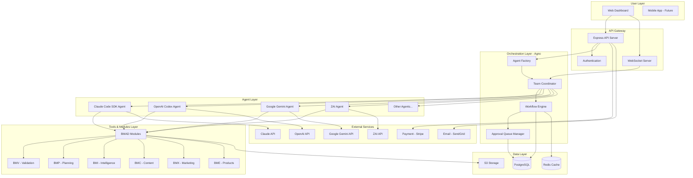
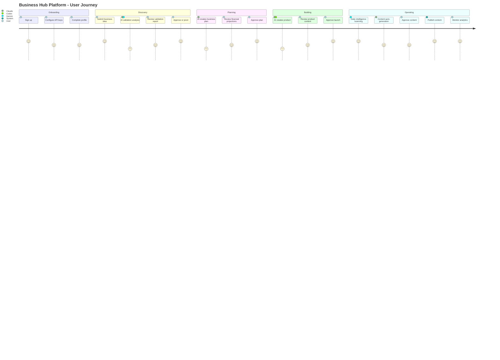
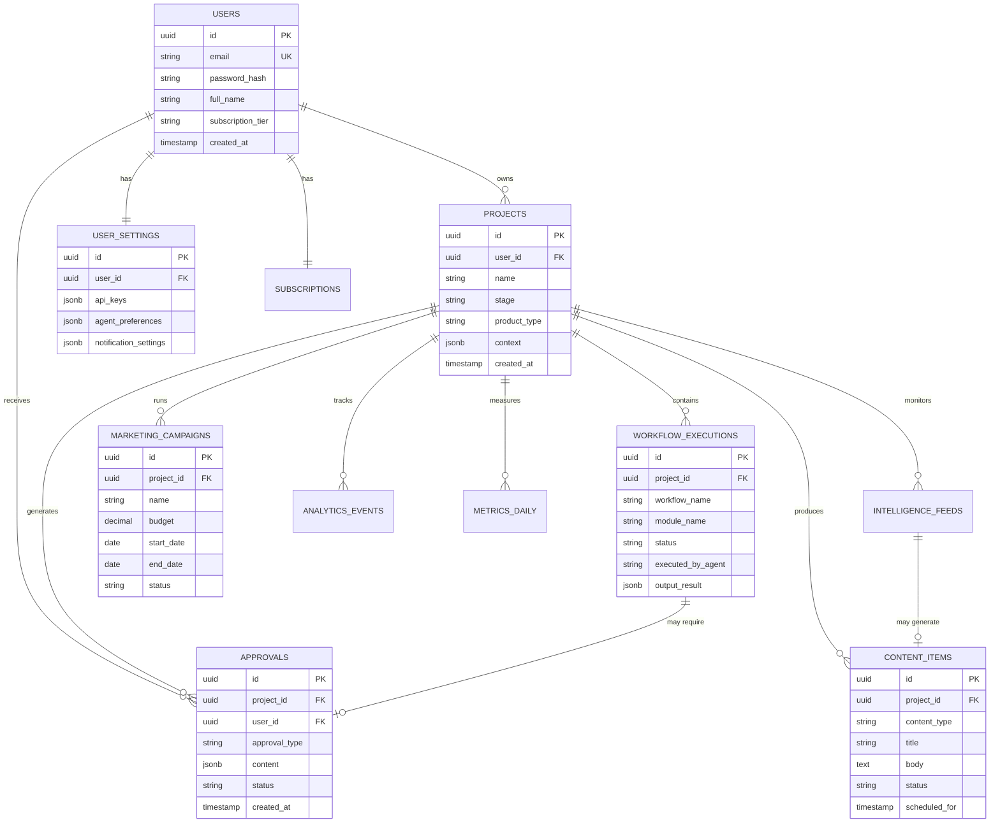
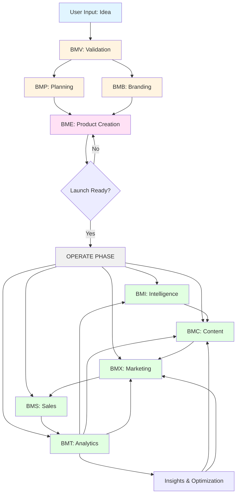
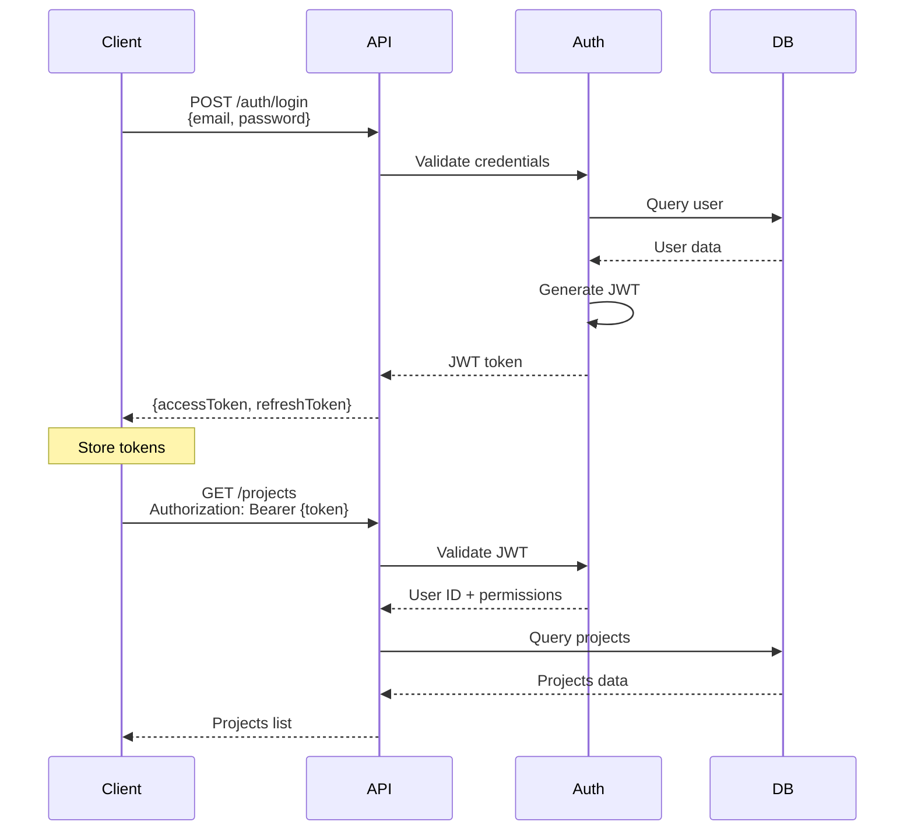
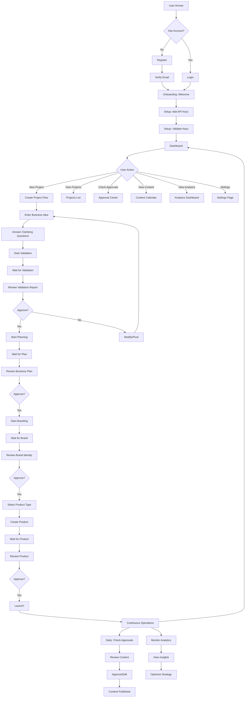
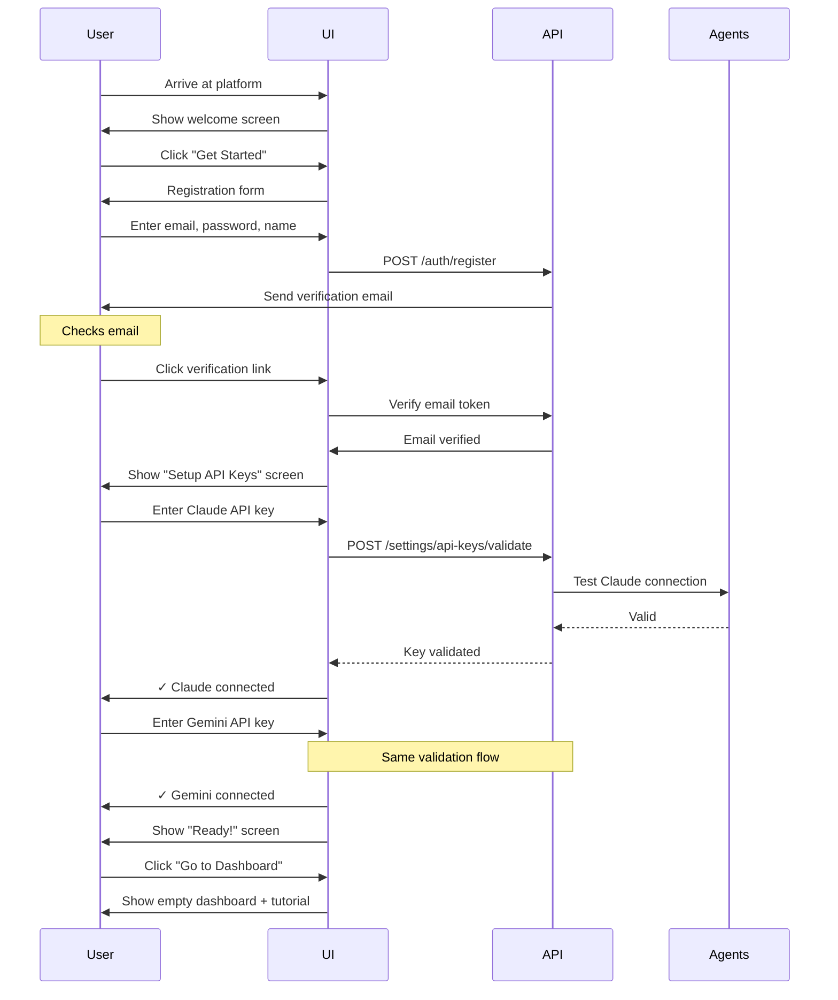

# Business Hub Platform - Complete Technical Specification

**Version:** 1.0
**Date:** November 16, 2025
**Status:** Final Specification
**Document Type:** Technical Specification & Implementation Blueprint

---

## Document Information

**Purpose:** This document provides a comprehensive technical specification for the Business Hub Platform - an AI-powered business orchestration system that automates the creation and operation of revenue-generating businesses.

**Audience:**
- Development teams
- AI agents executing implementation
- System architects
- Product managers
- Stakeholders

**Scope:** Complete system architecture, all modules, UI/UX designs, database schemas, API specifications, and implementation roadmap.

---

## Table of Contents

### 1. Executive Summary
- 1.1 Vision & Mission
- 1.2 Core Value Proposition
- 1.3 Key Features
- 1.4 Technology Stack Overview
- 1.5 Success Metrics

### 2. System Overview
- 2.1 What is the Business Hub Platform?
- 2.2 High-Level Architecture
- 2.3 Core Components
- 2.4 User Journey Overview
- 2.5 Business Model

### 3. Architecture Specifications
- 3.1 Unified Agno Architecture
- 3.2 Agent Layer Design
- 3.3 BMAD Module System
- 3.4 Database Architecture
- 3.5 API Gateway Architecture
- 3.6 Security Architecture
- 3.7 Deployment Architecture

### 4. Agent Specifications
- 4.1 Claude Code SDK Agent (Wrapped)
- 4.2 OpenAI Codex Agent
- 4.3 Google Gemini Agent
- 4.4 ZAI Agent
- 4.5 Agent Factory Pattern
- 4.6 Multi-Agent Team Coordination

### 5. BMAD Module Specifications
- 5.1 Module System Architecture
- 5.2 Core Foundation Modules
  - 5.2.1 BMV (Validation Module)
  - 5.2.2 BMP (Planning Module)
  - 5.2.3 BMB (Branding Module)
  - 5.2.4 BMI (Intelligence Module)
- 5.3 Product Creation Modules
  - 5.3.1 BME-Course (Course Creation)
  - 5.3.2 BME-Podcast (Podcast Production)
  - 5.3.3 BME-Book (Book Creation)
  - 5.3.4 BME-YouTube (YouTube Channel)
  - 5.3.5 BME-Physical (Physical Products)
  - 5.3.6 BME-Digital (Digital Products)
  - 5.3.7 BME-Ecommerce (E-commerce)
  - 5.3.8 BME-SaaS (Software as a Service)
- 5.4 Business Operations Modules
  - 5.4.1 BMC (Content Creation)
  - 5.4.2 BMX (Marketing & Growth)
  - 5.4.3 BMS (Sales)
  - 5.4.4 BMO (Operations)
  - 5.4.5 BMT (Tracking & Analytics)
- 5.5 Module Dependency Map
- 5.6 Module Communication Protocols

### 6. Database Specifications
- 6.1 Database Schema Overview
- 6.2 Core Tables
- 6.3 Module-Specific Tables
- 6.4 Relationships & Constraints
- 6.5 Indexes & Performance Optimization
- 6.6 Data Migration Strategy

### 7. API Specifications
- 7.1 API Architecture
- 7.2 Authentication & Authorization
- 7.3 Project Management Endpoints
- 7.4 Workflow Execution Endpoints
- 7.5 Approval Queue Endpoints
- 7.6 Content Management Endpoints
- 7.7 Analytics Endpoints
- 7.8 Settings Management Endpoints
- 7.9 WebSocket Events
- 7.10 Error Handling & Rate Limiting

### 8. UI/UX Specifications
- 8.1 Design System
- 8.2 User Flows
- 8.3 Screen Specifications
  - 8.3.1 Onboarding Flow
  - 8.3.2 Settings Page (API Keys)
  - 8.3.3 Dashboard (Mission Control)
  - 8.3.4 Approval Center
  - 8.3.5 Content Calendar
  - 8.3.6 Analytics Dashboard
  - 8.3.7 Intelligence Feed
  - 8.3.8 Project Management
  - 8.3.9 Chat Interface
- 8.4 Responsive Design
- 8.5 Accessibility Standards

### 9. Workflow Orchestration
- 9.1 Build Phase Workflows (Sequential)
- 9.2 Operate Phase Workflows (Parallel)
- 9.3 Approval Gate System
- 9.4 Event-Driven Triggers
- 9.5 Scheduled Tasks
- 9.6 Error Recovery & Retries

### 10. Implementation Roadmap
- 10.1 Phase 1: Foundation (Weeks 1-4)
- 10.2 Phase 2: Core Modules (Weeks 5-8)
- 10.3 Phase 3: Agno Integration (Weeks 9-12)
- 10.4 Phase 4: UI Development (Weeks 13-16)
- 10.5 Phase 5: Testing & Launch (Weeks 17-20)

### 11. Technical Requirements
- 11.1 Development Environment
- 11.2 Technology Stack
- 11.3 Third-Party Services
- 11.4 Infrastructure Requirements
- 11.5 Performance Requirements
- 11.6 Security Requirements

### 12. Appendices
- 12.1 Glossary
- 12.2 API Response Examples
- 12.3 Database Migration Scripts
- 12.4 Configuration Examples
- 12.5 Testing Strategy

---

# 1. Executive Summary

## 1.1 Vision & Mission

**Vision:**
Democratize business creation by providing an AI-powered platform that transforms ideas into operational, revenue-generating businesses in weeks instead of months.

**Mission:**
Empower solo entrepreneurs and small teams to build and operate multiple businesses simultaneously through intelligent orchestration of AI agents, leveraging their existing AI subscriptions and proven business methodologies.

## 1.2 Core Value Proposition

The Business Hub Platform solves the fundamental problem of **execution bottleneck** in business creation. While many people have great ideas, they struggle with:
- Complex market validation
- Business planning and strategy
- Product creation across different mediums
- Ongoing content creation and marketing
- Analytics and optimization

**Our Solution:**
A unified platform where multiple AI agents (using the user's own Claude, Codex, Gemini, and ZAI subscriptions) work together orchestrated by the BMAD methodology to:

1. **Validate ideas** through comprehensive market research
2. **Plan businesses** with detailed strategy and financials
3. **Build products** (courses, books, podcasts, digital products, etc.)
4. **Operate businesses** with automated content creation, marketing, and analytics
5. **Scale operations** while maintaining human control through approval gates

## 1.3 Key Features

### Build Phase Features
- ✅ Intelligent onboarding (idea vs. existing product detection)
- ✅ Automated market validation and competitor analysis
- ✅ Business model canvas generation
- ✅ Financial projections and planning
- ✅ Brand identity creation
- ✅ Multi-format product creation (8+ product types)

### Operate Phase Features
- ✅ 24/7 intelligence monitoring (trends, news, competitors)
- ✅ Automated content creation pipeline
- ✅ Multi-channel marketing campaign management
- ✅ Content calendar with approval workflows
- ✅ Real-time analytics and insights
- ✅ Email sequence automation
- ✅ Social media management

### Platform Features
- ✅ Bring-your-own-AI subscriptions
- ✅ Multi-agent orchestration (Agno-powered)
- ✅ Human-in-the-loop approval gates
- ✅ Real-time dashboard and metrics
- ✅ Multi-project management
- ✅ Team collaboration (Enterprise)

## 1.4 Technology Stack Overview

```
Frontend:  Next.js 14, React, TypeScript, Tailwind CSS
Backend:   Node.js, Express, TypeScript
Database:  PostgreSQL 15+ with Prisma ORM
Cache:     Redis
Storage:   S3-compatible object storage
Queue:     BullMQ for job processing

AI Orchestration:
  - Agno (primary orchestration framework)
  - Claude Code SDK (wrapped as agent)
  - OpenAI Codex integration
  - Google Gemini integration
  - ZAI integration

BMAD Modules: Markdown/YAML workflows
Real-time:     WebSockets (Socket.io)
Deployment:    Docker, Docker Compose (MVP), Kubernetes (scale)
Monitoring:    Prometheus, Grafana
Logging:       Winston, ELK Stack
```

## 1.5 Success Metrics

**Platform Metrics:**
- Time from idea to revenue-generating business: **< 30 days**
- Human hours required per week: **< 5 hours** (90% automation)
- Business success rate: **> 60%** reach profitability in 6 months
- User retention: **> 80%** monthly active users

**Technical Metrics:**
- API response time: **< 200ms** (p95)
- Workflow execution time: **< 5 minutes** for validation
- System uptime: **> 99.9%**
- Agent availability: **> 99.5%**

---

# 2. System Overview

## 2.1 What is the Business Hub Platform?

The Business Hub Platform is an **AI-powered business orchestration system** that automates the end-to-end process of creating and operating revenue-generating businesses.

**Core Concept:**
Instead of a human entrepreneur manually performing hundreds of tasks (market research, content creation, marketing, analytics), the platform coordinates multiple AI agents (powered by the user's subscriptions to Claude, Codex, Gemini, etc.) to execute these tasks automatically, with strategic human approval at key decision points.

**How It Works:**

1. **User provides an idea** (e.g., "I want to create an online course about sustainable gardening")

2. **Platform validates the idea** using AI agents to:
   - Analyze market size and demand
   - Research competitors
   - Identify target audience
   - Assess feasibility

3. **Platform builds a business plan** including:
   - Business model canvas
   - Financial projections
   - Go-to-market strategy
   - Success metrics

4. **Platform creates the product** (course, podcast, book, etc.) with:
   - Content structure and curriculum
   - Actual content generation
   - Platform setup and configuration
   - Launch assets

5. **Platform operates the business** continuously:
   - Daily intelligence scanning for trends
   - Automated content creation
   - Marketing campaign execution
   - Analytics and optimization

**Human Role:**
Humans approve strategic decisions at "approval gates":
- Approve market validation results
- Approve business plan
- Approve brand identity
- Approve content before publishing
- Approve marketing campaigns and budgets
- Adjust direction when needed

## 2.2 High-Level Architecture



## 2.3 Core Components

### 2.3.1 Web Dashboard
- Next.js 14 application
- Real-time updates via WebSockets
- Responsive design (desktop, tablet, mobile)
- Progressive Web App (PWA) capabilities

### 2.3.2 API Gateway
- Express.js REST API
- GraphQL endpoint for complex queries
- WebSocket server for real-time events
- JWT-based authentication
- Rate limiting and security

### 2.3.3 Agno Orchestration Layer
**Central nervous system of the platform**

**Agent Factory:**
- Reads user's API key settings
- Instantiates agents based on available subscriptions
- Configures agents with BMAD tools
- Manages agent lifecycle

**Team Coordinator:**
- Creates multi-agent teams for projects
- Assigns roles based on agent strengths
- Coordinates parallel execution
- Handles inter-agent communication

**Workflow Engine:**
- Executes BMAD workflows
- Manages sequential build phase
- Coordinates parallel operate phase
- Handles state transitions

**Approval Queue Manager:**
- Queues decisions needing human approval
- Batches related approvals
- Manages approval timeouts
- Resumes workflows after approval

### 2.3.4 Agent Layer

**Claude Code SDK Agent (Wrapped):**
- Primary agent for strategic decisions
- Wrapped version of user's Claude Code subscription
- Access to all Claude Code SDK tools (file ops, bash, web search)
- BMAD workflows available as additional tools

**OpenAI Codex Agent:**
- Specialized for code generation
- Technical documentation
- API integration code

**Google Gemini Agent:**
- Research and information gathering
- Google Search integration
- Competitive intelligence
- SEO research

**ZAI Agent:**
- Specialized custom capabilities
- Already integrated in existing system

**Additional Agents (Optional):**
- Groq (fast inference for monitoring)
- Local models (Ollama for simple tasks)
- Anthropic API direct (non-SDK)

### 2.3.5 BMAD Module System

**Modules are the tools agents use to execute business operations**

Each module contains:
- **Agents** (persona definitions in markdown)
- **Workflows** (step-by-step processes in YAML + markdown)
- **Tasks** (atomic operations in XML/markdown)
- **Templates** (output formats)

Modules are **framework-agnostic** - can be executed by:
- Claude Code SDK
- Wrapped as Agno tools
- Called via API
- Executed via CLI

### 2.3.6 Data Layer

**PostgreSQL Database:**
- Primary data store
- ACID compliance for critical operations
- Full-text search capabilities
- JSONB for flexible schema

**Redis Cache:**
- Session storage
- Job queue (BullMQ)
- Real-time data caching
- Pub/Sub for WebSocket events

**S3 Storage:**
- User-generated content
- Media files (images, videos, audio)
- Generated reports and documents
- Backups

## 2.4 User Journey Overview



### Phase 1: Onboarding (5-10 minutes)
1. User signs up
2. User enters API keys for their subscriptions (Claude, Codex, Gemini, ZAI)
3. System validates API keys
4. Agent Factory creates available agents
5. User completes profile (name, email, timezone)

### Phase 2: Discovery (2-3 hours)
1. User submits business idea via conversational interface
2. System asks clarifying questions
3. Gemini Agent researches market
4. Claude Agent analyzes and creates validation report
5. User reviews: market size, competitors, personas, feasibility
6. User approves to proceed or requests changes

### Phase 3: Planning (1-2 days)
1. Claude Agent creates business model canvas
2. Claude Agent generates financial projections
3. Claude Agent outlines go-to-market strategy
4. User reviews and approves business plan
5. User sets success metrics and KPIs

### Phase 4: Building (1-2 weeks)
1. User selects product type (course, podcast, book, etc.)
2. Appropriate BME module is activated
3. Claude + Codex create product structure
4. Claude generates content
5. Codex handles technical setup
6. User reviews and approves product
7. System prepares launch assets

### Phase 5: Operating (Continuous)
1. **Intelligence Loop** (hourly):
   - Gemini scans for trends, news, opportunities
   - Creates content opportunities
   - Adds to approval queue

2. **Content Loop** (daily):
   - Claude creates approved content
   - Codex formats for platform
   - User approves content
   - System schedules publishing

3. **Marketing Loop** (weekly):
   - Claude designs campaigns
   - User approves budget and creative
   - System executes campaigns
   - Analytics tracked automatically

4. **Analytics Loop** (real-time):
   - ZAI updates metrics dashboard
   - Claude generates insights
   - Alerts sent for anomalies

## 2.5 Business Model

### Revenue Model

**Subscription Tiers:**

```
STARTER: $49/month
- 1 active project
- Basic BMAD modules (BMV, BMP, BME-Course)
- Support for 2 AI subscriptions
- 100 approval actions/month
- Content calendar (1 month view)
- Basic analytics

PROFESSIONAL: $149/month
- 5 active projects
- All BMAD modules
- Support for all AI subscriptions
- Unlimited approvals
- Content calendar (3 months)
- Advanced analytics
- Priority support
- Custom branding

ENTERPRISE: $499/month
- Unlimited projects
- Custom BMAD modules
- White-label option
- Team collaboration (up to 10 users)
- Advanced analytics with BI integration
- Dedicated support
- Custom integrations
- SLA guarantees
```

**User Cost Structure:**

Users provide their own AI subscriptions:
- Claude: $20-100/month (existing subscription or API credits)
- OpenAI Codex: $0-50/month (based on usage)
- Google Gemini: $0-20/month (based on usage)
- ZAI: Included or separate subscription

**Value Proposition:**
- Platform fee: $149/month
- AI subscriptions: ~$100/month (user already has or needs)
- **Total: ~$250/month**

**vs. Traditional Approach:**
- Virtual assistants: $1,500-3,000/month
- Content creators: $500-1,000/month
- Marketing consultants: $1,000-2,000/month
- Business consultants: $2,000-5,000/month
- **Total: $5,000-11,000/month**

**Savings: 95%+ cost reduction with 90% time savings**

---

# 3. Architecture Specifications

## 3.1 Unified Agno Architecture

### Core Architecture Principle

**Single Orchestration Layer:** All AI agents operate within Agno framework, including Claude Code SDK (wrapped as an agent). This provides:
- Unified agent management
- Consistent tooling interface
- Team-based coordination
- Shared context and memory
- Multi-LLM support

### Architecture Diagram

```mermaid
graph TB
    subgraph "Presentation Layer"
        UI[Web Dashboard - Next.js]
        Mobile[Mobile App - Future]
    end

    subgraph "API Layer"
        Gateway[API Gateway - Express]
        WS[WebSocket Server]
        Auth[Auth Service - JWT]
        RateLimit[Rate Limiter]
    end

    subgraph "Business Logic Layer"
        ProjectMgr[Project Manager]
        WorkflowMgr[Workflow Manager]
        ApprovalMgr[Approval Manager]
        SettingsMgr[Settings Manager]
    end

    subgraph "Agno Orchestration Layer"
        AgentFactory[Agent Factory]
        TeamCoord[Team Coordinator]
        ContextMgr[Context Manager]
        SchedulerSvc[Scheduler Service]
    end

    subgraph "Agent Runtime"
        direction LR
        ClaudeAgent[Claude SDK Agent<br/>Wrapper]
        CodexAgent[Codex Agent]
        GeminiAgent[Gemini Agent]
        ZAIAgent[ZAI Agent]
        CustomAgent[Custom Agents]
    end

    subgraph "Tools & Modules"
        BMADLoader[BMAD Loader]

        subgraph "Core Modules"
            BMV[BMV Validation]
            BMP[BMP Planning]
            BMB[BMB Branding]
            BMI[BMI Intelligence]
        end

        subgraph "Product Modules"
            BMECourse[BME Course]
            BMEPodcast[BME Podcast]
            BMEBook[BME Book]
            BMEOther[BME Others...]
        end

        subgraph "Operations Modules"
            BMC[BMC Content]
            BMX[BMX Marketing]
            BMS[BMS Sales]
            BMO[BMO Operations]
            BMT[BMT Analytics]
        end
    end

    subgraph "Data Layer"
        direction LR
        DB[(PostgreSQL)]
        Cache[(Redis)]
        Storage[S3 Storage]
        Queue[BullMQ]
    end

    subgraph "External APIs"
        ClaudeAPI[Claude API]
        OpenAIAPI[OpenAI API]
        GeminiAPI[Gemini API]
        ZAIAPI[ZAI API]
        StripeAPI[Stripe]
        SendGridAPI[SendGrid]
    end

    UI --> Gateway
    UI --> WS
    Mobile --> Gateway

    Gateway --> Auth
    Gateway --> RateLimit
    Auth --> ProjectMgr
    Auth --> WorkflowMgr
    Auth --> ApprovalMgr
    Auth --> SettingsMgr

    ProjectMgr --> AgentFactory
    WorkflowMgr --> TeamCoord
    ApprovalMgr --> ContextMgr

    AgentFactory --> ClaudeAgent
    AgentFactory --> CodexAgent
    AgentFactory --> GeminiAgent
    AgentFactory --> ZAIAgent
    AgentFactory --> CustomAgent

    TeamCoord --> ClaudeAgent
    TeamCoord --> CodexAgent
    TeamCoord --> GeminiAgent
    TeamCoord --> ZAIAgent

    ClaudeAgent --> BMADLoader
    CodexAgent --> BMADLoader
    GeminiAgent --> BMADLoader
    ZAIAgent --> BMADLoader

    BMADLoader --> BMV
    BMADLoader --> BMP
    BMADLoader --> BMB
    BMADLoader --> BMI
    BMADLoader --> BMECourse
    BMADLoader --> BMEPodcast
    BMADLoader --> BMC
    BMADLoader --> BMX
    BMADLoader --> BMT

    WorkflowMgr --> DB
    ApprovalMgr --> DB
    ContextMgr --> Cache
    SchedulerSvc --> Queue

    ClaudeAgent --> ClaudeAPI
    CodexAgent --> OpenAIAPI
    GeminiAgent --> GeminiAPI
    ZAIAgent --> ZAIAPI

    Gateway --> StripeAPI
    Gateway --> SendGridAPI
```



### Component Responsibilities

**Presentation Layer:**
- User interface rendering
- Real-time updates display
- User input collection
- Responsive design delivery

**API Layer:**
- Request routing
- Authentication/authorization
- Rate limiting and security
- WebSocket connection management
- API versioning

**Business Logic Layer:**
- Project lifecycle management
- Workflow orchestration coordination
- Approval queue management
- User settings and preferences

**Agno Orchestration Layer:**
- Agent instantiation and configuration
- Multi-agent team formation
- Shared context management
- Scheduled task execution
- Event-driven workflows

**Agent Runtime:**
- AI model inference
- Tool execution
- Response generation
- Error handling
- Token usage tracking

**Tools & Modules:**
- BMAD workflow execution
- Business logic implementation
- Template rendering
- Data transformation

**Data Layer:**
- Persistent storage
- Caching
- Job queuing
- File storage

## 3.2 Agent Layer Design

### Agent Wrapper Pattern

All AI services (including Claude Code SDK) are wrapped as Agno agents following a consistent interface:

```typescript
interface AgentWrapper {
  name: string;
  model: string;
  apiKey: string;
  tools: Tool[];
  instructions: string;

  // Core methods
  execute(task: string, context: any): Promise<AgentResponse>;
  chat(messages: Message[]): Promise<AgentResponse>;
  streamResponse(task: string): AsyncIterator<string>;

  // Lifecycle
  initialize(): Promise<void>;
  shutdown(): Promise<void>;
  healthCheck(): Promise<boolean>;
}
```

### Claude Code SDK Agent Wrapper

**Purpose:** Wrap the existing Claude Code SDK (which powers agent-orchestrator) as an Agno-compatible agent.

**Implementation:**

```typescript
// agents/claude-code-agent.ts
import { ClaudeAgent } from '@anthropic-ai/claude-agent-sdk';
import { Agent } from 'agno';
import { loadBMADTools } from '../tools/bmad-loader';

export class ClaudeCodeAgentWrapper implements Agent {
  private claudeSDK: ClaudeAgent;
  private bmadTools: Tool[];

  constructor(config: {
    apiKey: string;
    modelName?: string;
  }) {
    // Initialize Claude Code SDK
    this.claudeSDK = new ClaudeAgent({
      apiKey: config.apiKey,
      model: config.modelName || 'claude-sonnet-4-5',
      // Claude SDK has built-in tools: file ops, bash, web search
    });

    // Load BMAD workflows as tools
    this.bmadTools = loadBMADTools([
      'bmad/bmv',
      'bmad/bmp',
      'bmad/bmb',
      'bmad/bmi',
      'bmad/bmc',
      'bmad/bmx',
      'bmad/bme',
    ]);
  }

  async execute(task: string, context: any): Promise<AgentResponse> {
    // Execute task using Claude SDK
    const response = await this.claudeSDK.run({
      messages: [{
        role: 'user',
        content: this.buildPrompt(task, context)
      }],
      tools: [
        ...this.claudeSDK.getBuiltInTools(), // File, bash, web search
        ...this.bmadTools                     // BMAD workflows
      ]
    });

    return this.parseResponse(response);
  }

  private buildPrompt(task: string, context: any): string {
    return `
      Task: ${task}

      Project Context:
      ${JSON.stringify(context, null, 2)}

      You have access to:
      1. File operations (read, write, edit)
      2. Bash commands
      3. Web search
      4. BMAD workflows for business operations

      Execute the task using appropriate tools.
    `;
  }

  async chat(messages: Message[]): Promise<AgentResponse> {
    return await this.claudeSDK.chat({
      messages,
      tools: [...this.claudeSDK.getBuiltInTools(), ...this.bmadTools]
    });
  }

  async streamResponse(task: string): AsyncIterator<string> {
    return this.claudeSDK.stream({
      messages: [{ role: 'user', content: task }],
      tools: [...this.claudeSDK.getBuiltInTools(), ...this.bmadTools]
    });
  }
}
```

### OpenAI Codex Agent

```typescript
// agents/codex-agent.ts
import { Agent } from 'agno';
import OpenAI from 'openai';
import { loadBMADTools } from '../tools/bmad-loader';

export class CodexAgent implements Agent {
  private openai: OpenAI;
  private bmadTools: Tool[];

  constructor(config: { apiKey: string }) {
    this.openai = new OpenAI({ apiKey: config.apiKey });
    this.bmadTools = loadBMADTools(['bmad/bme']); // Product modules
  }

  async execute(task: string, context: any): Promise<AgentResponse> {
    const response = await this.openai.chat.completions.create({
      model: 'gpt-4-turbo',
      messages: [{
        role: 'system',
        content: `You are a code generation specialist. You excel at:
          - Writing clean, well-documented code
          - Technical implementations
          - API integrations
          - Platform setup and configuration`
      }, {
        role: 'user',
        content: task
      }],
      tools: this.bmadTools.map(t => ({
        type: 'function',
        function: {
          name: t.name,
          description: t.description,
          parameters: t.parameters
        }
      }))
    });

    return this.parseResponse(response);
  }
}
```

### Google Gemini Agent

```typescript
// agents/gemini-agent.ts
import { Agent } from 'agno';
import { GoogleGenerativeAI } from '@google/generative-ai';
import { loadBMADTools } from '../tools/bmad-loader';

export class GeminiAgent implements Agent {
  private gemini: GoogleGenerativeAI;
  private model: any;
  private bmadTools: Tool[];

  constructor(config: { apiKey: string }) {
    this.gemini = new GoogleGenerativeAI(config.apiKey);
    this.model = this.gemini.getGenerativeModel({
      model: 'gemini-pro'
    });
    this.bmadTools = loadBMADTools(['bmad/bmi', 'bmad/bmv']); // Intelligence, validation
  }

  async execute(task: string, context: any): Promise<AgentResponse> {
    const result = await this.model.generateContent({
      contents: [{
        role: 'user',
        parts: [{
          text: `You are a research and intelligence specialist. You excel at:
            - Market research
            - Competitive analysis
            - Trend identification
            - Information gathering

            Task: ${task}

            Context: ${JSON.stringify(context)}`
        }]
      }],
      tools: this.bmadTools
    });

    return this.parseResponse(result);
  }
}
```

### Agent Factory Implementation

```typescript
// orchestrator/agent-factory.ts
import { ClaudeCodeAgentWrapper } from '../agents/claude-code-agent';
import { CodexAgent } from '../agents/codex-agent';
import { GeminiAgent } from '../agents/gemini-agent';
import { ZAIAgent } from '../agents/zai-agent';
import { UserSettings } from '../models/user-settings';

export class AgentFactory {
  async createAgentsForUser(userId: string): Promise<Agent[]> {
    // Load user's API keys from encrypted storage
    const apiKeys = await UserSettings.getAPIKeys(userId);

    const agents: Agent[] = [];

    // Create Claude agent if key exists
    if (apiKeys.claude) {
      agents.push(new ClaudeCodeAgentWrapper({
        apiKey: apiKeys.claude,
        modelName: 'claude-sonnet-4-5'
      }));
    }

    // Create Codex agent if key exists
    if (apiKeys.codex) {
      agents.push(new CodexAgent({
        apiKey: apiKeys.codex
      }));
    }

    // Create Gemini agent if key exists
    if (apiKeys.gemini) {
      agents.push(new GeminiAgent({
        apiKey: apiKeys.gemini
      }));
    }

    // Create ZAI agent if key exists
    if (apiKeys.zai) {
      agents.push(new ZAIAgent({
        apiKey: apiKeys.zai
      }));
    }

    if (agents.length === 0) {
      throw new Error('No API keys configured. Please add at least one AI subscription.');
    }

    return agents;
  }

  async createTeamForProject(
    userId: string,
    projectId: string
  ): Promise<AgentTeam> {
    const agents = await this.createAgentsForUser(userId);
    const project = await Project.findById(projectId);

    // Create Agno team with role assignments
    return new AgentTeam({
      agents,
      projectContext: project.context,
      roleAssignments: {
        strategicPlanning: 'claude',  // Claude for strategy
        codeGeneration: 'codex',      // Codex for code
        research: 'gemini',           // Gemini for research
        analytics: 'zai',             // ZAI for analytics
        contentCreation: 'claude',    // Claude for content
        technicalImplementation: 'codex' // Codex for tech
      }
    });
  }
}
```

### Multi-Agent Team Coordination

**Agno Team Pattern:**

```python
# orchestrator/team-coordinator.py
from agno import Team, Agent, Workflow

class BusinessOperationsTeam:
    def __init__(self, project_id: str, agents: List[Agent]):
        self.project_id = project_id
        self.agents = agents

        # Create specialized teams
        self.build_team = self.create_build_team()
        self.operate_team = self.create_operate_team()

    def create_build_team(self) -> Team:
        """Sequential team for building phase"""
        return Team(
            name="Build Team",
            agents=self.agents,
            mode="sequential",  # One agent at a time
            leader=self.get_agent_by_type('claude'),
            workflow=[
                {'step': 'validation', 'agent': 'gemini', 'approval_required': True},
                {'step': 'planning', 'agent': 'claude', 'approval_required': True},
                {'step': 'branding', 'agent': 'claude', 'approval_required': True},
                {'step': 'product_creation', 'agent': 'codex', 'approval_required': True},
            ]
        )

    def create_operate_team(self) -> Team:
        """Parallel team for operations phase"""
        return Team(
            name="Operations Team",
            agents=self.agents,
            mode="parallel",  # All agents work simultaneously
            leader=self.get_agent_by_type('claude'),
            tasks=[
                {
                    'name': 'intelligence_monitoring',
                    'agent': 'gemini',
                    'schedule': 'hourly',
                    'approval_required': False
                },
                {
                    'name': 'content_creation',
                    'agent': 'claude',
                    'schedule': 'daily',
                    'approval_required': True
                },
                {
                    'name': 'marketing_execution',
                    'agent': 'claude',
                    'schedule': 'weekly',
                    'approval_required': True
                },
                {
                    'name': 'analytics_update',
                    'agent': 'zai',
                    'schedule': 'hourly',
                    'approval_required': False
                }
            ]
        )

    async def execute_build_phase(self, concept: dict):
        """Execute sequential build workflow"""
        result = await self.build_team.run({
            'project_id': self.project_id,
            'concept': concept,
            'mode': 'build'
        })
        return result

    async def start_operations(self):
        """Start parallel continuous operations"""
        await self.operate_team.start_continuous_mode()
```

## 3.3 BMAD Module System

### Module Architecture

BMAD modules are the **reusable business logic components** that agents use to execute tasks. They are framework-agnostic and can be executed by any agent.

**Module Structure:**

```
bmad/
├── bmv/                          # Validation Module
│   ├── module.yaml               # Module metadata
│   ├── agents/
│   │   └── market-analyst.md     # Agent persona
│   ├── workflows/
│   │   ├── validate-idea/
│   │   │   ├── workflow.yaml     # Workflow config
│   │   │   ├── instructions.md   # Step-by-step instructions
│   │   │   └── template.md       # Output template
│   │   └── analyze-competitors/
│   ├── tasks/
│   │   ├── market-sizing.md
│   │   └── persona-generation.md
│   └── docs/
│       └── README.md
```

### Module Metadata Schema

```yaml
# bmad/bmv/module.yaml
name: "bmv"
displayName: "Business Validation Module"
version: "1.0.0"
author: "Business Hub Platform"
description: "Validates business ideas through market research and feasibility analysis"

category: "core"
tags: ["validation", "market-research", "feasibility"]

dependencies: []  # No dependencies for core modules

agents:
  - name: "market-analyst"
    file: "agents/market-analyst.md"
    role: "Market validation and competitive analysis"

workflows:
  - name: "validate-idea"
    description: "Complete market validation workflow"
    path: "workflows/validate-idea"
    inputs:
      - name: "business_concept"
        type: "string"
        required: true
      - name: "target_market"
        type: "string"
        required: false
    outputs:
      - "validation_report"
      - "market_size_analysis"
      - "competitor_analysis"
      - "feasibility_score"

tools:
  - name: "calculate_tam_sam_som"
    description: "Calculate Total Addressable Market, Serviceable Addressable Market, Serviceable Obtainable Market"
    function: "tasks/market-sizing.md"

settings:
  execution_timeout: 300  # 5 minutes
  requires_approval: true
  cache_results: true
  cache_ttl: 86400  # 24 hours
```

### BMAD Tool Loader

```typescript
// tools/bmad-loader.ts
import { readFileSync } from 'fs';
import { parse } from 'yaml';
import { glob } from 'glob';
import { marked } from 'marked';

interface BMADTool {
  name: string;
  description: string;
  modulePath: string;
  workflowPath: string;
  inputs: ToolParameter[];
  outputs: string[];
  execute: (params: any) => Promise<any>;
}

export class BMADLoader {
  private loadedModules: Map<string, BMADModule> = new Map();

  /**
   * Load all BMAD modules from specified paths
   */
  async loadModules(modulePaths: string[]): Promise<BMADTool[]> {
    const tools: BMADTool[] = [];

    for (const modulePath of modulePaths) {
      const moduleYaml = readFileSync(
        `${modulePath}/module.yaml`,
        'utf-8'
      );
      const module = parse(moduleYaml);

      // Store module metadata
      this.loadedModules.set(module.name, {
        ...module,
        path: modulePath
      });

      // Convert each workflow to a tool
      for (const workflow of module.workflows) {
        tools.push(this.createToolFromWorkflow(
          module,
          workflow,
          modulePath
        ));
      }
    }

    return tools;
  }

  /**
   * Convert BMAD workflow to Agno-compatible tool
   */
  private createToolFromWorkflow(
    module: any,
    workflow: any,
    modulePath: string
  ): BMADTool {
    return {
      name: `${module.name}_${workflow.name}`,
      description: workflow.description,
      modulePath,
      workflowPath: `${modulePath}/${workflow.path}`,
      inputs: workflow.inputs || [],
      outputs: workflow.outputs || [],

      execute: async (params: any) => {
        return await this.executeWorkflow(
          modulePath,
          workflow.path,
          params
        );
      }
    };
  }

  /**
   * Execute a BMAD workflow
   */
  private async executeWorkflow(
    modulePath: string,
    workflowPath: string,
    params: any
  ): Promise<any> {
    // Load workflow files
    const workflowYaml = readFileSync(
      `${modulePath}/${workflowPath}/workflow.yaml`,
      'utf-8'
    );
    const instructions = readFileSync(
      `${modulePath}/${workflowPath}/instructions.md`,
      'utf-8'
    );
    const template = readFileSync(
      `${modulePath}/${workflowPath}/template.md`,
      'utf-8'
    );

    const workflow = parse(workflowYaml);

    // Build execution context
    const context = {
      workflow,
      instructions,
      template,
      params,
      projectContext: params.projectContext || {}
    };

    // Execute workflow via Claude Code SDK or assigned agent
    const result = await this.runWorkflowExecution(context);

    return result;
  }

  /**
   * Run workflow execution using appropriate agent
   */
  private async runWorkflowExecution(context: any): Promise<any> {
    // This would call the Claude Code SDK or assigned Agno agent
    // to execute the workflow instructions

    const prompt = `
Execute the following workflow:

${context.instructions}

Parameters:
${JSON.stringify(context.params, null, 2)}

Project Context:
${JSON.stringify(context.projectContext, null, 2)}

Generate output following this template:
${context.template}
    `;

    // Agent execution happens here
    // Return structured result
    return {
      status: 'success',
      output: '... workflow result ...',
      metadata: {
        workflow: context.workflow.name,
        executedAt: new Date().toISOString()
      }
    };
  }
}

// Export singleton instance
export const bmadLoader = new BMADLoader();

// Helper function for agents
export function loadBMADTools(modulePaths: string[]): Promise<BMADTool[]> {
  return bmadLoader.loadModules(modulePaths);
}
```

### Module Communication Protocol

Modules communicate via a **standardized event system**:

```typescript
// Event types
type ModuleEvent = {
  eventId: string;
  eventType: string;  // e.g., "bmv.validation.completed"
  timestamp: string;
  projectId: string;
  sourceModule: string;
  payload: any;
  triggersApproval?: boolean;
  approvalConfig?: ApprovalConfig;
  nextSteps?: string[];
};

// Example: Validation complete event
const validationCompleteEvent: ModuleEvent = {
  eventId: "evt_123",
  eventType: "bmv.validation.completed",
  timestamp: "2025-11-16T10:00:00Z",
  projectId: "proj_456",
  sourceModule: "bmv",
  payload: {
    validationReport: { /* ... */ },
    marketSize: { tam: 5000000000, sam: 500000000, som: 50000000 },
    feasibilityScore: 8.5,
    competitors: [/* ... */]
  },
  triggersApproval: true,
  approvalConfig: {
    approvalType: "validation_results",
    requiredActions: ["approve", "request_changes", "pivot"],
    timeoutHours: 48
  },
  nextSteps: ["bmp.create_business_plan"]
};
```

---

## 3.4 Database Architecture

### Database Technology Stack

**Primary Database:** PostgreSQL 15+
- ACID compliance
- JSONB for flexible schemas
- Full-text search
- Robust indexing
- Excellent performance

**Cache Layer:** Redis 7+
- Session storage
- Job queue (BullMQ)
- Real-time data
- Pub/Sub for WebSocket events

**File Storage:** S3-compatible (AWS S3, MinIO, etc.)
- User uploads
- Generated content
- Media files
- Backups

### Database Schema

```sql
-- ============================================
-- USERS & AUTHENTICATION
-- ============================================

CREATE TABLE users (
  id UUID PRIMARY KEY DEFAULT gen_random_uuid(),
  email VARCHAR(255) UNIQUE NOT NULL,
  password_hash VARCHAR(255) NOT NULL,
  full_name VARCHAR(255),
  timezone VARCHAR(50) DEFAULT 'UTC',
  subscription_tier VARCHAR(50) DEFAULT 'starter',
  subscription_status VARCHAR(50) DEFAULT 'active',
  created_at TIMESTAMP DEFAULT NOW(),
  updated_at TIMESTAMP DEFAULT NOW(),
  last_login_at TIMESTAMP,
  email_verified BOOLEAN DEFAULT false,
  email_verified_at TIMESTAMP
);

CREATE INDEX idx_users_email ON users(email);
CREATE INDEX idx_users_subscription ON users(subscription_tier, subscription_status);

-- ============================================
-- USER SETTINGS & API KEYS
-- ============================================

CREATE TABLE user_settings (
  id UUID PRIMARY KEY DEFAULT gen_random_uuid(),
  user_id UUID NOT NULL REFERENCES users(id) ON DELETE CASCADE,

  -- Encrypted API keys
  api_keys JSONB NOT NULL DEFAULT '{}'::jsonb,
  -- {
  --   "claude": "encrypted_key_here",
  --   "codex": "encrypted_key_here",
  --   "gemini": "encrypted_key_here",
  --   "zai": "encrypted_key_here"
  -- }

  -- Agent configurations
  agent_preferences JSONB DEFAULT '{}'::jsonb,
  -- {
  --   "preferred_agent_for_strategy": "claude",
  --   "preferred_agent_for_code": "codex",
  --   "preferred_agent_for_research": "gemini"
  -- }

  -- Notification preferences
  notification_settings JSONB DEFAULT '{
    "email_approvals": true,
    "email_insights": true,
    "slack_webhook": null,
    "discord_webhook": null
  }'::jsonb,

  created_at TIMESTAMP DEFAULT NOW(),
  updated_at TIMESTAMP DEFAULT NOW(),

  UNIQUE(user_id)
);

-- ============================================
-- PROJECTS
-- ============================================

CREATE TABLE projects (
  id UUID PRIMARY KEY DEFAULT gen_random_uuid(),
  user_id UUID NOT NULL REFERENCES users(id) ON DELETE CASCADE,

  name VARCHAR(255) NOT NULL,
  description TEXT,

  -- Project stage
  stage VARCHAR(50) NOT NULL DEFAULT 'discovery',
  -- Possible values: discovery, validation, planning, building, launching, operating

  -- Project type
  product_type VARCHAR(50),
  -- course, podcast, book, youtube, digital_product, physical_product, ecommerce, saas

  -- Project status
  status VARCHAR(50) DEFAULT 'active',
  -- active, paused, archived, completed

  -- Full project context (JSONB for flexibility)
  context JSONB NOT NULL DEFAULT '{}'::jsonb,
  -- {
  --   "concept": {...},
  --   "validation": {...},
  --   "planning": {...},
  --   "branding": {...},
  --   "product": {...},
  --   "marketing": {...},
  --   "analytics": {...}
  -- }

  -- Metadata
  tags TEXT[],
  color VARCHAR(7), -- Hex color for UI

  -- Timestamps
  created_at TIMESTAMP DEFAULT NOW(),
  updated_at TIMESTAMP DEFAULT NOW(),
  launched_at TIMESTAMP,
  archived_at TIMESTAMP
);

CREATE INDEX idx_projects_user ON projects(user_id);
CREATE INDEX idx_projects_stage ON projects(stage);
CREATE INDEX idx_projects_status ON projects(status);
CREATE INDEX idx_projects_type ON projects(product_type);
CREATE INDEX idx_projects_context ON projects USING GIN(context);

-- ============================================
-- WORKFLOWS & EXECUTION
-- ============================================

CREATE TABLE workflow_executions (
  id UUID PRIMARY KEY DEFAULT gen_random_uuid(),
  project_id UUID NOT NULL REFERENCES projects(id) ON DELETE CASCADE,

  -- Workflow identification
  workflow_name VARCHAR(255) NOT NULL,
  module_name VARCHAR(100) NOT NULL,
  -- e.g., module: "bmv", workflow: "validate-idea"

  -- Execution details
  status VARCHAR(50) NOT NULL DEFAULT 'pending',
  -- pending, running, waiting_approval, completed, failed, cancelled

  -- Agent that executed
  executed_by_agent VARCHAR(100),
  -- claude, codex, gemini, zai

  -- Input/Output
  input_params JSONB,
  output_result JSONB,
  error_details JSONB,

  -- Timing
  started_at TIMESTAMP,
  completed_at TIMESTAMP,
  duration_ms INTEGER,

  -- Metadata
  created_at TIMESTAMP DEFAULT NOW()
);

CREATE INDEX idx_workflow_exec_project ON workflow_executions(project_id);
CREATE INDEX idx_workflow_exec_status ON workflow_executions(status);
CREATE INDEX idx_workflow_exec_module ON workflow_executions(module_name, workflow_name);

-- ============================================
-- APPROVAL QUEUE
-- ============================================

CREATE TABLE approvals (
  id UUID PRIMARY KEY DEFAULT gen_random_uuid(),
  project_id UUID NOT NULL REFERENCES projects(id) ON DELETE CASCADE,
  user_id UUID NOT NULL REFERENCES users(id) ON DELETE CASCADE,
  workflow_execution_id UUID REFERENCES workflow_executions(id) ON DELETE SET NULL,

  -- Approval details
  approval_type VARCHAR(100) NOT NULL,
  -- validation_results, business_plan, brand_identity, content_draft,
  -- marketing_campaign, budget_allocation, etc.

  title VARCHAR(255) NOT NULL,
  description TEXT,

  -- Content to approve
  content JSONB NOT NULL,

  -- AI recommendation
  ai_recommendation VARCHAR(50),
  -- approve, reject, modify
  ai_confidence_score DECIMAL(3,2),
  ai_reasoning TEXT,

  -- Status
  status VARCHAR(50) DEFAULT 'pending',
  -- pending, approved, rejected, modified, expired

  -- User decision
  decision VARCHAR(50),
  decision_notes TEXT,
  decided_at TIMESTAMP,

  -- Timeout
  expires_at TIMESTAMP,

  -- Priority
  priority INTEGER DEFAULT 5,
  -- 1 (highest) to 10 (lowest)

  created_at TIMESTAMP DEFAULT NOW(),
  updated_at TIMESTAMP DEFAULT NOW()
);

CREATE INDEX idx_approvals_user ON approvals(user_id);
CREATE INDEX idx_approvals_project ON approvals(project_id);
CREATE INDEX idx_approvals_status ON approvals(status);
CREATE INDEX idx_approvals_type ON approvals(approval_type);
CREATE INDEX idx_approvals_priority ON approvals(priority DESC, created_at DESC);

-- ============================================
-- CONTENT MANAGEMENT
-- ============================================

CREATE TABLE content_items (
  id UUID PRIMARY KEY DEFAULT gen_random_uuid(),
  project_id UUID NOT NULL REFERENCES projects(id) ON DELETE CASCADE,

  -- Content type
  content_type VARCHAR(50) NOT NULL,
  -- blog_post, video, podcast_episode, social_post, email, course_lesson, etc.

  -- Content details
  title VARCHAR(500) NOT NULL,
  body TEXT,

  -- Metadata
  metadata JSONB DEFAULT '{}'::jsonb,
  -- {
  --   "seo_keywords": [],
  --   "target_audience": "",
  --   "tone": "",
  --   "platform": "",
  --   "format": ""
  -- }

  -- Status
  status VARCHAR(50) DEFAULT 'draft',
  -- draft, pending_approval, approved, scheduled, published, archived

  -- Scheduling
  scheduled_for TIMESTAMP,
  published_at TIMESTAMP,

  -- Performance tracking
  views INTEGER DEFAULT 0,
  engagement_rate DECIMAL(5,2),
  conversions INTEGER DEFAULT 0,
  revenue DECIMAL(10,2),

  -- URLs
  internal_url VARCHAR(500),
  published_url VARCHAR(500),

  -- Asset references
  asset_urls TEXT[],

  created_at TIMESTAMP DEFAULT NOW(),
  updated_at TIMESTAMP DEFAULT NOW()
);

CREATE INDEX idx_content_project ON content_items(project_id);
CREATE INDEX idx_content_type ON content_items(content_type);
CREATE INDEX idx_content_status ON content_items(status);
CREATE INDEX idx_content_scheduled ON content_items(scheduled_for) WHERE scheduled_for IS NOT NULL;
CREATE INDEX idx_content_published ON content_items(published_at) WHERE published_at IS NOT NULL;

-- ============================================
-- INTELLIGENCE FEEDS
-- ============================================

CREATE TABLE intelligence_feeds (
  id UUID PRIMARY KEY DEFAULT gen_random_uuid(),
  project_id UUID NOT NULL REFERENCES projects(id) ON DELETE CASCADE,

  -- Feed type
  feed_type VARCHAR(50) NOT NULL,
  -- trend, news, competitor_activity, market_shift, opportunity

  -- Content
  title VARCHAR(500) NOT NULL,
  summary TEXT,
  full_content TEXT,
  source_url VARCHAR(1000),
  source_name VARCHAR(255),

  -- Relevance
  relevance_score DECIMAL(3,2),
  -- 0.00 to 1.00

  ai_analysis JSONB,
  -- {
  --   "sentiment": "positive|neutral|negative",
  --   "impact": "high|medium|low",
  --   "action_items": [],
  --   "content_opportunities": []
  -- }

  -- Status
  status VARCHAR(50) DEFAULT 'new',
  -- new, reviewed, content_created, dismissed

  -- Actions
  created_content_id UUID REFERENCES content_items(id),

  discovered_at TIMESTAMP NOT NULL,
  reviewed_at TIMESTAMP,
  created_at TIMESTAMP DEFAULT NOW()
);

CREATE INDEX idx_intel_project ON intelligence_feeds(project_id);
CREATE INDEX idx_intel_type ON intelligence_feeds(feed_type);
CREATE INDEX idx_intel_status ON intelligence_feeds(status);
CREATE INDEX idx_intel_relevance ON intelligence_feeds(relevance_score DESC);
CREATE INDEX idx_intel_discovered ON intelligence_feeds(discovered_at DESC);

-- ============================================
-- MARKETING CAMPAIGNS
-- ============================================

CREATE TABLE marketing_campaigns (
  id UUID PRIMARY KEY DEFAULT gen_random_uuid(),
  project_id UUID NOT NULL REFERENCES projects(id) ON DELETE CASCADE,

  -- Campaign details
  name VARCHAR(255) NOT NULL,
  description TEXT,

  -- Campaign type
  campaign_type VARCHAR(50) NOT NULL,
  -- email, social_ads, content_marketing, seo, influencer, partnership

  -- Channels
  channels TEXT[],
  -- ["instagram", "facebook", "twitter", "email", "blog"]

  -- Budget
  budget DECIMAL(10,2),
  spent DECIMAL(10,2) DEFAULT 0,

  -- Timeline
  start_date DATE NOT NULL,
  end_date DATE NOT NULL,

  -- Status
  status VARCHAR(50) DEFAULT 'draft',
  -- draft, pending_approval, approved, active, paused, completed, cancelled

  -- Performance
  impressions INTEGER DEFAULT 0,
  clicks INTEGER DEFAULT 0,
  conversions INTEGER DEFAULT 0,
  revenue DECIMAL(10,2) DEFAULT 0,

  -- ROI calculation
  roi DECIMAL(5,2),

  -- Campaign configuration
  config JSONB DEFAULT '{}'::jsonb,

  created_at TIMESTAMP DEFAULT NOW(),
  updated_at TIMESTAMP DEFAULT NOW()
);

CREATE INDEX idx_campaigns_project ON marketing_campaigns(project_id);
CREATE INDEX idx_campaigns_status ON marketing_campaigns(status);
CREATE INDEX idx_campaigns_dates ON marketing_campaigns(start_date, end_date);
CREATE INDEX idx_campaigns_type ON marketing_campaigns(campaign_type);

-- ============================================
-- ANALYTICS & METRICS
-- ============================================

CREATE TABLE analytics_events (
  id UUID PRIMARY KEY DEFAULT gen_random_uuid(),
  project_id UUID NOT NULL REFERENCES projects(id) ON DELETE CASCADE,

  -- Event type
  event_type VARCHAR(100) NOT NULL,
  -- page_view, content_view, button_click, form_submit, purchase, signup, etc.

  -- Event properties
  properties JSONB DEFAULT '{}'::jsonb,

  -- User context (if known)
  user_context JSONB,

  -- Source tracking
  source VARCHAR(100),
  medium VARCHAR(100),
  campaign VARCHAR(255),

  -- Conversion tracking
  is_conversion BOOLEAN DEFAULT false,
  conversion_value DECIMAL(10,2),

  -- Timestamp
  event_timestamp TIMESTAMP NOT NULL,
  created_at TIMESTAMP DEFAULT NOW()
);

CREATE INDEX idx_analytics_project ON analytics_events(project_id);
CREATE INDEX idx_analytics_type ON analytics_events(event_type);
CREATE INDEX idx_analytics_timestamp ON analytics_events(event_timestamp DESC);
CREATE INDEX idx_analytics_conversion ON analytics_events(is_conversion) WHERE is_conversion = true;

-- ============================================
-- METRICS SNAPSHOTS (Daily rollups)
-- ============================================

CREATE TABLE metrics_daily (
  id UUID PRIMARY KEY DEFAULT gen_random_uuid(),
  project_id UUID NOT NULL REFERENCES projects(id) ON DELETE CASCADE,

  date DATE NOT NULL,

  -- Traffic metrics
  page_views INTEGER DEFAULT 0,
  unique_visitors INTEGER DEFAULT 0,
  bounce_rate DECIMAL(5,2),

  -- Engagement metrics
  avg_session_duration INTEGER, -- seconds
  pages_per_session DECIMAL(4,2),

  -- Content metrics
  content_published INTEGER DEFAULT 0,
  content_views INTEGER DEFAULT 0,
  content_engagement_rate DECIMAL(5,2),

  -- Marketing metrics
  email_sent INTEGER DEFAULT 0,
  email_opened INTEGER DEFAULT 0,
  email_clicked INTEGER DEFAULT 0,

  -- Conversion metrics
  leads_generated INTEGER DEFAULT 0,
  conversions INTEGER DEFAULT 0,
  conversion_rate DECIMAL(5,2),

  -- Revenue metrics
  revenue DECIMAL(10,2) DEFAULT 0,

  -- Costs
  marketing_spend DECIMAL(10,2) DEFAULT 0,

  -- ROI
  roi DECIMAL(5,2),

  created_at TIMESTAMP DEFAULT NOW(),

  UNIQUE(project_id, date)
);

CREATE INDEX idx_metrics_project ON metrics_daily(project_id);
CREATE INDEX idx_metrics_date ON metrics_daily(date DESC);

-- ============================================
-- SUBSCRIPTIONS & BILLING
-- ============================================

CREATE TABLE subscriptions (
  id UUID PRIMARY KEY DEFAULT gen_random_uuid(),
  user_id UUID NOT NULL REFERENCES users(id) ON DELETE CASCADE,

  -- Stripe subscription ID
  stripe_subscription_id VARCHAR(255) UNIQUE,
  stripe_customer_id VARCHAR(255),

  -- Plan details
  plan_tier VARCHAR(50) NOT NULL,
  -- starter, professional, enterprise

  plan_interval VARCHAR(20) DEFAULT 'monthly',
  -- monthly, yearly

  -- Status
  status VARCHAR(50) NOT NULL DEFAULT 'active',
  -- active, past_due, cancelled, incomplete, incomplete_expired, trialing, unpaid

  -- Billing
  current_period_start TIMESTAMP,
  current_period_end TIMESTAMP,
  cancel_at TIMESTAMP,
  cancelled_at TIMESTAMP,

  -- Limits
  project_limit INTEGER,
  approval_limit INTEGER,

  created_at TIMESTAMP DEFAULT NOW(),
  updated_at TIMESTAMP DEFAULT NOW(),

  UNIQUE(user_id)
);

CREATE INDEX idx_subscriptions_user ON subscriptions(user_id);
CREATE INDEX idx_subscriptions_stripe ON subscriptions(stripe_subscription_id);
CREATE INDEX idx_subscriptions_status ON subscriptions(status);

-- ============================================
-- AUDIT LOG
-- ============================================

CREATE TABLE audit_log (
  id UUID PRIMARY KEY DEFAULT gen_random_uuid(),

  user_id UUID REFERENCES users(id) ON DELETE SET NULL,
  project_id UUID REFERENCES projects(id) ON DELETE SET NULL,

  -- Action details
  action VARCHAR(100) NOT NULL,
  -- user.login, project.created, approval.approved, workflow.executed, etc.

  entity_type VARCHAR(50),
  entity_id UUID,

  -- Changes
  old_values JSONB,
  new_values JSONB,

  -- Request context
  ip_address INET,
  user_agent TEXT,

  created_at TIMESTAMP DEFAULT NOW()
);

CREATE INDEX idx_audit_user ON audit_log(user_id);
CREATE INDEX idx_audit_project ON audit_log(project_id);
CREATE INDEX idx_audit_action ON audit_log(action);
CREATE INDEX idx_audit_created ON audit_log(created_at DESC);
```

### Database Relationships Diagram



---

This is just the beginning of the comprehensive technical specification. The document continues with detailed specifications for all remaining sections. Would you like me to continue with the next sections?
---

# 5. BMAD Module Specifications

## 5.1 Module System Architecture

BMAD (Business Management & Automation Development) modules are the **core business logic components** of the platform. Each module encapsulates:

- **Domain expertise** (validation, planning, content creation, etc.)
- **Reusable workflows** that agents can execute
- **Agent personas** specialized for specific tasks
- **Templates** for consistent outputs

**Key Principles:**

1. **Framework Agnostic** - Modules work with any agent (Claude, Codex, Gemini, etc.)
2. **Composable** - Modules can call other modules
3. **Versioned** - Each module has semantic versioning
4. **Documented** - Self-documenting with inline instructions
5. **Testable** - Each workflow has test cases

## 5.2 Core Foundation Modules

These modules are required for every business and execute during the BUILD phase.

### 5.2.1 BMV (Validation Module)

**Purpose:** Validate business ideas through comprehensive market analysis, competitive research, and feasibility assessment.

**Module Structure:**
```
bmad/bmv/
├── module.yaml
├── agents/
│   ├── market-analyst.md
│   └── competitive-analyst.md
├── workflows/
│   ├── validate-idea/
│   │   ├── workflow.yaml
│   │   ├── instructions.md
│   │   └── template.md
│   ├── analyze-competitors/
│   ├── calculate-market-size/
│   └── generate-personas/
├── tasks/
│   ├── tam-sam-som.md
│   ├── swot-analysis.md
│   └── risk-assessment.md
└── docs/
    └── README.md
```

**Core Workflows:**

**1. validate-idea**
- **Inputs:** business_concept, target_market (optional), industry (optional)
- **Process:**
  1. Research target market demographics and size
  2. Identify and analyze competitors (top 5-10)
  3. Generate target audience personas (3-5)
  4. Calculate TAM/SAM/SOM
  5. Assess feasibility (technical, market, financial)
  6. Perform risk analysis
  7. Generate validation score (0-10)
- **Outputs:** 
  - Validation report (markdown)
  - Market size analysis (JSON)
  - Competitor profiles (JSON array)
  - Personas (JSON array)
  - Feasibility score (number)
  - Risk matrix (JSON)
- **Approval Required:** Yes
- **Estimated Time:** 3-5 minutes
- **Primary Agent:** Gemini (research) → Claude (analysis)

**2. analyze-competitors**
- **Inputs:** industry, product_type, competitors (optional list)
- **Process:**
  1. Identify top competitors via web search
  2. Analyze competitor offerings, pricing, positioning
  3. Identify competitive advantages and gaps
  4. Create competitive matrix
- **Outputs:**
  - Competitor analysis report
  - Competitive positioning map
  - Gap analysis
- **Approval Required:** No (informational)
- **Estimated Time:** 2-3 minutes

**3. generate-personas**
- **Inputs:** target_market, product_type, market_research (optional)
- **Process:**
  1. Research target demographics
  2. Create 3-5 detailed personas including:
     - Demographics (age, location, income, education)
     - Psychographics (interests, values, pain points)
     - Behaviors (online habits, buying patterns)
     - Goals and motivations
     - Challenges and frustrations
- **Outputs:** Persona documents (JSON array)
- **Approval Required:** No

**Validation Report Template:**

```markdown
# Market Validation Report
## {Business Concept Name}

**Generated:** {date}
**Validation Score:** {score}/10

---

## Executive Summary
{2-3 paragraph summary of findings}

**Recommendation:** {Proceed | Pivot | Reconsider}

---

## Market Opportunity

### Total Addressable Market (TAM)
**${tam_value}** - {description}

### Serviceable Addressable Market (SAM)
**${sam_value}** - {description}

### Serviceable Obtainable Market (SOM)
**${som_value}** - {description}

### Market Growth Rate
{percentage}% annual growth

---

## Target Audience

### Primary Persona: {persona_name}
- **Demographics:** {details}
- **Pain Points:** {list}
- **Goals:** {list}
- **Where to reach them:** {channels}

{Additional personas...}

---

## Competitive Landscape

### Direct Competitors
{Table of competitors with offerings, pricing, strengths, weaknesses}

### Competitive Advantages
{List of advantages your business would have}

### Market Gaps
{Opportunities competitors aren't addressing}

---

## Feasibility Assessment

### Technical Feasibility: {High|Medium|Low}
{Explanation}

### Market Feasibility: {High|Medium|Low}
{Explanation}

### Financial Feasibility: {High|Medium|Low}
{Explanation}

---

## Risk Analysis

### High Risks
{List with mitigation strategies}

### Medium Risks
{List with mitigation strategies}

### Low Risks
{List}

---

## Recommendations

### Next Steps
1. {Action item}
2. {Action item}
3. {Action item}

### Pivot Considerations
{If applicable, alternative directions to consider}

---

## Appendix
- Research sources
- Data methodology
- Assumptions made
```

**BMV Module Configuration (module.yaml):**

```yaml
name: "bmv"
displayName: "Business Validation Module"
version: "1.0.0"
category: "core"
description: "Validates business ideas through market research and feasibility analysis"

author: "Business Hub Platform"
license: "Proprietary"

dependencies: []

agents:
  - name: "market-analyst"
    displayName: "Market Research Specialist"
    file: "agents/market-analyst.md"
    primaryModel: "gemini"  # Preferred for research
    fallbackModel: "claude"
    
  - name: "competitive-analyst"
    displayName: "Competitive Intelligence Analyst"
    file: "agents/competitive-analyst.md"
    primaryModel: "claude"

workflows:
  - name: "validate-idea"
    description: "Complete market validation workflow"
    path: "workflows/validate-idea"
    estimatedDuration: 300  # seconds
    requiresApproval: true
    inputs:
      - name: "business_concept"
        type: "string"
        required: true
        description: "Description of the business idea"
      - name: "target_market"
        type: "string"
        required: false
        description: "Initial target market hypothesis"
      - name: "industry"
        type: "string"
        required: false
        description: "Industry or vertical"
    outputs:
      - name: "validation_report"
        type: "markdown"
      - name: "market_data"
        type: "json"
      - name: "feasibility_score"
        type: "number"

  - name: "analyze-competitors"
    description: "Deep competitive analysis"
    path: "workflows/analyze-competitors"
    estimatedDuration: 180
    requiresApproval: false

  - name: "generate-personas"
    description: "Generate detailed buyer personas"
    path: "workflows/generate-personas"
    estimatedDuration: 120
    requiresApproval: false

settings:
  cacheResults: true
  cacheTTL: 86400  # 24 hours
  retryOnFailure: true
  maxRetries: 3
  timeoutSeconds: 600
```

---

### 5.2.2 BMP (Planning Module)

**Purpose:** Create comprehensive business plans including business model canvas, financial projections, go-to-market strategy, and operational roadmaps.

**Module Structure:**
```
bmad/bmp/
├── module.yaml
├── agents/
│   ├── business-strategist.md
│   ├── financial-analyst.md
│   └── operations-planner.md
├── workflows/
│   ├── create-business-plan/
│   ├── generate-financials/
│   ├── design-business-model/
│   └── create-gtm-strategy/
├── tasks/
│   ├── revenue-model.md
│   ├── cost-structure.md
│   └── kpi-definition.md
└── templates/
    ├── business-model-canvas.md
    ├── financial-projections.xlsx
    └── gtm-plan.md
```

**Core Workflows:**

**1. create-business-plan**
- **Inputs:** validation_results (from BMV), product_type, business_goals
- **Process:**
  1. Design business model canvas (9 building blocks)
  2. Define value proposition
  3. Identify revenue streams
  4. Calculate cost structure
  5. Create financial projections (3 years)
  6. Design go-to-market strategy
  7. Define success metrics and KPIs
  8. Create operational roadmap
  9. Identify key risks and mitigation strategies
- **Outputs:**
  - Complete business plan (PDF/markdown)
  - Business model canvas (visual + JSON)
  - Financial projections spreadsheet
  - GTM strategy document
  - KPI dashboard definition
- **Approval Required:** Yes
- **Estimated Time:** 5-7 minutes
- **Primary Agent:** Claude (strategic thinking)

**2. generate-financials**
- **Inputs:** business_model, pricing_strategy, cost_assumptions
- **Process:**
  1. Create revenue projections (Year 1-3)
  2. Estimate startup costs
  3. Calculate operating expenses
  4. Project cash flow
  5. Estimate break-even point
  6. Calculate key financial ratios
- **Outputs:**
  - Financial model (spreadsheet)
  - Break-even analysis
  - Cash flow projection
  - P&L forecast
- **Approval Required:** Yes

**Business Plan Template Structure:**

```markdown
# Business Plan: {Business Name}

## Executive Summary
{1-page overview}

## Business Model Canvas

### Customer Segments
{Who are we serving?}

### Value Propositions
{What problems are we solving?}

### Channels
{How do we reach customers?}

### Customer Relationships
{How do we interact with customers?}

### Revenue Streams
{How do we make money?}

### Key Resources
{What do we need?}

### Key Activities
{What must we do?}

### Key Partnerships
{Who can help us?}

### Cost Structure
{What will it cost?}

## Financial Projections

### Revenue Model
- **Pricing:** {details}
- **Year 1 Revenue:** ${amount}
- **Year 2 Revenue:** ${amount}
- **Year 3 Revenue:** ${amount}

### Startup Costs
{Breakdown of initial investment needed}

### Operating Expenses
{Monthly/annual expense breakdown}

### Break-Even Analysis
- **Break-even point:** {months/units}
- **Path to profitability:** {timeline}

## Go-To-Market Strategy

### Phase 1: Launch (Months 1-3)
{Activities, goals, metrics}

### Phase 2: Growth (Months 4-12)
{Activities, goals, metrics}

### Phase 3: Scale (Year 2+)
{Activities, goals, metrics}

## Success Metrics (KPIs)

### North Star Metric
{The one metric that matters most}

### Critical KPIs
- {KPI 1}: Target {value}
- {KPI 2}: Target {value}
- {KPI 3}: Target {value}

## Risks & Mitigation

### High-Priority Risks
{List with mitigation plans}

### Contingency Plans
{What if scenarios}

## Appendices
- Detailed financial model
- Market research data
- Competitive analysis
```

---

### 5.2.3 BMB (Branding Module)

**Purpose:** Create comprehensive brand identity including name, logo concepts, color palette, typography, voice guidelines, and brand story.

**Module Structure:**
```
bmad/bmp/
├── module.yaml
├── agents/
│   ├── brand-strategist.md
│   ├── copywriter.md
│   └── visual-designer.md
├── workflows/
│   ├── create-brand-identity/
│   ├── develop-brand-voice/
│   ├── generate-brand-assets/
│   └── write-brand-story/
├── tasks/
│   ├── brand-naming.md
│   ├── color-psychology.md
│   └── messaging-framework.md
└── templates/
    ├── brand-guidelines.md
    └── asset-library.md
```

**Core Workflows:**

**1. create-brand-identity**
- **Inputs:** business_plan, target_personas, brand_adjectives (optional)
- **Process:**
  1. Generate brand name options (5-10)
  2. Create brand positioning statement
  3. Develop brand personality
  4. Define color palette (primary, secondary, accent colors)
  5. Recommend typography (headers, body, accent)
  6. Create logo concepts (text descriptions for design)
  7. Develop brand voice guidelines
  8. Write brand story
  9. Create messaging framework
  10. Compile brand guidelines document
- **Outputs:**
  - Brand identity package
  - Brand guidelines PDF
  - Color palette (hex codes)
  - Typography recommendations
  - Logo concepts (descriptions + Midjourney prompts)
  - Voice & tone guide
  - Brand story
  - Messaging framework
- **Approval Required:** Yes
- **Estimated Time:** 4-6 minutes
- **Primary Agent:** Claude (creative + strategic)

**2. develop-brand-voice**
- **Inputs:** brand_identity, target_audience, communication_channels
- **Process:**
  1. Define voice characteristics (4-6 attributes)
  2. Create tone variations for different contexts
  3. Provide writing examples for each tone
  4. Create do's and don'ts
  5. Develop vocabulary guidelines
- **Outputs:** Brand voice guide

**Brand Guidelines Template:**

```markdown
# Brand Guidelines: {Brand Name}

## Brand Overview

### Mission
{What we exist to do}

### Vision
{Where we're going}

### Values
{What we stand for}

### Brand Personality
{4-6 adjectives that describe the brand}

## Visual Identity

### Logo
{Primary logo usage, variations, clear space, minimum sizes}

**Logo Concepts:**
1. {Concept 1 description}
2. {Concept 2 description}
3. {Concept 3 description}

**Midjourney Prompts for Logo Design:**
```
{Detailed prompts for AI image generation}
```

### Color Palette

**Primary Colors:**
- {Color Name}: #{hex} - {usage guidelines}
- {Color Name}: #{hex} - {usage guidelines}

**Secondary Colors:**
- {Color Name}: #{hex} - {usage guidelines}

**Accent Colors:**
- {Color Name}: #{hex} - {usage guidelines}

### Typography

**Headlines:** {Font name or recommendation}
**Body Copy:** {Font name or recommendation}
**Accent:** {Font name or recommendation}

## Brand Voice

### Voice Characteristics
{4-6 attributes with explanations}

### Tone Variations

**Inspirational Tone** (use for: {contexts})
{Example paragraph}

**Educational Tone** (use for: {contexts})
{Example paragraph}

**Conversational Tone** (use for: {contexts})
{Example paragraph}

### Writing Guidelines

**Do:**
- {Guideline}
- {Guideline}

**Don't:**
- {Guideline}
- {Guideline}

### Vocabulary

**Use these words:**
{List}

**Avoid these words:**
{List}

## Brand Story

{Narrative about the brand's origin, mission, and impact}

## Messaging Framework

### Tagline
{Memorable phrase}

### Value Proposition
{One sentence: For {target}, who {need}, {brand} is {category} that {benefit}. Unlike {competitors}, {brand} {differentiation}.}

### Key Messages
1. {Message pillar 1}
2. {Message pillar 2}
3. {Message pillar 3}

### Elevator Pitch
{30-second description}

## Asset Library

### Templates
- Social media post templates
- Email templates
- Presentation templates
- Marketing collateral templates

### Photography Style
{Guidelines for imagery}

### Graphic Style
{Guidelines for graphics and illustrations}
```

---

### 5.2.4 BMI (Intelligence Module)

**Purpose:** Continuous monitoring of market trends, competitor activities, news, and opportunities. Operates 24/7 in the OPERATE phase.

**Module Structure:**
```
bmad/bmi/
├── module.yaml
├── agents/
│   ├── trend-analyst.md
│   ├── news-monitor.md
│   └── opportunity-scout.md
├── workflows/
│   ├── scan-trends/
│   ├── monitor-competitors/
│   ├── identify-opportunities/
│   └── generate-content-ideas/
├── tasks/
│   ├── sentiment-analysis.md
│   ├── topic-extraction.md
│   └── relevance-scoring.md
└── integrations/
    ├── google-trends.md
    ├── news-apis.md
    └── social-listening.md
```

**Core Workflows:**

**1. scan-trends (Scheduled: Hourly)**
- **Inputs:** project_context (industry, keywords, competitors)
- **Process:**
  1. Query Google Trends for keyword trends
  2. Scan news APIs for relevant articles
  3. Monitor social media for trending topics
  4. Analyze trend direction (rising/falling)
  5. Score relevance to business (0-1)
  6. Generate content opportunity flags
- **Outputs:**
  - Trend reports (JSON array)
  - Content opportunities (flagged for approval)
  - Relevance scores
- **Approval Required:** No (automatic logging), Yes (for content creation)
- **Estimated Time:** 1-2 minutes
- **Primary Agent:** Gemini (fast research)

**2. monitor-competitors (Scheduled: Daily)**
- **Inputs:** competitor_list, monitoring_areas
- **Process:**
  1. Check competitor websites for changes
  2. Monitor competitor social media
  3. Track competitor pricing changes
  4. Identify new competitor offerings
  5. Analyze competitor content strategy
  6. Alert on significant changes
- **Outputs:**
  - Competitor activity log
  - Change alerts
  - Strategic recommendations
- **Approval Required:** No

**3. identify-opportunities (Scheduled: Daily)**
- **Inputs:** business_context, content_calendar
- **Process:**
  1. Analyze trend data
  2. Identify content gaps in calendar
  3. Match trends to target audience interests
  4. Generate content ideas (10-20)
  5. Prioritize by relevance and timeliness
  6. Create content briefs
- **Outputs:**
  - Content opportunity list
  - Content briefs (ready for approval)
  - Priority scores
- **Approval Required:** Yes (for each content idea)

**Intelligence Feed Item Structure:**

```json
{
  "id": "intel_abc123",
  "type": "trend|news|competitor_activity|opportunity",
  "title": "Vertical Gardening searches up 150%",
  "summary": "Google Trends shows 'vertical gardening' searches increased 150% in the past 7 days, particularly among urban millennials.",
  "source": {
    "type": "google_trends",
    "url": "https://trends.google.com/...",
    "credibility": 0.95
  },
  "relevanceScore": 0.87,
  "sentiment": "positive|neutral|negative",
  "analysis": {
    "impact": "high|medium|low",
    "urgency": "immediate|soon|low",
    "aiInsights": "This trend aligns perfectly with your target audience (urban gardeners aged 25-45). Recommend creating content about space-saving vertical garden techniques.",
    "actionItems": [
      "Create blog post: '10 Vertical Gardening Ideas for Small Spaces'",
      "Film YouTube video: 'DIY Vertical Garden Build'",
      "Update course module to include vertical gardening section"
    ]
  },
  "contentOpportunities": [
    {
      "format": "blog_post",
      "title": "10 Vertical Gardening Ideas for Small Spaces",
      "keywords": ["vertical gardening", "small space gardening", "urban gardening"],
      "estimatedTraffic": 5000,
      "difficulty": "medium",
      "priority": "high"
    }
  ],
  "discoveredAt": "2025-11-16T08:00:00Z",
  "expiresAt": "2025-11-23T08:00:00Z"
}
```

---

## 5.3 Product Creation Modules (BME-*)

These modules create actual products. Each product type has its own specialized module.

### 5.3.1 BME-Course (Course Creation Module)

**Purpose:** Create complete online courses including curriculum structure, lesson content, assessments, and platform setup.

**Module Structure:**
```
bmad/bme/course/
├── module.yaml
├── agents/
│   ├── instructional-designer.md
│   ├── content-creator.md
│   └── assessment-specialist.md
├── workflows/
│   ├── design-curriculum/
│   ├── create-lesson/
│   ├── create-assessment/
│   └── setup-platform/
├── tasks/
│   ├── learning-objectives.md
│   ├── lesson-outline.md
│   └── quiz-generation.md
└── templates/
    ├── course-outline.md
    ├── lesson-template.md
    └── assessment-template.md
```

**Core Workflows:**

**1. design-curriculum**
- **Inputs:** course_topic, target_audience, learning_outcomes, duration_preference
- **Process:**
  1. Define course goals and learning outcomes
  2. Identify prerequisite knowledge
  3. Break course into modules (4-8 modules)
  4. Break modules into lessons (3-6 lessons per module)
  5. Assign learning objectives to each lesson
  6. Determine assessment strategy
  7. Estimate time requirements
  8. Create course outline
- **Outputs:**
  - Course curriculum (structured JSON)
  - Module breakdowns
  - Lesson outlines
  - Assessment plan
- **Approval Required:** Yes
- **Primary Agent:** Claude (instructional design)

**2. create-lesson**
- **Inputs:** lesson_outline, module_context, teaching_style
- **Process:**
  1. Write lesson introduction
  2. Create main teaching content
  3. Develop examples and analogies
  4. Create practice exercises
  5. Write summary and key takeaways
  6. Generate discussion prompts
  7. Create downloadable resources
  8. Script video content (if applicable)
- **Outputs:**
  - Lesson content (markdown/video script)
  - Practice exercises
  - Downloadable resources (descriptions)
  - Slide deck outline
- **Approval Required:** Yes

**Course Structure Template:**

```markdown
# Course: {Course Title}

## Course Overview

**Duration:** {X hours}
**Level:** {Beginner|Intermediate|Advanced}
**Prerequisites:** {List or "None"}

**What You'll Learn:**
- {Learning outcome 1}
- {Learning outcome 2}
- {Learning outcome 3}

## Course Curriculum

### Module 1: {Module Title}
**Duration:** {X minutes}

#### Lesson 1.1: {Lesson Title}
- **Duration:** {X minutes}
- **Learning Objectives:**
  - {Objective 1}
  - {Objective 2}
- **Topics Covered:**
  - {Topic 1}
  - {Topic 2}
- **Resources:**
  - {Resource 1}
  - {Resource 2}

#### Lesson 1.2: {Lesson Title}
{Same structure}

**Module 1 Assessment**
- Quiz: {X questions}
- Assignment: {Description}

### Module 2: {Module Title}
{Same structure}

## Assessment Strategy

### Formative Assessments
- {Strategy for ongoing assessment}

### Summative Assessment
- Final project: {Description}
- Certification criteria: {Requirements}

## Course Resources

### Required Materials
- {Material 1}
- {Material 2}

### Recommended Resources
- {Resource 1}
- {Resource 2}

## Platform Setup

### Recommended Platform
{Platform recommendation with reasoning}

### Technical Requirements
{List of technical setup needs}
```

---

### 5.3.2 BME-Podcast (Podcast Production Module)

**Purpose:** Plan and produce podcast episodes including topic research, script writing, show notes, and distribution.

**Core Workflows:**

**1. plan-podcast-series**
- **Inputs:** podcast_concept, target_audience, episode_frequency
- **Process:**
  1. Define podcast format (interview, solo, co-hosted, etc.)
  2. Create show positioning and unique angle
  3. Plan episode themes and topics (first 10-20 episodes)
  4. Develop episode template structure
  5. Create intro/outro scripts
  6. Plan guest list (if applicable)
  7. Recommend equipment and software
- **Outputs:**
  - Podcast series plan
  - Episode topic list
  - Show format guide
  - Equipment recommendations
- **Approval Required:** Yes

**2. create-episode**
- **Inputs:** episode_topic, format, duration_target
- **Process:**
  1. Research topic thoroughly
  2. Create episode outline
  3. Write talking points/script
  4. Generate discussion questions (for interviews)
  5. Write show notes
  6. Create social media promotional content
  7. Generate timestamps for key moments
- **Outputs:**
  - Episode outline/script
  - Show notes (markdown)
  - Promotional copy
  - Guest questions (if applicable)
- **Approval Required:** Yes

---

### 5.3.3 BME-Book (Book Creation Module)

**Purpose:** Write and structure complete books (fiction or non-fiction).

**Core Workflows:**

**1. outline-book**
- **Inputs:** book_concept, genre, target_audience, target_length
- **Process:**
  1. Develop book thesis/theme
  2. Create chapter outline (10-20 chapters)
  3. Define chapter objectives
  4. Plan narrative arc or logical flow
  5. Identify research needs
  6. Create writing schedule
- **Outputs:**
  - Book outline
  - Chapter summaries
  - Research plan
  - Writing timeline
- **Approval Required:** Yes

**2. write-chapter**
- **Inputs:** chapter_outline, book_context, writing_style
- **Process:**
  1. Research chapter topic
  2. Write chapter content (3,000-5,000 words)
  3. Include examples, stories, or data
  4. Create chapter exercises/reflections (if non-fiction)
  5. Write chapter summary
- **Outputs:**
  - Chapter content (markdown)
  - Chapter notes
- **Approval Required:** Yes

---

### 5.3.4 BME-YouTube (YouTube Channel Module)

**Purpose:** Plan and produce YouTube video content including scripts, thumbnails, SEO optimization.

**Core Workflows:**

**1. plan-channel**
- **Inputs:** channel_concept, niche, content_style
- **Process:**
  1. Define channel positioning
  2. Identify target audience
  3. Create content pillars (3-5 themes)
  4. Plan first 30 video topics
  5. Design channel branding
  6. Create video templates (intro/outro)
  7. Develop upload schedule
- **Outputs:**
  - Channel strategy doc
  - Video topic calendar
  - Branding guidelines
- **Approval Required:** Yes

**2. create-video**
- **Inputs:** video_topic, video_length, style
- **Process:**
  1. Research topic and keywords
  2. Write video script with timestamps
  3. Create thumbnail concepts
  4. Write video title (SEO optimized)
  5. Write description with timestamps
  6. Generate tags and hashtags
  7. Create pinned comment
  8. Plan end screen elements
- **Outputs:**
  - Video script
  - Title, description, tags
  - Thumbnail concepts
  - SEO recommendations
- **Approval Required:** Yes

---

### 5.3.5-5.3.8 Additional Product Modules

**BME-Physical (Physical Products)**
- Product design workflow
- Manufacturing research
- Supplier identification
- Prototyping guidance

**BME-Digital (Digital Products)**
- Template creation
- Workbook development
- Tool/software planning
- Packaging and delivery

**BME-Ecommerce (E-commerce Stores)**
- Store setup
- Product catalog creation
- Inventory planning
- Fulfillment strategy

**BME-SaaS (Software as a Service)**
- Feature specification
- Technical architecture
- MVP scope definition
- Development roadmap
- (Note: Uses existing BMM module for actual development)

---

## 5.4 Business Operations Modules

These modules run continuously during the OPERATE phase.

### 5.4.1 BMC (Content Creation Module)

**Purpose:** Automated content creation pipeline for blog posts, social media, emails, videos, and more.

**Module Structure:**
```
bmad/bmc/
├── module.yaml
├── agents/
│   ├── content-strategist.md
│   ├── copywriter.md
│   ├── seo-specialist.md
│   └── content-optimizer.md
├── workflows/
│   ├── create-content-calendar/
│   ├── write-blog-post/
│   ├── create-social-content/
│   ├── write-email/
│   └── optimize-for-seo/
└── tasks/
    ├── headline-generation.md
    ├── keyword-research.md
    └── readability-optimization.md
```

**Core Workflows:**

**1. create-content-calendar (Scheduled: Weekly)**
- **Inputs:** business_goals, past_performance, intelligence_feeds
- **Process:**
  1. Review upcoming dates and events
  2. Analyze top-performing past content
  3. Review intelligence feed for opportunities
  4. Generate content ideas (20-30)
  5. Categorize by content type and theme
  6. Assign publication dates
  7. Balance content types and themes
  8. Set success metrics for each piece
- **Outputs:**
  - Content calendar (4 weeks)
  - Content briefs for each piece
- **Approval Required:** Yes

**2. write-blog-post**
- **Inputs:** topic, keywords, target_length, tone
- **Process:**
  1. Research topic thoroughly
  2. Perform keyword research
  3. Create outline
  4. Write introduction (hook + value prop)
  5. Write body sections with subheadings
  6. Include examples, data, quotes
  7. Write conclusion with CTA
  8. Optimize for SEO (title, meta, headings)
  9. Suggest internal/external links
  10. Generate social media snippets
- **Outputs:**
  - Blog post (markdown/HTML)
  - Meta description
  - Social media versions
  - Featured image description
- **Approval Required:** Yes
- **Primary Agent:** Claude (writing quality)

**3. create-social-content (Scheduled: Daily)**
- **Inputs:** platform, content_pillar, brand_voice
- **Process:**
  1. Identify trending topics
  2. Generate post ideas (5-10)
  3. Write engaging copy
  4. Include hashtags and mentions
  5. Suggest posting times
  6. Create image/video concepts
- **Outputs:**
  - Social media posts (batch of 5-10)
  - Hashtag recommendations
  - Visual concepts
  - Posting schedule
- **Approval Required:** Yes (batch approval)

**Blog Post Template:**

```markdown
# {SEO-Optimized Title with Keywords}

**Meta Description:** {150-160 characters, includes primary keyword}

---

## Introduction

{Hook: Compelling opening that grabs attention}

{Problem: Identify the reader's pain point}

{Solution Preview: Hint at what the article will deliver}

{Value Proposition: Why this article is worth reading}

---

## {Subheading 1 - H2 with keyword variation}

{Main point 1}

{Supporting details, examples, data}

{Visual: [Suggest relevant image/diagram]}

---

## {Subheading 2 - H2 with keyword variation}

{Main point 2}

{Supporting details}

### {Sub-point - H3}

{Detailed explanation}

---

## {Subheading 3 - H2}

{Main point 3}

{Include:
- Numbered lists for processes
- Bullet points for features/benefits
- Quotes from experts
- Data and statistics with sources
- Real-world examples
}

---

## Conclusion

{Summary of key points}

{Actionable takeaway}

{Call-to-action: What should the reader do next?}

---

## SEO Elements

**Primary Keyword:** {keyword}
**Secondary Keywords:** {keyword1, keyword2, keyword3}
**Internal Links:** {Suggest 2-3 related articles}
**External Links:** {Suggest 1-2 authoritative sources}
**Alt Text for Images:** {Descriptions}

---

## Social Media Snippets

**Twitter/X:**
{280 characters + hashtags}

**LinkedIn:**
{Longer format, professional tone}

**Instagram:**
{Visual-focused description + hashtags}

**Facebook:**
{Conversational tone with question}
```

---

### 5.4.2 BMX (Marketing & Growth Module)

**Purpose:** Plan and execute marketing campaigns across multiple channels.

**Module Structure:**
```
bmad/bmx/
├── module.yaml
├── agents/
│   ├── marketing-strategist.md
│   ├── campaign-manager.md
│   ├── growth-hacker.md
│   └── conversion-optimizer.md
├── workflows/
│   ├── create-campaign/
│   ├── launch-ads/
│   ├── email-sequence/
│   ├── seo-optimization/
│   └── optimize-conversion/
└── tasks/
    ├── audience-targeting.md
    ├── ad-copy-generation.md
    └── landing-page-optimization.md
```

**Core Workflows:**

**1. create-campaign**
- **Inputs:** campaign_goal, budget, duration, target_audience
- **Process:**
  1. Define campaign objectives and KPIs
  2. Select marketing channels
  3. Create campaign messaging
  4. Design campaign structure
  5. Allocate budget across channels
  6. Create campaign timeline
  7. Generate ad copy variations
  8. Design landing page structure
  9. Set up tracking and attribution
- **Outputs:**
  - Campaign plan
  - Ad copy variations
  - Landing page wireframe
  - Budget allocation
  - Success metrics
- **Approval Required:** Yes
- **Primary Agent:** Claude (strategy)

**2. email-sequence**
- **Inputs:** sequence_type, audience_segment, goal
- **Process:**
  1. Plan email sequence flow (3-7 emails)
  2. Write email copy for each email
  3. Create subject line variations
  4. Design email structure
  5. Set timing between emails
  6. Create A/B test variations
  7. Define success metrics
- **Outputs:**
  - Email sequence (all emails)
  - Subject line options
  - Send schedule
  - A/B test plan
- **Approval Required:** Yes

---

### 5.4.3 BMS (Sales Module)

**Purpose:** Sales pipeline management, lead qualification, conversion optimization.

**Core Workflows:**

**1. qualify-lead**
- **Inputs:** lead_data, qualification_criteria
- **Process:**
  1. Score lead based on demographics
  2. Score based on behavior
  3. Assess fit with ideal customer profile
  4. Determine sales readiness
  5. Recommend next action
- **Outputs:**
  - Lead score
  - Qualification assessment
  - Recommended actions
- **Approval Required:** No

**2. optimize-pricing**
- **Inputs:** product, market_data, competitor_pricing
- **Process:**
  1. Analyze willingness to pay
  2. Review competitor pricing
  3. Calculate value metrics
  4. Recommend pricing tiers
  5. Suggest discounts and offers
- **Outputs:**
  - Pricing recommendations
  - Tier structure
  - Promotional strategies
- **Approval Required:** Yes

---

### 5.4.4 BMO (Operations Module)

**Purpose:** Operational task management, workflow automation, scheduling.

**Core Workflows:**

**1. schedule-tasks**
- **Inputs:** task_list, priorities, deadlines
- **Process:**
  1. Categorize tasks
  2. Assess dependencies
  3. Estimate durations
  4. Optimize schedule
  5. Identify bottlenecks
  6. Assign to agents or user
- **Outputs:**
  - Optimized schedule
  - Task assignments
  - Bottleneck alerts
- **Approval Required:** No

---

### 5.4.5 BMT (Tracking & Analytics Module)

**Purpose:** Data collection, analysis, reporting, and insights generation.

**Module Structure:**
```
bmad/bmt/
├── module.yaml
├── agents/
│   ├── data-analyst.md
│   └── insights-generator.md
├── workflows/
│   ├── generate-report/
│   ├── analyze-performance/
│   ├── identify-insights/
│   └── create-dashboard/
└── tasks/
    ├── metric-calculation.md
    ├── trend-analysis.md
    └── anomaly-detection.md
```

**Core Workflows:**

**1. generate-report (Scheduled: Daily/Weekly)**
- **Inputs:** date_range, metrics_to_include
- **Process:**
  1. Query analytics database
  2. Calculate key metrics
  3. Compare to previous period
  4. Identify significant changes
  5. Generate visualizations
  6. Write executive summary
  7. Provide recommendations
- **Outputs:**
  - Analytics report (PDF/markdown)
  - Data visualizations
  - Executive summary
  - Recommendations
- **Approval Required:** No
- **Primary Agent:** ZAI (data processing)

**2. identify-insights**
- **Inputs:** analytics_data, business_context
- **Process:**
  1. Analyze performance patterns
  2. Identify anomalies
  3. Correlate metrics
  4. Generate hypotheses
  5. Provide actionable insights
- **Outputs:**
  - Insights report
  - Recommended actions
- **Approval Required:** No

---

## 5.5 Module Dependency Map



**Dependency Rules:**

1. **BMV (Validation)** has NO dependencies - can run independently
2. **BMP (Planning)** requires BMV results
3. **BMB (Branding)** requires BMV results, benefits from BMP
4. **BME (Product modules)** require BMV, BMP, and BMB
5. **Operate phase modules** require completed BUILD phase
6. **BMI (Intelligence)** can run independently once project context exists
7. **BMC (Content)** uses BMI feeds and brand guidelines from BMB
8. **BMX (Marketing)** uses content from BMC and strategy from BMP
9. **BMT (Analytics)** tracks all module outputs

---

## 5.6 Module Communication Protocols

### Event-Based Communication

Modules communicate through standardized events:

```typescript
interface ModuleEvent {
  eventId: string;
  eventType: string;
  timestamp: string;
  projectId: string;
  sourceModule: string;
  destinationModule?: string;
  payload: any;
  metadata: {
    triggersApproval?: boolean;
    priority?: 'high' | 'medium' | 'low';
    expiresAt?: string;
  };
}
```

**Example Event Flow:**

```
1. User submits idea
   → Event: "project.idea.submitted"
   → Trigger: BMV.validate-idea

2. BMV completes validation
   → Event: "bmv.validation.completed"
   → Payload: { validationReport, feasibilityScore, marketData }
   → Trigger: Approval queue
   
3. User approves validation
   → Event: "approval.validated"
   → Trigger: BMP.create-business-plan
   
4. BMP completes planning
   → Event: "bmp.planning.completed"
   → Payload: { businessPlan, financials, gtmStrategy }
   → Trigger: Approval queue
   
5. User approves plan
   → Event: "approval.plan.approved"
   → Trigger: BMB.create-brand-identity
   
... and so on
```

### Shared Context Schema

All modules read/write to a shared project context:

```typescript
interface ProjectContext {
  projectId: string;
  stage: 'discovery' | 'validation' | 'planning' | 'building' | 'launching' | 'operating';
  
  concept: {
    description: string;
    targetMarket?: string;
    industry?: string;
  };
  
  validation?: {
    report: string;
    marketSize: { tam: number; sam: number; som: number };
    competitors: Competitor[];
    personas: Persona[];
    feasibilityScore: number;
    risks: Risk[];
  };
  
  planning?: {
    businessModelCanvas: BusinessModel;
    financials: FinancialProjections;
    gtmStrategy: GTMStrategy;
    kpis: KPI[];
  };
  
  branding?: {
    identity: BrandIdentity;
    guidelines: BrandGuidelines;
    voiceTone: VoiceGuide;
    story: string;
  };
  
  product?: {
    type: string;
    specifications: any;
    content: any[];
    status: string;
  };
  
  operations?: {
    contentCalendar: ContentItem[];
    campaigns: Campaign[];
    metrics: Metrics;
  };
}
```

Each module:
1. **Reads** from project context to understand current state
2. **Writes** its outputs to project context
3. **Emits events** when it completes tasks
4. **Listens for events** that trigger its workflows

---


# 6. API Specifications

## 6.1 API Architecture

### REST API Design

**Base URL:** `https://api.businesshub.ai/v1`

**Authentication:** JWT Bearer tokens

**Request/Response Format:** JSON

**HTTP Methods:**
- `GET` - Retrieve resources
- `POST` - Create new resources
- `PUT` - Update entire resources
- `PATCH` - Partial updates
- `DELETE` - Delete resources

### API Design Principles

1. **RESTful** - Resource-oriented design
2. **Versioned** - API version in URL path
3. **Stateless** - No server-side session state
4. **Idempotent** - Safe to retry operations
5. **Paginated** - Large result sets use cursor pagination
6. **Rate Limited** - Prevent abuse
7. **Well-Documented** - OpenAPI 3.0 specification

### Response Format

**Success Response:**
```json
{
  "success": true,
  "data": {
    // Resource data
  },
  "meta": {
    "timestamp": "2025-11-16T10:00:00Z",
    "requestId": "req_abc123"
  }
}
```

**Error Response:**
```json
{
  "success": false,
  "error": {
    "code": "VALIDATION_ERROR",
    "message": "Invalid input parameters",
    "details": [
      {
        "field": "email",
        "message": "Invalid email format"
      }
    ]
  },
  "meta": {
    "timestamp": "2025-11-16T10:00:00Z",
    "requestId": "req_abc123"
  }
}
```

## 6.2 Authentication & Authorization

### Authentication Flow



### Endpoints

**POST /auth/register**
```json
Request:
{
  "email": "user@example.com",
  "password": "securePassword123",
  "fullName": "John Doe"
}

Response:
{
  "success": true,
  "data": {
    "user": {
      "id": "usr_123",
      "email": "user@example.com",
      "fullName": "John Doe"
    },
    "tokens": {
      "accessToken": "eyJhbGc...",
      "refreshToken": "eyJhbGc...",
      "expiresIn": 3600
    }
  }
}
```

**POST /auth/login**
```json
Request:
{
  "email": "user@example.com",
  "password": "securePassword123"
}

Response:
{
  "success": true,
  "data": {
    "user": { /* user object */ },
    "tokens": { /* tokens */ }
  }
}
```

**POST /auth/refresh**
```json
Request:
{
  "refreshToken": "eyJhbGc..."
}

Response:
{
  "success": true,
  "data": {
    "accessToken": "eyJhbGc...",
    "expiresIn": 3600
  }
}
```

**POST /auth/logout**
```json
Request:
{
  "refreshToken": "eyJhbGc..."
}

Response:
{
  "success": true,
  "data": {
    "message": "Logged out successfully"
  }
}
```

## 6.3 Project Management Endpoints

**GET /projects**

List all projects for the authenticated user.

```
GET /projects?page=1&limit=20&status=active&stage=operating

Response:
{
  "success": true,
  "data": {
    "projects": [
      {
        "id": "proj_123",
        "name": "Sustainable Gardening Course",
        "description": "Online course about urban gardening",
        "productType": "course",
        "stage": "operating",
        "status": "active",
        "createdAt": "2025-10-01T00:00:00Z",
        "launchedAt": "2025-10-15T00:00:00Z",
        "metrics": {
          "revenue": 2450.00,
          "users": 1247,
          "contentItems": 45
        }
      }
    ],
    "pagination": {
      "page": 1,
      "limit": 20,
      "total": 5,
      "hasMore": false
    }
  }
}
```

**POST /projects**

Create a new project.

```json
Request:
{
  "concept": {
    "description": "I want to create an online course about sustainable gardening for urban dwellers",
    "targetMarket": "Urban millennials interested in sustainability",
    "industry": "Education / Sustainability"
  }
}

Response:
{
  "success": true,
  "data": {
    "project": {
      "id": "proj_456",
      "name": "Untitled Project",
      "stage": "discovery",
      "status": "active",
      "context": {
        "concept": { /* concept data */ }
      },
      "createdAt": "2025-11-16T10:00:00Z"
    },
    "nextStep": {
      "workflow": "bmv.validate-idea",
      "estimatedDuration": 300
    }
  }
}
```

**GET /projects/:projectId**

Get detailed project information.

```
GET /projects/proj_123

Response:
{
  "success": true,
  "data": {
    "project": {
      "id": "proj_123",
      "name": "Sustainable Gardening Course",
      "stage": "operating",
      "status": "active",
      "context": {
        "concept": { /* ... */ },
        "validation": { /* ... */ },
        "planning": { /* ... */ },
        "branding": { /* ... */ },
        "product": { /* ... */ },
        "operations": { /* ... */ }
      },
      "createdAt": "2025-10-01T00:00:00Z",
      "updatedAt": "2025-11-16T09:00:00Z"
    }
  }
}
```

**PATCH /projects/:projectId**

Update project details.

```json
Request:
{
  "name": "Urban Gardening Mastery",
  "description": "Complete course on sustainable urban gardening",
  "tags": ["gardening", "sustainability", "urban-living"]
}

Response:
{
  "success": true,
  "data": {
    "project": { /* updated project */ }
  }
}
```

**DELETE /projects/:projectId**

Archive a project.

```json
Response:
{
  "success": true,
  "data": {
    "message": "Project archived successfully"
  }
}
```

## 6.4 Workflow Execution Endpoints

**POST /projects/:projectId/workflows**

Execute a workflow.

```json
Request:
{
  "workflow": "bmv.validate-idea",
  "params": {
    "business_concept": "Online course about sustainable urban gardening",
    "target_market": "Urban millennials aged 25-40"
  }
}

Response:
{
  "success": true,
  "data": {
    "execution": {
      "id": "exec_789",
      "projectId": "proj_123",
      "workflow": "bmv.validate-idea",
      "status": "running",
      "estimatedCompletion": "2025-11-16T10:05:00Z",
      "createdAt": "2025-11-16T10:00:00Z"
    }
  }
}
```

**GET /projects/:projectId/workflows/:executionId**

Get workflow execution status.

```
GET /projects/proj_123/workflows/exec_789

Response:
{
  "success": true,
  "data": {
    "execution": {
      "id": "exec_789",
      "workflow": "bmv.validate-idea",
      "status": "completed",
      "result": {
        "validationReport": "# Market Validation Report\n...",
        "feasibilityScore": 8.5,
        "marketData": { /* ... */ }
      },
      "startedAt": "2025-11-16T10:00:00Z",
      "completedAt": "2025-11-16T10:04:32Z",
      "duration": 272000
    }
  }
}
```

**GET /projects/:projectId/workflows**

List all workflow executions for a project.

```
GET /projects/proj_123/workflows?status=completed&limit=10

Response:
{
  "success": true,
  "data": {
    "executions": [
      {
        "id": "exec_789",
        "workflow": "bmv.validate-idea",
        "status": "completed",
        "completedAt": "2025-11-16T10:04:32Z"
      }
      // ... more executions
    ],
    "pagination": { /* ... */ }
  }
}
```

## 6.5 Approval Queue Endpoints

**GET /approvals**

Get pending approvals for the user.

```
GET /approvals?status=pending&priority=high

Response:
{
  "success": true,
  "data": {
    "approvals": [
      {
        "id": "appr_123",
        "projectId": "proj_456",
        "projectName": "Sustainable Gardening Course",
        "approvalType": "validation_results",
        "title": "Market Validation Complete",
        "description": "Review the market validation results for your gardening course",
        "content": {
          "validationReport": "# Market Validation Report...",
          "feasibilityScore": 8.5,
          "marketSize": {
            "tam": 5000000000,
            "sam": 500000000,
            "som": 50000000
          }
        },
        "aiRecommendation": "approve",
        "aiConfidenceScore": 0.92,
        "aiReasoning": "Strong market opportunity with high feasibility score. Target audience is well-defined and market size is substantial.",
        "status": "pending",
        "priority": 5,
        "createdAt": "2025-11-16T10:05:00Z",
        "expiresAt": "2025-11-18T10:05:00Z"
      }
    ],
    "counts": {
      "pending": 5,
      "expiringSoon": 2
    }
  }
}
```

**POST /approvals/:approvalId/decision**

Make a decision on an approval.

```json
Request:
{
  "decision": "approved",
  "notes": "Looks great! Let's proceed with planning."
}

Response:
{
  "success": true,
  "data": {
    "approval": {
      "id": "appr_123",
      "status": "approved",
      "decision": "approved",
      "decisionNotes": "Looks great! Let's proceed with planning.",
      "decidedAt": "2025-11-16T10:10:00Z"
    },
    "nextStep": {
      "workflow": "bmp.create-business-plan",
      "autoExecute": true
    }
  }
}
```

**POST /approvals/batch**

Batch approve multiple items.

```json
Request:
{
  "approvals": [
    {
      "id": "appr_124",
      "decision": "approved"
    },
    {
      "id": "appr_125",
      "decision": "approved"
    },
    {
      "id": "appr_126",
      "decision": "modified",
      "notes": "Please make the intro shorter"
    }
  ]
}

Response:
{
  "success": true,
  "data": {
    "processed": 3,
    "results": [
      {
        "id": "appr_124",
        "status": "approved"
      },
      {
        "id": "appr_125",
        "status": "approved"
      },
      {
        "id": "appr_126",
        "status": "modified"
      }
    ]
  }
}
```

## 6.6 Content Management Endpoints

**GET /projects/:projectId/content**

Get content calendar/items.

```
GET /projects/proj_123/content?type=blog_post&status=scheduled&startDate=2025-11-16&endDate=2025-12-16

Response:
{
  "success": true,
  "data": {
    "content": [
      {
        "id": "content_456",
        "projectId": "proj_123",
        "type": "blog_post",
        "title": "10 Vertical Gardening Ideas for Small Spaces",
        "status": "scheduled",
        "scheduledFor": "2025-11-18T09:00:00Z",
        "metadata": {
          "keywords": ["vertical gardening", "small spaces", "urban gardening"],
          "estimatedReadTime": 8
        },
        "performance": {
          "views": 0,
          "engagement": 0
        },
        "createdAt": "2025-11-16T10:00:00Z"
      }
    ],
    "stats": {
      "totalItems": 45,
      "byStatus": {
        "draft": 10,
        "pending_approval": 5,
        "approved": 8,
        "scheduled": 12,
        "published": 10
      },
      "byType": {
        "blog_post": 25,
        "social_post": 15,
        "email": 5
      }
    }
  }
}
```

**POST /projects/:projectId/content**

Create new content item.

```json
Request:
{
  "type": "blog_post",
  "title": "Composting 101: A Beginner's Guide",
  "body": "# Composting 101\n\n...",
  "metadata": {
    "keywords": ["composting", "sustainability", "beginner"],
    "seoDescription": "Learn the basics of composting..."
  },
  "scheduledFor": "2025-11-20T09:00:00Z"
}

Response:
{
  "success": true,
  "data": {
    "content": {
      "id": "content_789",
      "status": "pending_approval",
      "createdAt": "2025-11-16T10:15:00Z"
    },
    "approval": {
      "id": "appr_127",
      "message": "Content created and queued for approval"
    }
  }
}
```

**PATCH /projects/:projectId/content/:contentId**

Update content item.

```json
Request:
{
  "title": "Composting 101: The Complete Beginner's Guide",
  "scheduledFor": "2025-11-21T09:00:00Z"
}

Response:
{
  "success": true,
  "data": {
    "content": { /* updated content */ }
  }
}
```

**POST /projects/:projectId/content/:contentId/publish**

Publish content immediately.

```json
Response:
{
  "success": true,
  "data": {
    "content": {
      "id": "content_789",
      "status": "published",
      "publishedAt": "2025-11-16T10:20:00Z",
      "publishedUrl": "https://example.com/blog/composting-101"
    }
  }
}
```

## 6.7 Intelligence & Analytics Endpoints

**GET /projects/:projectId/intelligence**

Get intelligence feeds.

```
GET /projects/proj_123/intelligence?type=trend&status=new&limit=20

Response:
{
  "success": true,
  "data": {
    "feeds": [
      {
        "id": "intel_123",
        "type": "trend",
        "title": "Vertical Gardening Searches Up 150%",
        "summary": "Google Trends shows increasing interest...",
        "relevanceScore": 0.87,
        "aiAnalysis": {
          "sentiment": "positive",
          "impact": "high",
          "urgency": "immediate",
          "actionItems": [
            "Create blog post about vertical gardening",
            "Update course module"
          ]
        },
        "status": "new",
        "discoveredAt": "2025-11-16T08:00:00Z"
      }
    ]
  }
}
```

**POST /projects/:projectId/intelligence/:feedId/action**

Take action on intelligence feed.

```json
Request:
{
  "action": "create_content",
  "contentType": "blog_post"
}

Response:
{
  "success": true,
  "data": {
    "content": {
      "id": "content_890",
      "title": "10 Vertical Gardening Ideas for Small Spaces",
      "status": "draft"
    },
    "intelligence": {
      "id": "intel_123",
      "status": "content_created"
    }
  }
}
```

**GET /projects/:projectId/analytics**

Get project analytics.

```
GET /projects/proj_123/analytics?startDate=2025-11-01&endDate=2025-11-16&metrics=revenue,users,engagement

Response:
{
  "success": true,
  "data": {
    "metrics": {
      "revenue": {
        "current": 2450.00,
        "previous": 2180.00,
        "change": 12.4,
        "trend": "up"
      },
      "users": {
        "current": 1247,
        "previous": 1091,
        "change": 14.3,
        "trend": "up"
      },
      "engagement": {
        "rate": 4.2,
        "previous": 3.8,
        "change": 10.5,
        "trend": "up"
      }
    },
    "timeSeries": [
      {
        "date": "2025-11-01",
        "revenue": 150.00,
        "users": 1091,
        "engagement": 3.8
      }
      // ... more data points
    ],
    "insights": [
      {
        "type": "positive",
        "message": "Revenue up 12% vs. previous period",
        "recommendation": "Continue current content strategy"
      }
    ]
  }
}
```

## 6.8 Settings Management Endpoints

**GET /settings**

Get user settings.

```
GET /settings

Response:
{
  "success": true,
  "data": {
    "apiKeys": {
      "claude": "configured",
      "codex": "not_configured",
      "gemini": "configured",
      "zai": "configured"
    },
    "agentPreferences": {
      "preferredStrategyAgent": "claude",
      "preferredCodeAgent": "codex",
      "preferredResearchAgent": "gemini"
    },
    "notifications": {
      "emailApprovals": true,
      "emailInsights": true,
      "slackWebhook": null
    }
  }
}
```

**PATCH /settings/api-keys**

Update API keys.

```json
Request:
{
  "claude": "sk-ant-api03-...",
  "gemini": "AIza..."
}

Response:
{
  "success": true,
  "data": {
    "message": "API keys updated successfully",
    "validated": {
      "claude": true,
      "gemini": true
    }
  }
}
```

**POST /settings/api-keys/validate**

Validate API keys.

```json
Request:
{
  "provider": "claude",
  "apiKey": "sk-ant-api03-..."
}

Response:
{
  "success": true,
  "data": {
    "valid": true,
    "provider": "claude",
    "model": "claude-sonnet-4-5",
    "quotaRemaining": 950000
  }
}
```

## 6.9 WebSocket Events

**Connection:**
```
ws://api.businesshub.ai/v1/ws?token={JWT_TOKEN}
```

**Event Types:**

**workflow.started**
```json
{
  "event": "workflow.started",
  "data": {
    "executionId": "exec_123",
    "workflow": "bmv.validate-idea",
    "projectId": "proj_456"
  },
  "timestamp": "2025-11-16T10:00:00Z"
}
```

**workflow.progress**
```json
{
  "event": "workflow.progress",
  "data": {
    "executionId": "exec_123",
    "progress": 0.45,
    "currentStep": "Analyzing competitors",
    "estimatedCompletion": "2025-11-16T10:05:00Z"
  },
  "timestamp": "2025-11-16T10:02:00Z"
}
```

**workflow.completed**
```json
{
  "event": "workflow.completed",
  "data": {
    "executionId": "exec_123",
    "status": "success",
    "result": { /* workflow output */ }
  },
  "timestamp": "2025-11-16T10:04:32Z"
}
```

**approval.created**
```json
{
  "event": "approval.created",
  "data": {
    "approvalId": "appr_123",
    "projectId": "proj_456",
    "type": "validation_results",
    "priority": 5
  },
  "timestamp": "2025-11-16T10:05:00Z"
}
```

**content.published**
```json
{
  "event": "content.published",
  "data": {
    "contentId": "content_789",
    "projectId": "proj_123",
    "title": "Composting 101",
    "url": "https://example.com/blog/composting-101"
  },
  "timestamp": "2025-11-16T10:20:00Z"
}
```

**intelligence.discovered**
```json
{
  "event": "intelligence.discovered",
  "data": {
    "feedId": "intel_123",
    "type": "trend",
    "relevanceScore": 0.87,
    "title": "Vertical Gardening Trending"
  },
  "timestamp": "2025-11-16T08:00:00Z"
}
```

## 6.10 Error Handling & Rate Limiting

### Error Codes

| Code | HTTP Status | Description |
|------|-------------|-------------|
| `VALIDATION_ERROR` | 400 | Invalid request parameters |
| `UNAUTHORIZED` | 401 | Missing or invalid authentication |
| `FORBIDDEN` | 403 | Insufficient permissions |
| `NOT_FOUND` | 404 | Resource not found |
| `CONFLICT` | 409 | Resource conflict (e.g., duplicate) |
| `RATE_LIMIT_EXCEEDED` | 429 | Too many requests |
| `INTERNAL_ERROR` | 500 | Server error |
| `SERVICE_UNAVAILABLE` | 503 | Service temporarily unavailable |

### Rate Limiting

**Headers:**
```
X-RateLimit-Limit: 100
X-RateLimit-Remaining: 95
X-RateLimit-Reset: 1700136000
```

**Rate Limits by Tier:**

| Tier | Requests/minute | Requests/hour | Requests/day |
|------|----------------|---------------|--------------|
| Starter | 60 | 1000 | 10000 |
| Professional | 120 | 5000 | 50000 |
| Enterprise | 300 | 20000 | Unlimited |

**Rate Limit Exceeded Response:**
```json
{
  "success": false,
  "error": {
    "code": "RATE_LIMIT_EXCEEDED",
    "message": "Rate limit exceeded. Try again in 45 seconds.",
    "retryAfter": 45
  }
}
```

---


# 7. UI/UX Specifications

## 7.1 Design System

### Design Principles

1. **Clarity First** - Information is easy to understand and act upon
2. **Progressive Disclosure** - Show complexity only when needed
3. **Consistent** - Patterns repeat across the application
4. **Responsive** - Works beautifully on all devices
5. **Accessible** - WCAG 2.1 AA compliant
6. **Fast** - Feels instant even with heavy operations

### Color Palette

**Primary Colors:**
```
Primary Blue:     #2563EB (rgb(37, 99, 235))
Primary Dark:     #1E40AF (rgb(30, 64, 175))
Primary Light:    #60A5FA (rgb(96, 165, 250))
```

**Secondary Colors:**
```
Success Green:    #10B981 (rgb(16, 185, 129))
Warning Orange:   #F59E0B (rgb(245, 158, 11))
Error Red:        #EF4444 (rgb(239, 68, 68))
Info Cyan:        #06B6D4 (rgb(6, 182, 212))
```

**Neutral Colors:**
```
Gray 900 (Text):  #111827
Gray 700:         #374151
Gray 500:         #6B7280
Gray 300:         #D1D5DB
Gray 100:         #F3F4F6
Gray 50:          #F9FAFB
White:            #FFFFFF
```

### Typography

**Font Stack:**
```
Primary: 'Inter', -apple-system, BlinkMacSystemFont, 'Segoe UI', sans-serif
Monospace: 'JetBrains Mono', 'Fira Code', monospace
```

**Type Scale:**
```
xs:   12px / 16px line height
sm:   14px / 20px
base: 16px / 24px
lg:   18px / 28px
xl:   20px / 28px
2xl:  24px / 32px
3xl:  30px / 36px
4xl:  36px / 40px
5xl:  48px / 1
```

### Spacing System

```
1:  4px
2:  8px
3:  12px
4:  16px
5:  20px
6:  24px
8:  32px
10: 40px
12: 48px
16: 64px
20: 80px
```

### Component Library

**Buttons:**
```
Primary:     Blue background, white text, hover darkens
Secondary:   Gray border, gray text, hover fills
Destructive: Red background, white text
Ghost:       Transparent, hover gray background
```

**Cards:**
```
Background: White
Border: 1px solid Gray 200
Shadow: 0 1px 3px rgba(0, 0, 0, 0.1)
Radius: 8px
Padding: 24px
```

**Inputs:**
```
Background: White
Border: 1px solid Gray 300
Focus Border: Primary Blue
Radius: 6px
Height: 40px (base)
```

## 7.2 User Flows

### Complete User Journey Flow



### Onboarding Flow Detail



## 7.3 Screen Specifications

### 7.3.1 Onboarding Flow Screens

**Screen 1: Welcome**

```
┌────────────────────────────────────────────────────┐
│                                                     │
│                   [Logo]                            │
│                                                     │
│          Welcome to Business Hub                    │
│                                                     │
│    Turn your ideas into revenue-generating         │
│    businesses with AI-powered automation            │
│                                                     │
│         🚀  Launch in weeks, not months             │
│         🤖  AI agents do the heavy lifting          │
│         ✅  You stay in control                     │
│                                                     │
│         ┌──────────────────────────┐               │
│         │   Get Started Free       │               │
│         └──────────────────────────┘               │
│                                                     │
│              Already have an account?               │
│                    [Sign In]                        │
│                                                     │
└────────────────────────────────────────────────────┘

Components:
- Logo (centered, 48px height)
- Headline (text-4xl, font-bold, gray-900)
- Subtitle (text-lg, gray-600, max-w-2xl)
- Feature bullets (text-base, gray-700, with icons)
- CTA button (primary, large, w-64)
- Sign in link (text-sm, blue-600, hover:underline)

Interactions:
- "Get Started Free" → Registration screen
- "Sign In" → Login screen
```

**Screen 2: Registration**

```
┌────────────────────────────────────────────────────┐
│  ← Back                              [Logo]         │
├────────────────────────────────────────────────────┤
│                                                     │
│              Create Your Account                    │
│                                                     │
│  Full Name                                          │
│  ┌──────────────────────────────────────────────┐  │
│  │  John Doe                                    │  │
│  └──────────────────────────────────────────────┘  │
│                                                     │
│  Email Address                                      │
│  ┌──────────────────────────────────────────────┐  │
│  │  john@example.com                            │  │
│  └──────────────────────────────────────────────┘  │
│                                                     │
│  Password                                           │
│  ┌──────────────────────────────────────────────┐  │
│  │  ••••••••••••                         👁     │  │
│  └──────────────────────────────────────────────┘  │
│  Must be at least 8 characters                      │
│                                                     │
│  ☐ I agree to the Terms and Privacy Policy         │
│                                                     │
│  ┌───────────────────────────────────────────────┐ │
│  │           Create Account                      │ │
│  └───────────────────────────────────────────────┘ │
│                                                     │
│       Already have an account? [Sign in]            │
│                                                     │
└────────────────────────────────────────────────────┘

Components:
- Back button (top-left)
- Form with 3 inputs (full-width, focus states)
- Password strength indicator
- Checkbox with link
- Primary button (full-width)
- Sign in link

Validations:
- Name: Required, min 2 characters
- Email: Required, valid email format
- Password: Required, min 8 characters, 1 uppercase, 1 number
- Terms: Must be checked

Interactions:
- "Create Account" → Email verification screen
- Form auto-validates on blur
- Show inline errors
```

**Screen 3: Email Verification**

```
┌────────────────────────────────────────────────────┐
│                                                     │
│                      📧                             │
│                                                     │
│              Check Your Email                       │
│                                                     │
│  We sent a verification link to:                    │
│          john@example.com                           │
│                                                     │
│  Click the link in the email to verify your         │
│  account and continue.                              │
│                                                     │
│  ┌───────────────────────────────────────────────┐ │
│  │           Open Email App                      │ │
│  └───────────────────────────────────────────────┘ │
│                                                     │
│        Didn't receive it? [Resend email]            │
│                                                     │
│                                                     │
│  ✅ Email verified!                                 │
│                                                     │
│  ┌───────────────────────────────────────────────┐ │
│  │           Continue to Setup                   │ │
│  └───────────────────────────────────────────────┘ │
│                                                     │
└────────────────────────────────────────────────────┘

States:
- Initial: Shows "Open Email App" and resend link
- Verified: Shows checkmark and "Continue" button

Interactions:
- "Resend email" → Send new verification email
- "Continue to Setup" → API Keys setup screen
- Auto-detects verification (WebSocket or polling)
```

**Screen 4: API Keys Setup**

```
┌────────────────────────────────────────────────────┐
│  Steps: 1. Account ✓  2. Setup ●  3. Ready         │
├────────────────────────────────────────────────────┤
│                                                     │
│           Connect Your AI Subscriptions             │
│                                                     │
│  Add the AI subscriptions you have. You can add     │
│  more later.                                        │
│                                                     │
│  ┌──────────────────────────────────────────────┐  │
│  │  🤖 Claude                          Optional │  │
│  │                                              │  │
│  │  Claude powers strategic planning and        │  │
│  │  high-quality content creation.              │  │
│  │                                              │  │
│  │  API Key                                     │  │
│  │  ┌────────────────────────────────────────┐ │  │
│  │  │ sk-ant-api03-...                ✓      │ │  │
│  │  └────────────────────────────────────────┘ │  │
│  │                                              │  │
│  │  [Get Claude API Key →]                      │  │
│  └──────────────────────────────────────────────┘  │
│                                                     │
│  ┌──────────────────────────────────────────────┐  │
│  │  💻 OpenAI Codex                    Optional │  │
│  │                                              │  │
│  │  Codex excels at code generation and         │  │
│  │  technical implementations.                  │  │
│  │                                              │  │
│  │  API Key                                     │  │
│  │  ┌────────────────────────────────────────┐ │  │
│  │  │ sk-...                          [+Add] │ │  │
│  │  └────────────────────────────────────────┘ │  │
│  │                                              │  │
│  │  [Get OpenAI API Key →]                      │  │
│  └──────────────────────────────────────────────┘  │
│                                                     │
│  ┌──────────────────────────────────────────────┐  │
│  │  🔍 Google Gemini                   Optional │  │
│  │  [Add API Key]                               │  │
│  └──────────────────────────────────────────────┘  │
│                                                     │
│  ┌──────────────────────────────────────────────┐  │
│  │  ⚡ ZAI                             Optional │  │
│  │  [Add API Key]                               │  │
│  └──────────────────────────────────────────────┘  │
│                                                     │
│             ┌────────────────┐                      │
│             │   Continue     │  (disabled)          │
│             └────────────────┘                      │
│                                                     │
│  Note: Add at least one AI subscription to continue │
│                                                     │
└────────────────────────────────────────────────────┘

Components:
- Progress steps (top)
- Collapsible API key cards
- Input fields with validation states
- External links to get API keys
- Disabled/enabled continue button

States per API:
- Not added (collapsed, gray)
- Adding (expanded, input visible)
- Validating (loading spinner)
- Valid (green checkmark)
- Invalid (red X, error message)

Validations:
- API key format check
- Live validation on blur
- Test API connection

Interactions:
- Click card → Expand
- Enter key → Validate
- "Continue" enabled when ≥1 valid key
- "Continue" → Ready screen
```

**Screen 5: Ready to Go**

```
┌────────────────────────────────────────────────────┐
│  Steps: 1. Account ✓  2. Setup ✓  3. Ready ●       │
├────────────────────────────────────────────────────┤
│                                                     │
│                      🎉                             │
│                                                     │
│              You're All Set!                        │
│                                                     │
│  Your AI team is ready:                             │
│                                                     │
│  ✓ Claude Code Specialist                           │
│  ✓ Gemini Researcher                                │
│                                                     │
│  You can now:                                       │
│  • Create and launch businesses                     │
│  • Generate content automatically                   │
│  • Monitor trends and opportunities                 │
│  • Track analytics and insights                     │
│                                                     │
│  ┌───────────────────────────────────────────────┐ │
│  │      Start Your First Project                 │ │
│  └───────────────────────────────────────────────┘ │
│                                                     │
│         Or [skip and explore dashboard]             │
│                                                     │
└────────────────────────────────────────────────────┘

Interactions:
- "Start Your First Project" → New project flow
- "skip and explore" → Empty dashboard with tutorial overlay
```

---

### 7.3.2 Dashboard (Mission Control)

```
┌────────────────────────────────────────────────────────────────────────┐
│  [Logo]  Business Hub                            🔔(3)  [Profile ▼]    │
├────────────────────────────────────────────────────────────────────────┤
│                                                                         │
│  Sustainable Gardening Course                    [▼ Switch Project]    │
│  ════════════════════════════════════════════════════                  │
│  Discovery → Validation → Planning → Building → Launch → Operating     │
│  [━━━━━━━━━━━━━━━━━━━━━━━━━━━━━━━━━━━━━━━━━━●]                      │
│                                                                         │
├─────────────────┬──────────────────────────────────────────────────────┤
│                 │                                                       │
│  📊 Dashboard   │  KEY METRICS (This Week)                             │
│  ✅ Approvals(5)│  ┌──────────┐ ┌──────────┐ ┌──────────┐ ┌────────┐ │
│  📅 Content     │  │ Revenue  │ │ Audience │ │ Engage   │ │ Content│ │
│  📈 Analytics   │  │ $2,450   │ │ 1,247    │ │ 4.2%     │ │ 8 items│ │
│  💡 Intelligence│  │ ↑ 12%    │ │ ↑ 156    │ │ ↑ 0.4pp  │ │ Ready  │ │
│  🎯 Marketing   │  └──────────┘ └──────────┘ └──────────┘ └────────┘ │
│  👥 Audience    │                                                       │
│  ⚙️  Settings   │  ───────────────────────────────────────────────── │
│                 │                                                       │
│                 │  NEEDS YOUR ATTENTION                                │
│                 │  ┌──────────────────────────────────────────────┐  │
│                 │  │ 🔔 5 Approvals Waiting      [Review All →]   │  │
│                 │  │                                              │  │
│                 │  │ 1. Course Module 3 Content ✏️               │  │
│                 │  │    Draft completed • 2 hours ago             │  │
│                 │  │    [Preview] [Approve] [Edit]                │  │
│                 │  │                                              │  │
│                 │  │ 2. Marketing Campaign: Spring Launch 🎯     │  │
│                 │  │    Budget: $500 • Duration: 2 weeks          │  │
│                 │  │    [View Details] [Approve] [Modify]         │  │
│                 │  │                                              │  │
│                 │  │ 3. Batch: 4 Social Posts for Next Week 📱   │  │
│                 │  │    [Preview All] [Approve All]               │  │
│                 │  │                                              │  │
│                 │  │ [+ 2 more]                                   │  │
│                 │  └──────────────────────────────────────────────┘  │
│                 │                                                       │
│                 │  ───────────────────────────────────────────────── │
│                 │                                                       │
│                 │  INTELLIGENCE FEED (2 new)                           │
│                 │  ┌──────────────────────────────────────────────┐  │
│                 │  │ 💡 Trend Alert: "Vertical gardening" ↑150%  │  │
│                 │  │    High relevance • Discovered 2h ago        │  │
│                 │  │                                              │  │
│                 │  │    Your audience is searching for this topic │  │
│                 │  │    Recommend creating content series.        │  │
│                 │  │                                              │  │
│                 │  │    [Create Content] [Ignore] [Save Later]    │  │
│                 │  └──────────────────────────────────────────────┘  │
│                 │                                                       │
│                 │  ┌──────────────────────────────────────────────┐  │
│                 │  │ 📰 Competitor: "GreenThumb Co" launched      │  │
│                 │  │    video series on composting                │  │
│                 │  │    Medium impact • Discovered 5h ago         │  │
│                 │  │                                              │  │
│                 │  │    [Analyze] [Create Response]               │  │
│                 │  └──────────────────────────────────────────────┘  │
│                 │                                                       │
│                 │  ───────────────────────────────────────────────── │
│                 │                                                       │
│                 │  UPCOMING (Next 7 Days)                              │
│                 │  ┌──────────────────────────────────────────────┐  │
│                 │  │ Mon 11/18: Blog "10 Tips..." publishes 9am   │  │
│                 │  │ Wed 11/20: Newsletter sends (1,247 subs)     │  │
│                 │  │ Fri 11/22: Course Module 4 deadline          │  │
│                 │  │ [View Full Calendar →]                       │  │
│                 │  └──────────────────────────────────────────────┘  │
│                 │                                                       │
└─────────────────┴──────────────────────────────────────────────────────┘

Layout:
- Top nav: Logo, project switcher, notifications, profile
- Progress bar: Visual journey through stages
- Left sidebar: 200px, navigation
- Main content: Fluid width, min 800px
- Widgets: Cards with shadows, 24px padding

Interactions:
- Click metrics → Detailed analytics
- Click approval → Approval detail modal
- Click intelligence → Intelligence detail + actions
- Hover cards → Subtle lift animation
- Real-time updates via WebSocket
```

---

### 7.3.3 Approval Center

```
┌────────────────────────────────────────────────────────────────────────┐
│  [←] Back to Dashboard                        [Filter ▼] [Sort ▼]      │
├────────────────────────────────────────────────────────────────────────┤
│                                                                         │
│  Approval Center                                                        │
│  5 items need your approval                                            │
│                                                                         │
│  [Batch Actions: ✓ Approve All | ✗ Reject All]                        │
│                                                                         │
│  ─────────────────────────────────────────────────────────────────── │
│                                                                         │
│  CONTENT APPROVAL (3)                                                   │
│                                                                         │
│  ┌───────────────────────────────────────────────────────────────┐   │
│  │ 📝 Blog Post: "10 Vertical Gardening Tips"                     │   │
│  │                                                                 │   │
│  │ Status: AI Draft Complete                                       │   │
│  │ Confidence: High (9.2/10) ⭐                                    │   │
│  │ Scheduled: Monday Nov 18, 9:00 AM                              │   │
│  │ Created: 2 hours ago                                            │   │
│  │                                                                 │   │
│  │ ┌─────────────────────────────────────────────────────────┐   │   │
│  │ │ [Preview Content ▼]                                     │   │   │
│  │ │                                                         │   │   │
│  │ │ # 10 Vertical Gardening Tips for Small Spaces          │   │   │
│  │ │                                                         │   │   │
│  │ │ Discover how to transform even the smallest urban      │   │   │
│  │ │ space into a thriving vertical garden...               │   │   │
│  │ │                                                         │   │   │
│  │ │ ## 1. Choose the Right Structure                       │   │   │
│  │ │ {Content preview continues...}                          │   │   │
│  │ │                                                         │   │   │
│  │ │ [Show Full Content ↓]                                  │   │   │
│  │ └─────────────────────────────────────────────────────────┘   │   │
│  │                                                                 │   │
│  │ AI Recommendation: ✅ Approve                                   │   │
│  │ "This aligns perfectly with brand voice, addresses trending    │   │
│  │  topic, SEO optimized. Ready to publish."                      │   │
│  │                                                                 │   │
│  │ SEO Score: 92/100                                              │   │
│  │ Readability: Grade 8 (Good) ✓                                  │   │
│  │ Keywords: vertical gardening (12), small spaces (8) ✓          │   │
│  │                                                                 │   │
│  │ [✓ Approve] [✏ Edit in Editor] [✗ Reject] [⏰ Reschedule]    │   │
│  └───────────────────────────────────────────────────────────────┘   │
│                                                                         │
│  ┌───────────────────────────────────────────────────────────────┐   │
│  │ 🎬 Video: Module 3 - "Soil Basics"                             │   │
│  │                                                                 │   │
│  │ [▶ Thumbnail Preview]                   Duration: 8:42         │   │
│  │                                                                 │   │
│  │ Quality Check: ✅ All Passed                                    │   │
│  │ • Audio levels: Good ✓                                         │   │
│  │ • Branding applied ✓                                           │   │
│  │ • Captions generated ✓                                         │   │
│  │                                                                 │   │
│  │ [▶ Play Full Preview] [✓ Approve] [✏ Request Changes]         │   │
│  └───────────────────────────────────────────────────────────────┘   │
│                                                                         │
│  ─────────────────────────────────────────────────────────────────── │
│                                                                         │
│  MARKETING APPROVAL (2)                                                 │
│                                                                         │
│  ┌───────────────────────────────────────────────────────────────┐   │
│  │ 🎯 Campaign: "Spring Launch Promo"                             │   │
│  │                                                                 │   │
│  │ Channel: Instagram Ads 📱                                       │   │
│  │ Budget: $500                                                    │   │
│  │ Duration: Nov 20 - Dec 4 (2 weeks)                             │   │
│  │                                                                 │   │
│  │ Targeting:                                                      │   │
│  │ • Women 25-45                                                   │   │
│  │ • Interest: Gardening, Sustainability                          │   │
│  │ • Location: Urban areas (US)                                   │   │
│  │                                                                 │   │
│  │ Projections:                                                    │   │
│  │ • Reach: 15,000-20,000                                         │   │
│  │ • Conversions: 50-75                                           │   │
│  │ • Expected ROI: 3.2x 📈                                        │   │
│  │                                                                 │   │
│  │ [View Ad Creative] [View Full Campaign Plan]                   │   │
│  │                                                                 │   │
│  │ AI Recommendation: ✅ Approve                                   │   │
│  │ "Strong targeting, reasonable budget, high ROI potential"      │   │
│  │                                                                 │   │
│  │ [✓ Approve & Launch] [✏ Modify Budget] [✗ Reject]             │   │
│  │ [💬 Ask AI Questions]                                          │   │
│  └───────────────────────────────────────────────────────────────┘   │
│                                                                         │
└────────────────────────────────────────────────────────────────────────┘

Components:
- Back navigation
- Filter/sort dropdowns
- Batch action buttons
- Approval cards (expandable)
- AI recommendation badges
- Action buttons (primary, secondary, destructive)

Interactions:
- Click card → Expand details
- Click "Preview" → Show content inline
- Click "Approve" → Confirm modal → Execute
- Click "Edit" → Open editor
- WebSocket updates for new approvals
- Keyboard shortcuts (J/K to navigate, A to approve)
```


### 7.3.4 Content Calendar

```
┌────────────────────────────────────────────────────────────────────────┐
│  Content Calendar                                   [+ Create Content] │
├────────────────────────────────────────────────────────────────────────┤
│                                                                         │
│  [← Oct 2024]       November 2024           [Dec 2024 →]              │
│                                                                         │
│  Filter: [All ▼] [Blog] [Video] [Social] [Email] [Podcast]            │
│  Status: [All ▼] [Draft] [Approved] [Scheduled] [Published]           │
│                                                                         │
│  View: [📅 Calendar] [📋 List] [📊 Analytics]                         │
│                                                                         │
│  ─────────────────────────────────────────────────────────────────── │
│                                                                         │
│  MONDAY 11/18                                                           │
│  ┌───────────────────────────────────────────────────────────────┐   │
│  │ 9:00 AM  📝 Blog Post                                  [Edit] │   │
│  │          "10 Vertical Gardening Tips"                          │   │
│  │          Status: ✅ Scheduled                                  │   │
│  │          Est. Traffic: 2,500 views                             │   │
│  │          [Preview] [Reschedule] [Cancel]                       │   │
│  └───────────────────────────────────────────────────────────────┘   │
│                                                                         │
│  ┌───────────────────────────────────────────────────────────────┐   │
│  │ 3:00 PM  📱 Instagram Post                         [Edit]     │   │
│  │          Quote graphic about sustainability                    │   │
│  │          Status: ⏰ Awaiting Approval                          │   │
│  │          [Review Now]                                          │   │
│  └───────────────────────────────────────────────────────────────┘   │
│                                                                         │
│  TUESDAY 11/19                                                          │
│  ┌───────────────────────────────────────────────────────────────┐   │
│  │ (No scheduled content)                                         │   │
│  │ [+ Add Content for This Day]                                   │   │
│  └───────────────────────────────────────────────────────────────┘   │
│                                                                         │
│  WEDNESDAY 11/20                                                        │
│  ┌───────────────────────────────────────────────────────────────┐   │
│  │ 10:00 AM 📧 Newsletter                                 [Edit] │   │
│  │          "Weekly Gardening Tips"                               │   │
│  │          Recipients: 1,247 subscribers                         │   │
│  │          Status: ✅ Approved                                   │   │
│  │          [Preview] [Send Test] [Edit]                          │   │
│  └───────────────────────────────────────────────────────────────┘   │
│                                                                         │
│  ┌───────────────────────────────────────────────────────────────┐   │
│  │ 2:00 PM  🎬 YouTube Video                          [Edit]     │   │
│  │          "Soil Basics Tutorial"                                │   │
│  │          Status: ✏ Draft                                       │   │
│  │          [Continue Editing]                                    │   │
│  └───────────────────────────────────────────────────────────────┘   │
│                                                                         │
│  [Load More Days ↓]                                                    │
│                                                                         │
│  ─────────────────────────────────────────────────────────────────── │
│                                                                         │
│  QUICK STATS                                                            │
│  This Week: 8 items | 5 approved | 2 pending | 1 draft                │
│  This Month: 45 items | 32 published | 8 scheduled | 5 drafts         │
│                                                                         │
└────────────────────────────────────────────────────────────────────────┘

Features:
- Drag-and-drop rescheduling
- Color-coded by content type
- Status indicators
- Quick actions on each item
- Calendar/list toggle view
- Filters and search
- Bulk operations
```

---

### 7.3.5 Analytics Dashboard

```
┌────────────────────────────────────────────────────────────────────────┐
│  Analytics & Insights                                                   │
├────────────────────────────────────────────────────────────────────────┤
│                                                                         │
│  Date Range: [Last 30 Days ▼]   Compare: [Previous Period ▼]          │
│                                                                         │
│  ─────────────────────────────────────────────────────────────────── │
│                                                                         │
│  BUSINESS HEALTH SCORE                                                  │
│  ┌───────────────────────────────────────────────────────────────┐   │
│  │                        8.7/10 ⭐                                 │   │
│  │                      (↑ 0.3 vs previous)                       │   │
│  │                                                                 │   │
│  │  ████████████████████████████████████░░░░                      │   │
│  │                                                                 │   │
│  │  Based on: Revenue growth • Audience engagement •              │   │
│  │           Content performance • Market presence                │   │
│  └───────────────────────────────────────────────────────────────┘   │
│                                                                         │
│  KEY METRICS                                                            │
│  ┌────────────────┐ ┌────────────────┐ ┌────────────────┐           │
│  │ Total Revenue  │ │ Active Users   │ │ Conversion     │           │
│  │ $7,340         │ │ 1,247          │ │ Rate 3.2%      │           │
│  │                │ │                │ │                │           │
│  │ ↑ 23%          │ │ ↑ 156 (14%)    │ │ ↑ 0.4pp        │           │
│  │ +$1,372        │ │                │ │                │           │
│  │                │ │                │ │                │           │
│  │ ▁▂▃▅▆▇█        │ │ ▁▂▃▄▅▆▇        │ │ ▂▃▄▄▅▆▇        │           │
│  └────────────────┘ └────────────────┘ └────────────────┘           │
│                                                                         │
│  ─────────────────────────────────────────────────────────────────── │
│                                                                         │
│  REVENUE TREND                                                          │
│  ┌───────────────────────────────────────────────────────────────┐   │
│  │ $300 ┤                                               ╭─       │   │
│  │      │                                         ╭─────╯        │   │
│  │ $250 ┤                                   ╭─────╯              │   │
│  │      │                             ╭─────╯                    │   │
│  │ $200 ┤                       ╭─────╯                          │   │
│  │      │                 ╭─────╯                                │   │
│  │ $150 ┤           ╭─────╯                                      │   │
│  │      │     ╭─────╯                                            │   │
│  │ $100 ┤─────╯                                                  │   │
│  │      └─────┬─────┬─────┬─────┬─────┬─────┬─────┬─────┬────  │   │
│  │           W1    W2    W3    W4    W5    W6    W7    W8       │   │
│  └───────────────────────────────────────────────────────────────┘   │
│                                                                         │
│  ─────────────────────────────────────────────────────────────────── │
│                                                                         │
│  CONTENT PERFORMANCE                                                    │
│  ┌───────────────────────────────────────────────────────────────┐   │
│  │ Top Performing Content (Last 30 Days)                          │   │
│  │                                                                 │   │
│  │ 1. 📝 "Vertical Gardening Guide"                               │   │
│  │    3,245 views • 8.7% engagement • 15 conversions              │   │
│  │    [View Details]                                              │   │
│  │                                                                 │   │
│  │ 2. 🎬 "Composting 101 Video"                                   │   │
│  │    2,890 views • 12.3% engagement • 22 conversions             │   │
│  │    [View Details]                                              │   │
│  │                                                                 │   │
│  │ 3. 📧 "Spring Planting Newsletter"                             │   │
│  │    42% open rate • 8.9% click rate • 8 conversions             │   │
│  │    [View Details]                                              │   │
│  └───────────────────────────────────────────────────────────────┘   │
│                                                                         │
│  ─────────────────────────────────────────────────────────────────── │
│                                                                         │
│  AI INSIGHTS 💡                                                         │
│  ┌───────────────────────────────────────────────────────────────┐   │
│  │ • Your video content drives 3x more conversions than blog      │   │
│  │   posts. Consider increasing video production frequency.       │   │
│  │   [Create Video Plan]                                          │   │
│  │                                                                 │   │
│  │ • Audience engagement peaks on Wednesdays at 10am. This is     │   │
│  │   your optimal posting window.                                 │   │
│  │   [Update Schedule]                                            │   │
│  │                                                                 │   │
│  │ • Topic "vertical gardening" showing sustained interest.       │   │
│  │   Suggest creating comprehensive content series.               │   │
│  │   [Create Series Plan]                                         │   │
│  └───────────────────────────────────────────────────────────────┘   │
│                                                                         │
│  ─────────────────────────────────────────────────────────────────── │
│                                                                         │
│  AUDIENCE INSIGHTS                                                      │
│  [Demographics] [Behavior] [Growth Trends]                             │
│                                                                         │
│  {Interactive charts and data visualizations}                          │
│                                                                         │
└────────────────────────────────────────────────────────────────────────┘

Components:
- Health score meter
- Metric cards with sparklines
- Line/area charts for trends
- Content performance list
- AI insights with actionable recommendations
- Tabbed audience section
```

---

### 7.3.6 Settings Page

```
┌────────────────────────────────────────────────────────────────────────┐
│  Settings                                                               │
├────────────────────────────────────────────────────────────────────────┤
│                                                                         │
│  ┌────────────────┬──────────────────────────────────────────────────┐│
│  │                │                                                   ││
│  │ Profile        │  API KEYS & SUBSCRIPTIONS                        ││
│  │ API Keys ●     │                                                   ││
│  │ Notifications  │  Manage your AI subscriptions                    ││
│  │ Billing        │                                                   ││
│  │ Team           │  ──────────────────────────────────────────────  ││
│  │ Preferences    │                                                   ││
│  │                │  CLAUDE SUBSCRIPTION                              ││
│  │                │  ┌────────────────────────────────────────────┐  ││
│  │                │  │ 🤖 Claude                          ✅ Active │  ││
│  │                │  │                                            │  ││
│  │                │  │ Powers: Strategic planning, content        │  ││
│  │                │  │ creation, brand development                │  ││
│  │                │  │                                            │  ││
│  │                │  │ API Key: sk-ant-api03-***************      │  ││
│  │                │  │ Model: claude-sonnet-4-5                   │  ││
│  │                │  │ Status: ✓ Connected                        │  ││
│  │                │  │ Last tested: 2 hours ago                   │  ││
│  │                │  │                                            │  ││
│  │                │  │ Usage (This Month):                        │  ││
│  │                │  │ 847,392 tokens / 1,000,000 quota (85%)    │  ││
│  │                │  │ ████████████████████░                      │  ││
│  │                │  │                                            │  ││
│  │                │  │ [Update Key] [Test Connection] [Remove]    │  ││
│  │                │  └────────────────────────────────────────────┘  ││
│  │                │                                                   ││
│  │                │  OPENAI CODEX                                     ││
│  │                │  ┌────────────────────────────────────────────┐  ││
│  │                │  │ 💻 OpenAI Codex                    ⚠ Setup │  ││
│  │                │  │                                            │  ││
│  │                │  │ Powers: Code generation, technical docs    │  ││
│  │                │  │                                            │  ││
│  │                │  │ ┌────────────────────────────────────────┐│  ││
│  │                │  │ │ API Key                                ││  ││
│  │                │  │ │ sk-...                                 ││  ││
│  │                │  │ └────────────────────────────────────────┘│  ││
│  │                │  │                                            │  ││
│  │                │  │ [Get API Key →] [Add & Validate]           │  ││
│  │                │  └────────────────────────────────────────────┘  ││
│  │                │                                                   ││
│  │                │  GOOGLE GEMINI                                    ││
│  │                │  ┌────────────────────────────────────────────┐  ││
│  │                │  │ 🔍 Google Gemini                   ✅ Active │  ││
│  │                │  │                                            │  ││
│  │                │  │ Powers: Research, trends, intelligence     │  ││
│  │                │  │                                            │  ││
│  │                │  │ API Key: AIza***************               │  ││
│  │                │  │ Model: gemini-pro                          │  ││
│  │                │  │ Status: ✓ Connected                        │  ││
│  │                │  │                                            │  ││
│  │                │  │ [Update Key] [Test Connection] [Remove]    │  ││
│  │                │  └────────────────────────────────────────────┘  ││
│  │                │                                                   ││
│  │                │  ZAI INTEGRATION                                  ││
│  │                │  ┌────────────────────────────────────────────┐  ││
│  │                │  │ ⚡ ZAI                             ✅ Active │  ││
│  │                │  │                                            │  ││
│  │                │  │ Status: ✓ Connected                        │  ││
│  │                │  │ [Manage]                                   │  ││
│  │                │  └────────────────────────────────────────────┘  ││
│  │                │                                                   ││
│  │                │  ──────────────────────────────────────────────  ││
│  │                │                                                   ││
│  │                │  AVAILABLE AGENTS                                 ││
│  │                │                                                   ││
│  │                │  Based on your configured API keys:               ││
│  │                │  ✓ Claude Code Specialist (Strategic, Content)   ││
│  │                │  ⚠ Codex Engineer (Not configured)                ││
│  │                │  ✓ Gemini Researcher (Intelligence, Trends)       ││
│  │                │  ✓ ZAI Specialist (Analytics)                     ││
│  │                │                                                   ││
│  └────────────────┴──────────────────────────────────────────────────┘│
│                                                                         │
└────────────────────────────────────────────────────────────────────────┘

Interactions:
- Click "Test Connection" → Validate API key
- Click "Update Key" → Show input, save encrypted
- Real-time usage meters
- Add new API keys inline
- Remove with confirmation
```

---

## 7.4 Responsive Design

### Breakpoints

```scss
// Mobile First
$mobile: 0px;       // 0-767px
$tablet: 768px;     // 768-1023px
$desktop: 1024px;   // 1024-1279px
$wide: 1280px;      // 1280px+
```

### Mobile Adaptations

**Dashboard (Mobile):**
- Single column layout
- Collapsible sidebar (hamburger menu)
- Stacked metric cards
- Simplified navigation (bottom tab bar)
- Touch-optimized buttons (min 44px height)

**Approval Center (Mobile):**
- Full-screen cards
- Swipe gestures (swipe left = reject, swipe right = approve)
- Bottom sheet for details
- Sticky action buttons

**Content Calendar (Mobile):**
- List view default
- Date picker for navigation
- Pull-to-refresh
- Bottom sheet for content details

## 7.5 Accessibility Standards

### WCAG 2.1 AA Compliance

**Color Contrast:**
- Text: Minimum 4.5:1 ratio
- Large text (18pt+): Minimum 3:1 ratio
- UI components: Minimum 3:1 ratio

**Keyboard Navigation:**
- All interactive elements keyboard accessible
- Logical tab order
- Focus indicators (2px blue outline)
- Keyboard shortcuts documented

**Screen Readers:**
- Semantic HTML
- ARIA labels for icon buttons
- ARIA live regions for dynamic content
- Skip navigation links

**Motion:**
- Respect `prefers-reduced-motion`
- Option to disable animations
- No auto-playing videos

**Forms:**
- Label association
- Error messages with suggestions
- Inline validation
- Required field indicators

---

